<!-- ===========================================================================
  생성형 AI 아트 파이프라인 — 케이스 스터디 본문
  출처: _src/01-ai-pipeline/ (Notion 원고 + AI 모델링보고서)
  이미지: img/01-ai-pipeline/ (PDF에서 추출)
  ※ 사실/수치는 원고 기준. 수정 시 PDF와 대조하세요.
=========================================================================== -->

온라인 댄스 게임 「오디션」의 아트 파이프라인을 설계하는 업무를 맡았습니다. 꾸준히 새 의상이 추가되는 라이브 서비스라, 매번 에셋을 모델링하고 정리·규격화해 엔진에 넣는 과정이 반복됐습니다. 이 반복을 줄이기 위해 생성형 AI를 제작 공정에 끌어들이는 것이 이 작업의 목표였습니다.

## 1. 받은 지시, 그리고 진짜 문제

회사의 요구는 분명했습니다. 라이브로 계속 늘어나는 의상 에셋 제작을, AI를 활용해 더 빠르게 만들 방법을 찾는 것이었습니다.

기존 방식에서는 에셋 하나를 만들어 엔진에 반영하기까지 약 3일이 걸렸습니다. 그런데 그 시간의 대부분은 모델링 자체가 아니라, 만들고 난 뒤의 **정리·규격화 같은 반복 작업**에 들어갔습니다. 그래서 저는 이 지시를 단순히 "AI 이미지 생성기를 도입하는 일"로 좁게 보지 않고, AI가 만든 결과물을 실제 아트 파이프라인에 곧바로 흘려보낼 수 있는 형태로 잇는 일로 정의했습니다. 생성 자체보다, 그 뒤를 잇는 설계가 핵심이라고 봤기 때문입니다.

## 2. 첫 번째 벽 — 일관된 멀티뷰 이미지 만들기

이미지를 기반으로 AI에게 모델링을 맡기려면, 한 장이 아니라 같은 대상을 여러 각도에서 본 이미지(멀티뷰)가 필요합니다. 정면 한 장만으로는 AI가 측면·후면의 형태를 추론하면서 원본과 다른 결과를 내기 때문입니다.

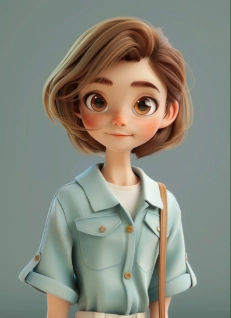{w=200}

처음에는 회사에서 제공하는 제미나이 이미지 생성을 썼지만, 같은 캐릭터의 측면·후면을 정확히 만들어내지 못했습니다. 팔이 어색하게 올라가거나 각도가 비스듬해지고, 옷의 디테일이 멋대로 바뀌었습니다. 가장 큰 문제는 **일관성**이었습니다. 똑같은 이미지에 똑같은 프롬프트를 넣어도 매번 다른 결과가 나왔고, 그때마다 이미지를 다시 첨부하고 규칙을 설명해야 했습니다.

그래서 택한 것이 **ComfyUI**입니다. 노드를 연결해 생성 공정을 직접 설계하는 도구로, 어떤 그리기 엔진·출력 크기·모델을 쓸지 규칙을 한 번 고정해두면 매번 설명할 필요가 없어집니다. 덕분에 특정 그림체나 일관성을 유지하기가 훨씬 수월해졌습니다.

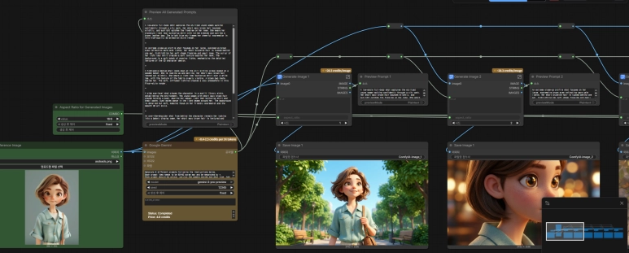

특히 ComfyUI가 제공하는 노드 중 카메라 앵글을 제어하는 노드를 쓰면, 동일한 객체의 여러 각도를 한 번에 생성할 수 있었습니다. 멀티뷰 문제를 여기서 해결한 셈입니다.

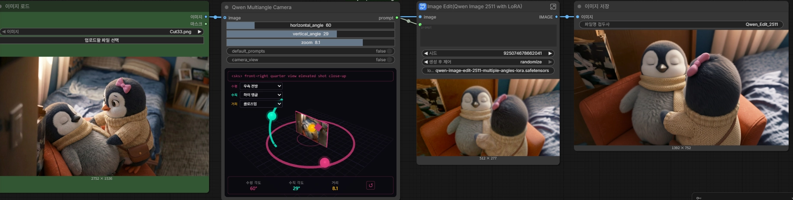

## 3. 이미지를 3D로 — 변환과 토폴로지 정리

이렇게 얻은 여러 각도의 이미지를, 이미지를 3D로 변환하는 생성 AI에 함께 넣었습니다. 한 각도만 줄 때와 달리 여러 각도를 함께 주면 형태 추론이 정확해져, 디테일이 뭉개지거나 어색해지는 부분이 줄었습니다.

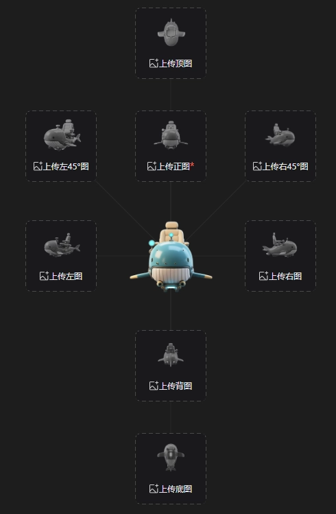

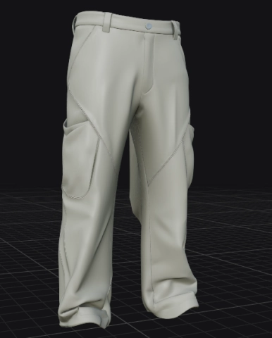

다만 두 번째 문제가 있었습니다. **토폴로지의 복잡성**입니다. AI가 만든 메쉬는 면과 점이 규칙 없이 빽빽하게 박힌 하이폴리 상태라, 그대로는 작업에 쓸 수 없었습니다. 그래서 블렌더에서 기본 리토폴로지를 한 뒤, ZBrush의 **프로젝트(Project) 기능**으로 다듬었습니다. 리토폴로지한 깔끔한 메쉬와 원본 메쉬 사이의 간극을 줄여, 형태는 유지하면서 토폴로지만 정리하는 방식입니다.

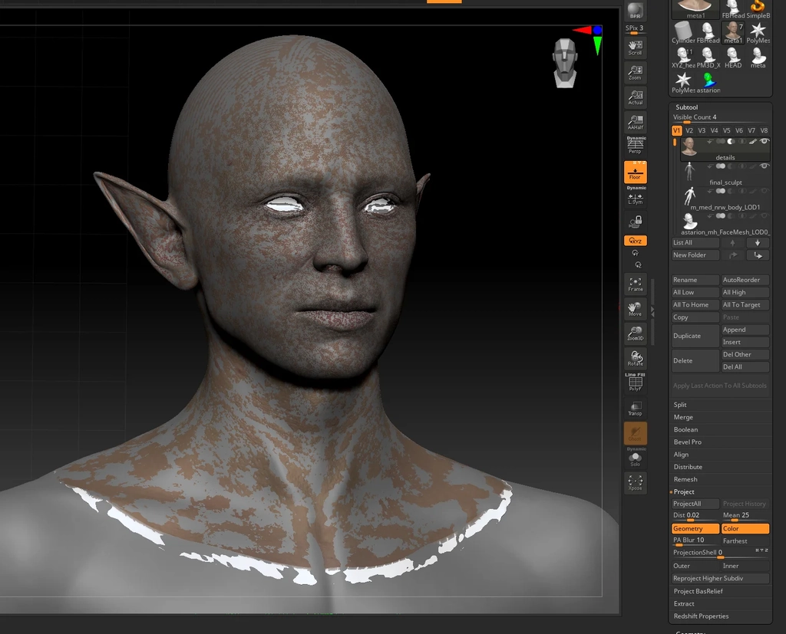

## 4. 반복을 없애기 — 3ds Max 자동화

마지막으로, 위 과정에서 반복되는 손작업을 3ds Max 자동화 스크립트로 묶었습니다. 한 창에서 AI 생성, 폴더 정리, 자동 스냅샷 같은 단계를 처리하도록 만들어, 사람이 매번 같은 클릭을 반복하지 않도록 했습니다.

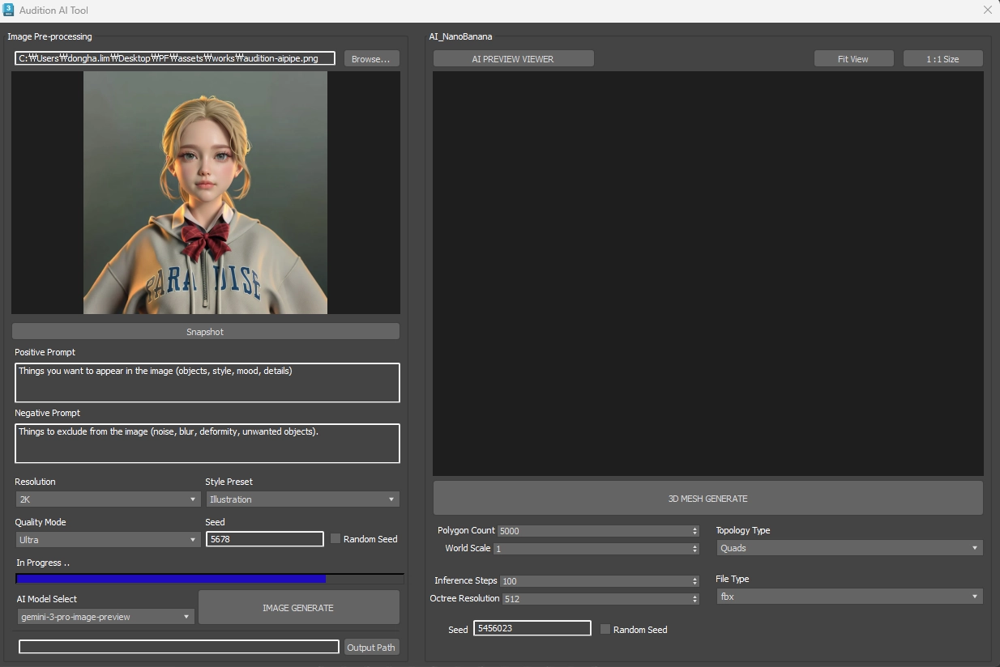

전체 그림으로 보면, 모델링 → UV 전개 → 텍스처링 → 리깅 → 툴 검증으로 이어지는 공정 중 **리깅(골격 생성)을 제외한 거의 모든 단계에 AI와 자동화를 적용**했습니다. 가장 큰 시간 단축은 모델링과 텍스처링에서 나왔고, 툴 검증 단계도 스크립트로 자동화했습니다. UV는 수작업이지만 오디션 에셋이 단순한 편이라 부담이 거의 없었습니다.

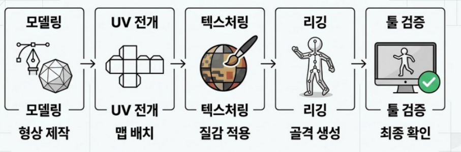

## 5. 결과

에셋 하나를 만드는 데 걸리던 시간이 약 **3일에서 1일로** 줄었습니다. 한 달 단위로 보면 차이가 더 분명합니다. 기존 방식으로는 월 평균 3.5~5세트(머리·상의·하의·신발)의 의상을 만들 수 있었는데, AI 파이프라인을 적용한 뒤에는 같은 기간에 24세트까지 제작할 수 있었습니다(2월 기준, 약 6.8배). 개당 속도가 빨라진 데 더해, 여러 벌을 한 번에 생성할 수 있어 월 제작량은 그보다 더 크게 늘었습니다.

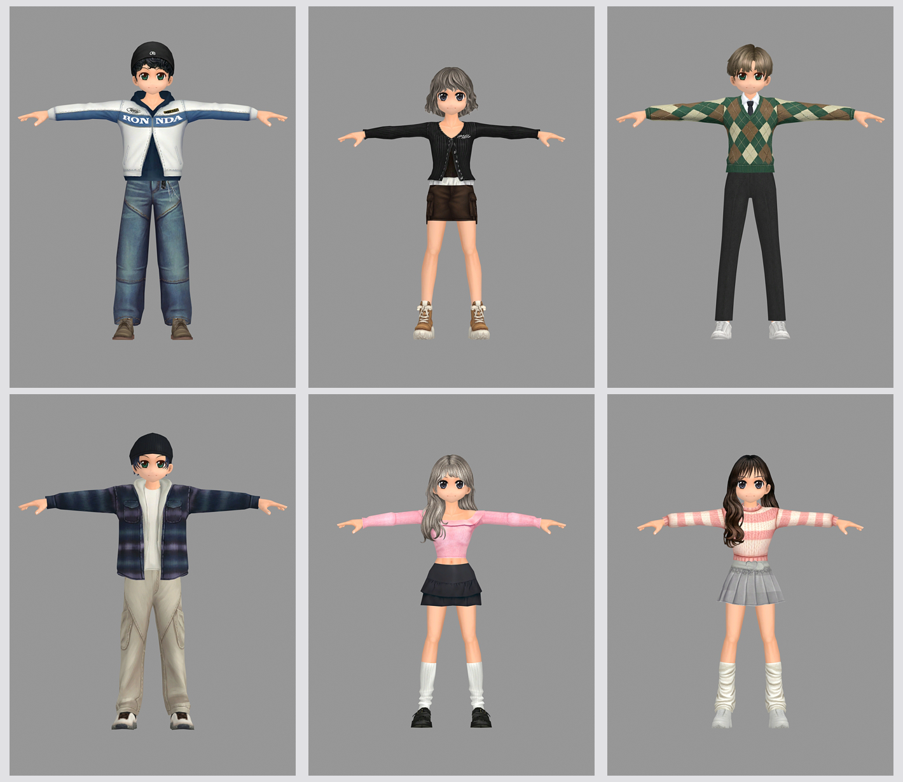

제작 요청서의 요구사항도 일정 수준 반영할 수 있었습니다. 레퍼런스를 기반으로 의상·헤어·색상을 맞추고, 하의·신발 파츠 분리나 로고 제거 같은 세부 요구도 처리했습니다.

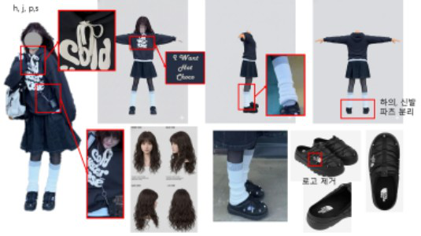

결과물은 실제 게임에 들어갔습니다. 오디션 인게임 상점에서 구매할 수 있고, 파츠로 분리돼 다양한 조합으로 장착됩니다.

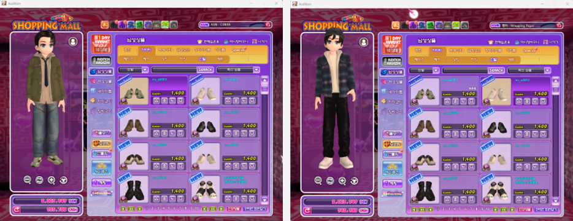

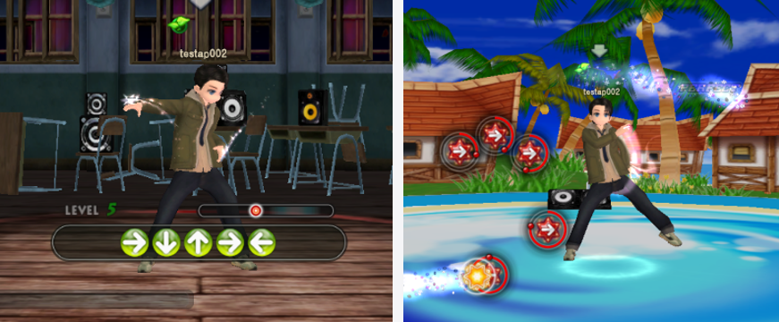

## 6. 한계와 배운 점

모든 의상을 AI로 만들 수 있는 것은 아니었습니다. 화려한 무대 의상이나 드레스처럼 구조가 복잡한 옷은 AI가 형태를 정확히 해석하지 못해, 추가 보정에 최대 하루 정도가 더 들 수 있었습니다. 머리카락처럼 구조가 복잡한 파츠나 레이스·시스루 같은 반투명 재질도 아직 안정적으로 나오지 않았습니다. 리깅과 웨이트 작업은 현재 AI로 대체하기 어려워 수작업으로 남겨두었습니다.

그래서 이 파이프라인은 모든 제작을 대체하는 도구가 아니라, **반복적으로 대량 제작해야 하는 의상·NPC 같은 자산에서 특히 효율이 큰 도구**로 정리됐습니다. AI의 적용 범위를 넓혀가면서, 사람은 복잡하고 판단이 필요한 작업에 집중하도록 만드는 방향이 맞다고 봤습니다.
