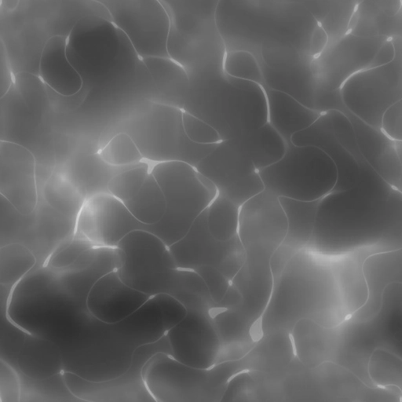
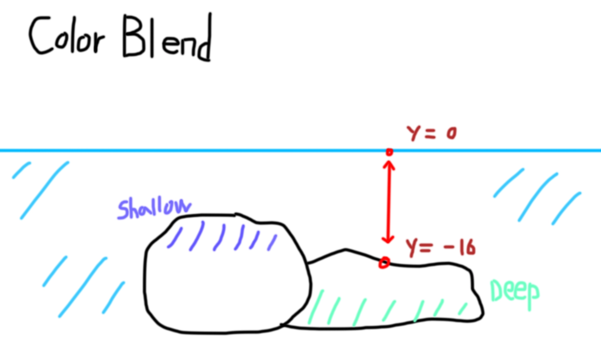
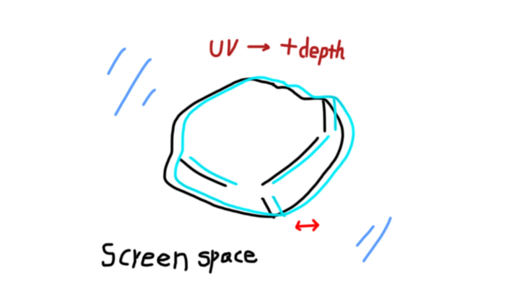
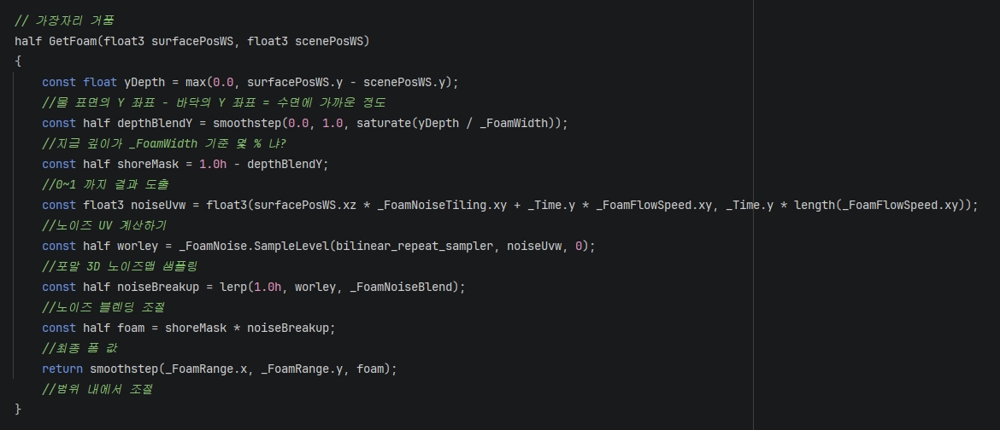

<!-- ===========================================================================
  Water 셰이더 (스타일라이즈드·모바일) — 케이스 스터디 본문
  출처: _src/02-water/ (Notion 원고 PDF) + 사용자 보강 답변
  이미지: img/02-water/ (PDF에서 추출) · 영상: water-loop.mp4
  ※ 사실/수치는 원고+사용자 확인 기준. 수정 시 원고와 대조하세요.
=========================================================================== -->

Maze 프로젝트의 각종 셰이더 제작을 맡았고, 그중 물 셰이더를 만든 과정을 정리했습니다. 모바일을 타깃으로 하는 프로젝트였기 때문에, "얼마나 그럴듯하게 보이느냐"만큼이나 "얼마나 가볍게 돌아가느냐"가 중요한 작업이었습니다.

## 1. 받은 지시, 그리고 방향 설정

물 셰이더를 만들어 달라는 요구였지만, 프로젝트가 모바일 타깃이라는 점에서 저는 이 지시를 "사실적인 물"이 아니라 **게임 전체 톤에 어울리는 스타일라이즈드 물을, 최대한 가볍게** 만드는 일로 읽었습니다. 고사양 물 표현에서 흔히 쓰는 무거운 기법을 그대로 가져오면 모바일에서 프레임을 유지하기 어렵기 때문에, 처음부터 "무엇을 뺄 수 있는가"를 기준으로 설계를 시작했습니다.

## 2. 비용부터 설계하기 — 텍스처와 렌더타겟

가장 먼저 정한 것은 표현 기법이 아니라 **예산**이었습니다. 텍스처를 몇 장까지 쓸지, 굴절에 필요한 씬 컬러(물 아래로 비치는 화면)를 어떻게 확보할지를 팀 내 그래픽 프로그래머와 함께 상의했습니다. 모바일에서는 텍스처 한 장, 렌더타겟 복사 한 번이 그대로 성능 부담으로 돌아오기 때문입니다.

여기서 두 가지 절약 지점을 잡았습니다. 하나는 **텍스처 재활용**입니다. 물결 패턴에 쓸 노이즈는 새로 만들지 않고, 이미 프로젝트 다른 곳에서 쓰고 있던 3D 노이즈 텍스처를 그대로 가져와 물 표면에 재사용했습니다. 새 텍스처를 추가하지 않고도 물의 일렁임을 표현할 수 있었습니다.

{medium}

다른 하나는 **렌더타겟 재활용**입니다. 물 굴절을 표현하려면 물 아래로 비치는 화면(씬 컬러)이 필요한데, 이걸 위해 화면을 별도 렌더타겟으로 새로 복사하면 그만큼 대역폭을 더 씁니다. 다행히 이 프로젝트는 커스텀 디퍼드 렌더링을 쓰고 있어서, 이미 만들어져 있는 G-Buffer와 씬 컬러 렌더타겟을 **새로 복사하지 않고 그대로 참조**할 수 있었습니다. 물 셰이더가 추가로 지불하는 비용을 크게 줄인 지점입니다.

## 3. 토대 — 스크린 UV로 G-Buffer 읽기

이후의 모든 표현(깊이 색, 굴절, 포말)은 하나의 토대 위에서 동작합니다. **지금 그리고 있는 물 픽셀이 화면상 어디에 있는지(스크린 UV)를 구하고, 그 위치의 G-Buffer 정보를 읽어오는 것**입니다. G-Buffer에는 그 화면 지점의 색과 월드 좌표가 들어 있으므로, 이 값을 물 표면과 비교하면 "이 픽셀 아래에 무엇이, 얼마나 깊이 있는가"를 알 수 있습니다.

## 4. 깊이에 따른 색 — 얕은 물과 깊은 물

먼저 물의 색입니다. G-Buffer에서 읽어온 바닥의 월드 좌표와 물 표면의 높이를 비교해, 물이 얕은 곳과 깊은 곳을 구분했습니다. 이 깊이 값으로 얕은 물 색(ShallowColor)과 깊은 물 색(DeepColor)을 섞어(lerp), 가장자리는 밝고 투명하게, 깊어질수록 짙어지는 자연스러운 색 변화를 만들었습니다.

{medium}

## 5. 굴절 — 깊이에 비례해 미는 왜곡

굴절은 물 아래 화면이 일렁여 보이게 하는 표현입니다. 스크린 UV를 노이즈로 조금씩 밀어, 그 위치의 씬 컬러를 다시 샘플링하는 방식으로 구현했습니다. 미는 정도는 파라미터로 조절할 수 있게 했습니다.

여기서 중요한 처리가 하나 있었습니다. UV를 일정하게 밀면, 수면 위로 튀어나온 물체(바위나 캐릭터의 다리처럼 물에 잠기지 않은 부분)까지 함께 왜곡돼 경계가 지저분해집니다. 그래서 **미는 양을 깊이에 비례**시켰습니다. 깊이가 0에 가까운 지점(수면 위로 올라온 물체)은 거의 밀리지 않고, 깊은 지점일수록 더 크게 일렁이도록 해서 경계가 깨지지 않게 했습니다.

{medium}

## 6. 반사와 흐름 — 노말 스크롤

물 표면이 정지해 보이지 않도록, 노말(표면의 굴곡 방향) 텍스처를 속도·타일링 값으로 **스크롤**시켰습니다. 스크롤된 노말로 표면의 UV를 다시 계산하고, 여기서 샘플한 탄젠트 공간 노말을 TBN 행렬로 월드 공간으로 변환해 빛 반사 방향으로 썼습니다. 물의 "흐름"은 별도의 플로우 맵이 아니라, 이 노말 스크롤의 속도·방향으로 표현했습니다. 스크롤 속도와 타일링을 조절하면 잔잔한 물부터 빠르게 흐르는 물까지 연출할 수 있습니다.

## 7. 포말 — 경계에 생기는 거품

물과 물체가 맞닿는 가장자리에는 거품(포말)이 생깁니다. 물 표면과 바닥이 얼마나 가까운지를 계산해(둘의 높이 차이를 포말 폭 기준으로 나눠 0~1 값을 만듭니다), 경계에 가까울수록 1에 가까운 마스크를 얻었습니다. 여기에 노이즈를 섞어 거품이 딱딱한 띠가 아니라 자글자글하게 부서지도록 만든 뒤, 기존 물 색 위에 더했습니다.

## 8. 모바일 최적화 — 필요한 픽셀만, 있는 자원만

굴절과 포말은 씬을 다시 참조해야 하는 표현입니다. 이런 재샘플링을 화면 전체에 무겁게 돌리면 모바일에서는 부담이 큽니다. 그래서 **실제로 그 표현이 필요한 물 픽셀에서만** 재샘플링이 일어나도록 제한했습니다. 앞서 렌더타겟을 새로 복사하지 않고 기존 G-Buffer·씬 컬러를 재활용한 것과 함께, "새로 만들지 않고 이미 있는 것을 다시 쓴다"는 원칙을 굴절·포말 계산에도 그대로 적용했습니다.

## 9. 아티스트가 직접 만지는 물

마지막으로, 이 셰이더의 주요 값들을 모두 인스펙터에 노출했습니다. 얕은 물·깊은 물 색, 굴절 강도, 포말 두께, 노말의 스크롤 속도와 타일링 등을 아티스트가 코드를 건드리지 않고 조절할 수 있습니다. 덕분에 스테이지마다 다른 분위기의 수역(맑은 연못, 탁한 늪 등)을 같은 셰이더 하나로 연출할 수 있었고, 실제로 Maze의 여러 스테이지에 이 물 셰이더가 사용되었습니다.

## 10. 한계와 배운 점

이 물 셰이더가 씬 컬러와 G-Buffer를 값싸게 가져올 수 있었던 것은, 프로젝트가 커스텀 디퍼드 렌더링을 쓰고 있었기 때문입니다. 바꿔 말하면 이 접근은 그 렌더링 구조를 전제로 하며, 렌더 파이프라인이 다른 프로젝트에 그대로 옮기기는 어렵습니다.

작업하면서 가장 크게 남은 것은, 모바일 셰이더에서는 "무엇을 더 넣느냐"보다 **"이미 있는 자원(텍스처·렌더타겟)을 어떻게 다시 쓰느냐"**가 품질과 성능을 동시에 좌우한다는 점이었습니다. 표현을 설계하기 전에 예산부터 그래픽 프로그래머와 맞춘 것이, 결과적으로 여러 스테이지에 부담 없이 넣을 수 있는 물을 만든 가장 큰 이유였습니다.
