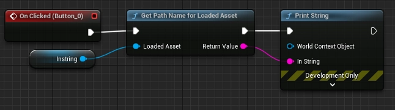
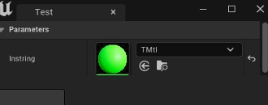
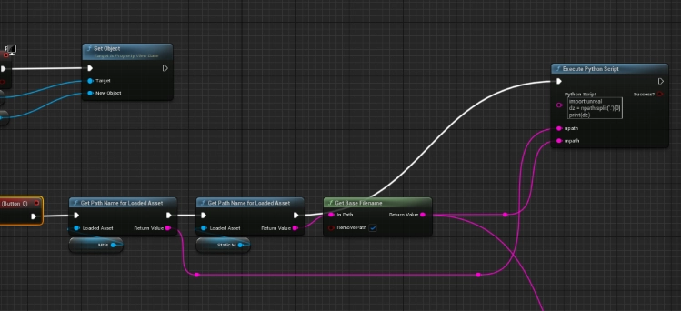
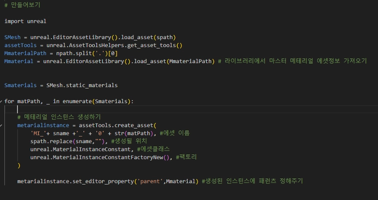
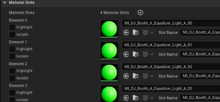

<!-- ===========================================================================
  언리얼 머티리얼 스캐터 — 케이스 스터디 본문
  출처: _src/03-material-scatter/ (Notion 원고 PDF) + 사용자 보강 답변
  이미지: img/03-material-scatter/ (PDF에서 추출) · 시연영상: 유튜브(일부공개)
  ※ 시행착오 섹션은 사용자 요청으로 생략(첫 언리얼 툴, 세부 기억 불확실).
  ※ 사실/수치는 원고+사용자 확인 기준. 코드는 이미지로만(옮겨적지 않음).
=========================================================================== -->

칼리버스 프로젝트에서, 아티스트가 만든 모델에 머티리얼을 자동으로 세팅해 주는 언리얼 에디터 툴 「머티리얼 스캐터」를 만든 과정입니다. 이름 그대로 머티리얼을 알맞은 자리에 "뿌려" 주는 툴입니다.

## 1. 지시가 아니라, 눈에 밟힌 반복 작업

이 툴은 위에서 내려온 지시로 시작한 것이 아니라, 팀 아티스트들의 작업을 보다가 제가 직접 제안한 것입니다. 아티스트들은 모델을 가져올 때마다 늘 같은 일을 반복하고 있었습니다. 상황에 맞는 마스터 머티리얼을 고르고, 그것을 하나하나 인스턴스로 만들고, 규칙에 맞게 이름을 바꾸고, 메쉬의 각 슬롯에 끼워 넣고, 대응하는 텍스처를 일일이 연결하는 작업입니다.

한 번은 몇 분이지만, 모델 하나에 슬롯이 여럿이고 모델은 계속 늘어나니 이 반복이 쌓이면 무시할 수 없는 시간이 됩니다. 게다가 손으로 하는 만큼 슬롯을 잘못 끼우거나 텍스처를 엉뚱하게 연결하는 실수도 생깁니다. 그래서 "이 과정을 자동화하면 좋겠다"고 판단했고, **아티스트의 클릭 수를 최대한 줄이는 것**을 목표로 잡았습니다.

## 2. 목표를 기능 단위로 쪼개기

막연히 "자동화"라고 두지 않고, 반복 작업을 그대로 기능 목록으로 옮겼습니다.

- 머티리얼 인스턴스를 자동으로 생성한다
- 규칙에 맞게 리네이밍되어 알맞은 슬롯에 적용된다
- 팀의 폴더 규칙에 맞게 정리된다
- 네이밍 규칙을 따라 텍스처가 자동으로 링크된다

## 3. 출발점은 "경로" — 먼저 위치부터 알아내기

이 기능들을 구현하려면 결국 "어떤 머티리얼을, 어떤 모델의, 어느 슬롯에" 넣을지를 알아야 합니다. 그 모든 것의 기준이 되는 정보가 에셋의 **경로**입니다. 경로만 정확히 알면 그다음 동작들은 거기서 파생시킬 수 있다고 봤기 때문에, 가장 먼저 경로를 가져오는 것부터 시도했습니다.

UI에서 마스터 머티리얼을 지정하고 버튼을 누르면, 그 머티리얼의 경로를 얻어 오도록 했습니다.

## 4. 구조 — 블루프린트는 앞단, 파이썬은 속

툴은 블루프린트와 파이썬을 역할을 나눠 구성했습니다. **블루프린트는 프론트엔드처럼** 썼습니다. UI를 그리고, 아티스트가 지정한 값을 받아와 정리해 두는 역할입니다. 그리고 실제 에셋을 만들고 고치는 **구체적인 동작은 파이썬**이 맡았습니다. 블루프린트로 모은 경로·네이밍 정보를 파이썬 스크립트에 넘겨, 엔진 내부에서 인스턴스를 생성하고 값을 설정하도록 했습니다.

## 5. 핵심 동작 — 인스턴스 생성과 부모 연결

파이썬 쪽 핵심은 마스터 머티리얼과 모델의 경로·네이밍을 받아, 머티리얼 인스턴스를 만들고 그 부모를 원래의 마스터 머티리얼로 연결하는 것입니다. 이렇게 하면 아티스트가 손으로 인스턴스를 만들어 부모를 지정하고 슬롯에 끼우던 과정이 한 번에 처리됩니다.

## 6. 텍스처 자동 링크 — 네이밍 규칙을 읽다

텍스처 연결은 파일 이름의 규칙을 근거로 삼았습니다. 팀에는 이미 텍스처 네이밍 규칙이 있었기 때문에, 그 규칙을 그대로 읽어 어떤 텍스처가 어디에 들어갈지를 판단했습니다. 예를 들어 이름에 `_D`가 붙어 있으면 디퓨즈 맵으로, 중간에 `_01_` 같은 표기가 있으면 첫 번째 슬롯용으로 해석하는 식입니다. 덕분에 아티스트가 텍스처를 하나씩 끌어다 연결하지 않아도, 이름만 규칙에 맞으면 알맞은 슬롯과 채널에 자동으로 붙었습니다. 폴더 정리 역시 팀이 정해 둔 규칙이 있어, 생성된 에셋의 경로를 그 규칙에 맞게 지정해 주는 방식으로 처리했습니다.

## 7. 결과

머티리얼 스캐터는 아티스트가 DCC 툴에서 작업한 모델을 언리얼 엔진으로 옮겨 세팅하는 시간을 **2배 이상 단축**시켰습니다. 무엇보다 특정 작업자만 쓰는 툴에 그치지 않고, 칼리버스 프로젝트의 **모델링팀 전원이 사용**했으며, 특정 프로젝트에 한정되지 않고 이후 여러 프로젝트에서 두루 쓰였습니다. 제가 처음으로 만든 언리얼 에디터 툴이었지만, "아티스트가 반복하는 손작업을 관찰해 클릭 수로 환산하고, 그것을 하나씩 없애 나간다"는 접근이 실제 팀의 작업 방식에 자리 잡은 사례가 되었습니다.
