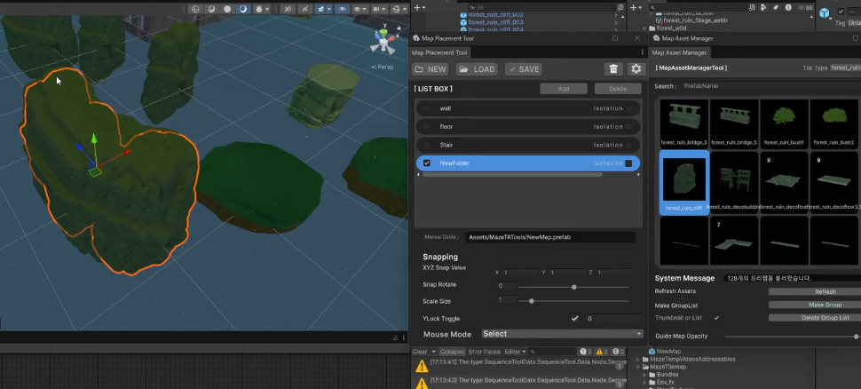

<!-- ===========================================================================
  맵 에셋 배치 툴 — 케이스 스터디 본문
  출처: 사용자 채팅 인터뷰(원고 PDF 없음) + 상단 유튜브 시연영상
  ※ 시행착오 세부 해결법은 사용자 기억 불확실 → 지어내지 않고 구현 기능 중심으로 서술.
  ※ 카드 요약의 "브러시/스캐터·그리드 스냅·랜덤 변형"은 실제 기능 여부 확인 중.
=========================================================================== -->

Maze 프로젝트에서, 맵에 프리팹 에셋을 빠르게 배치하기 위해 요청받아 만든 Unity 에디터 툴입니다.

## 1. 배경 — 프리팹 안에 갇힌 배치 작업

그동안 팀은 스테이지를 꾸밀 때, 해당 스테이지의 프리팹을 열고 그 안에서 프로젝트 창의 프리팹을 하나하나 드래그 앤 드롭으로 배치하고 있었습니다. 여기엔 두 가지 불편이 있었습니다. 하나는 에셋을 일일이 끌어다 놓는 단순 반복이고, 다른 하나는 좀 더 근본적인 문제였습니다. 프리팹 편집 모드 안에서 작업하다 보니, 캐릭터와 함께 크기를 가늠하거나 실제 조명 아래에서 보기가 어려웠습니다. 정작 게임에서 보일 모습과 배치하는 화면이 따로 놀았던 것입니다.

## 2. 받은 요청, 그리고 핵심 의도

요청받은 기능은 다음과 같았습니다.

- 창을 두 개 띄운다 — 하나는 프리팹 썸네일 목록, 다른 하나는 스테이지를 조작하는 컨트롤 창
- 프리팹마다 알아보기 좋은 썸네일을 보여준다
- 프리팹 선택을 마우스뿐 아니라 단축키로도 할 수 있게 한다
- 복사·붙여넣기·실행 취소(Undo)를 지원한다
- 배치 결과는 스테이지 안의 'Graphic' 프리팹에만 반영되고, 그 프리팹만 저장된다

저는 이 요청들의 바탕에 깔린 진짜 목적을 **"배치하는 화면과 저장되는 결과를 분리하는 것"**으로 읽었습니다. 작업자는 캐릭터와 조명이 있는 편한 환경에서 자유롭게 배치하되, 실제로 저장되는 것은 'Graphic' 프리팹 하나로 깔끔하게 모이도록 하는 것이 이 툴이 풀어야 할 핵심이라고 봤습니다.

## 3. 설계 — MVP 패턴으로 역할 나누기

UI가 있는 툴이라, 코드를 역할별로 나누는 MVP 패턴을 택했습니다. 기능을 잘게 나눠 객체지향적으로 짜 두면 나중에 기능을 더하거나 고칠 때 유지보수가 낫다고 판단했기 때문입니다. 세 역할은 이렇게 나눴습니다.

- **Model(Service)** — UI에서 들어오고 나가는 값을 가지고 실제로 무엇을 할지, 그 데이터와 로직을 담습니다. 화면이 어떻게 생겼는지는 알지 못합니다.
- **View** — 사용자가 보고 조작하는 두 개의 창입니다. 무엇을 보여줄지만 압니다.
- **Presenter(Binder)** — 뷰에서 입력이 들어오면 모델에 전달하고, 모델이 처리한 결과를 다시 뷰에 반영합니다. 뷰와 모델이 서로를 직접 알지 않도록 사이에서 이어 주는 역할입니다.

이렇게 역할을 갈라 두니, 이후 단축키나 복사·붙여넣기 같은 기능을 더할 때도 서로 얽히지 않고 해당 역할만 손보면 됐습니다.

## 4. 만든 기능

두 개의 창으로 UI를 나눴습니다. 한쪽('Map Asset Manager')은 프리팹을 썸네일로 훑어보며 고르는 브라우저이고, 다른 한쪽('Map Placement Tool')은 고른 프리팹을 스테이지에 배치하고 조작하는 컨트롤 창입니다. 프리팹은 목록에서 바로 알아볼 수 있도록 썸네일로 보여 주고, 자주 쓰는 선택은 마우스 대신 단축키로도 집을 수 있게 했습니다. 배치할 때는 위치·회전·크기를 스냅 값에 맞춰 정렬할 수 있게 했고, 실수를 되돌리거나 반복 배치를 편하게 하도록 복사·붙여넣기·실행 취소도 넣었습니다. 그리고 이 모든 배치는 스테이지 안의 'Graphic' 프리팹에만 반영되며, 저장할 때도 그 프리팹만 저장되도록 범위를 묶었습니다.

## 5. 결과

가장 큰 변화는, 이제 **어떤 씬에서 작업하든 상관없어졌다**는 점입니다. 프리팹을 직접 열 필요 없이 캐릭터와 조명이 놓인 실제 환경에서 배치할 수 있고, 심지어 빈 씬에서 작업해도 결과는 'Graphic' 프리팹에만 반영되어 저장됩니다. 배치하는 화면과 저장되는 결과가 따로 놀던 원래의 문제가 풀린 것입니다. 이 툴은 Maze 프로젝트의 스테이지 배치에 전면적으로 쓰였고, 팀의 반응도 좋았습니다.
