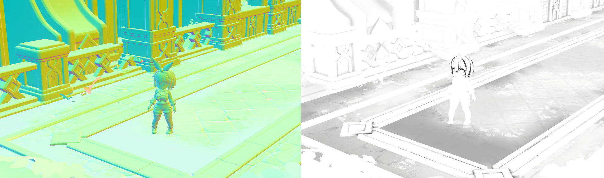
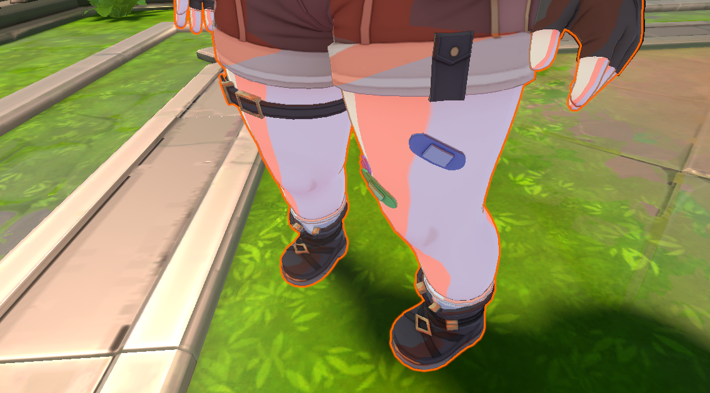
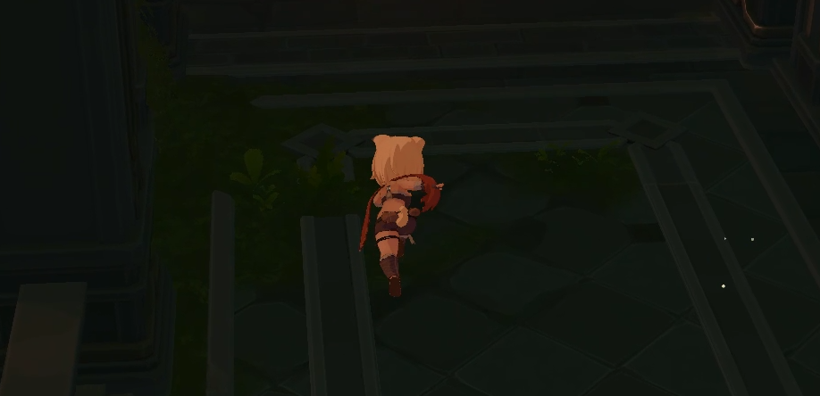
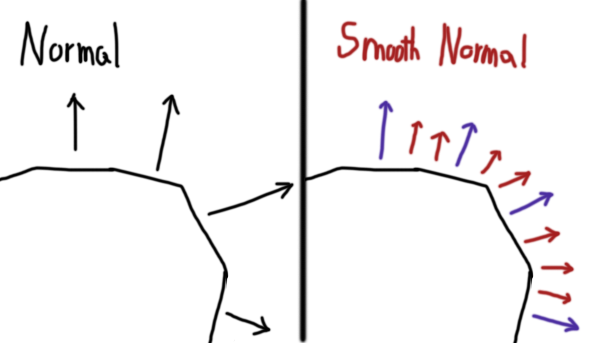
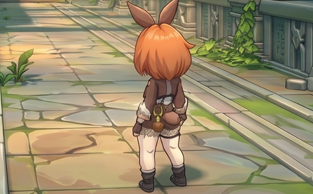

<!-- ===========================================================================
  URP 툰 셰이딩 — 케이스 스터디 본문
  출처: 사내 발표자료(캐릭터_툰셰이더_발표.md, 캐릭터_아웃라인_발표.md) → 포트폴리오 톤으로 재작성.
  방침: 개념 중심, 내부 함수·변수명·파일명·스텐실 번호는 일반 용어로 치환(심볼 가림).
        예) _ToCharacterMainLight → "캐릭터 전용 키라이트", SmoothNormalBaker.cs → "이웃 면 평균 법선을 구운 데이터".
  상태: [명암 파트] 완료 / [외곽선 파트] 완료. 이미지 fig02·04·05·06·07 배치됨.
=========================================================================== -->

Maze의 캐릭터에 셀 애니메이션 느낌의 툰 룩을 입히기 위해 만든 URP 툰 셰이더입니다. 툰 셰이딩의 기본 원리는 앞서 DirectX 11로 직접 구현하며 정리한 적이 있습니다. 이 파트는 그 원리를 응용하여 상용 엔진 Unity URP의 정해진 파이프라인 위에서 제작되었습니다.


## 1. 라이팅을 미룬다 — 디퍼드 라이팅 패스에서 픽셀당 한 번

Maze는 **커스텀 디퍼드 렌더러**를 씁니다. 제 툰 셰이딩은 그 파이프라인 위에 얹혔고 그래서 셰이더도 그 구조에 맞춰 짜야 했습니다. 핵심은 **캐릭터 셰이더가 색을 직접 계산하지 않는다**는 점입니다. 일이 두 단계로 나뉩니다.

- **캐릭터 패스** — 이 픽셀의 베이스색, 그림자색, 경계 위치 같은 '재료 정보'만 GBuffer에 적고 끝냅니다. 빛 계산은 하지 않습니다.
- **풀스크린 라이팅 패스** — 화면을 딱 한 번 훑으며 그제야 재료와 빛을 섞어 최종 색을 만듭니다. 제가 짠 셀 셰이딩 로직은 이 라이팅 패스에서 계산됩니다.



이 디퍼드 구조에는 **대가**가 있습니다. 모바일에서는 치명적인 **대역폭 문제**입니다. GBuffer 여러 장을 메모리에 썼다가 라이팅 패스에서 다시 읽어야 하는 과정에서 DRAM과 SRAM의 반복적인 이동이 일어났고 모바일에서 문제가 되는 발열이 일어나는 구조입니다.

이건 제가 설계한 부분은 아니지만 제 셰이딩이 그 위에서 도는 만큼 왜 이렇게 되어 있는지는 이해하고 작업했습니다.

그 대신 이점도 분명했습니다. 광원이 많아지면 포워드 방식은 오브젝트마다 광원 수만큼 라이팅을 반복해 비용이 급격히 늘지만 디퍼드는 재료를 GBuffer에 모아 두고 화면 공간에서 픽셀당 한 번만 계산해 광원 수에 훨씬 덜 민감합니다.

여기에 바닥 데칼·아웃라인 포스트프로세스·포그·오클루전·물처럼 여러 패스가 같은 노멀·포지션·재료 버퍼를 공유할 수 있다는 장점도 있습니다.

## 2. 그라데이션 밴드를 활용한 툰 경계

셰이딩 모델 자체는 밴드 방식입니다. 일반 램버트는 빛과 노말의 내적 N·L이 0.30, 0.31, 0.32…처럼 연속으로 이어지는데 툰 룩은 이 명암을 계단처럼 잘라야 합니다.

자르는 도구는 하나입니다. `InverseLerp`에 `saturate`를 씌운 경계 함수로 `[min, max]` 구간 밖은 0 또는 1로 딱 잘리고 안에서만 부드럽게 이어집니다. 즉 **경계선 하나**를 만듭니다.

다만 아트팀에게 min/max를 그대로 주지 않고 더 직관적인 두 개의 손잡이로 바꿔 노출했습니다.

- **경계 위치(Step)** — 밝음과 그림자가 갈리는 지점
- **경계 폭(Feather)** — 경계의 부드러움. 0이면 칼같은 애니 라인, 크면 부드러운 그라데이션

```
[min, max] = [Step - Feather/2,  Step + Feather/2]
```

이 두 손잡이만으로 "쨍한 셀 룩"과 "부드러운 지브리풍"을 같은 셰이더에서 오갈 수 있습니다. 코드를 건드리지 않고 아티스트가 룩을 직접 조율할 수 있게 한 것이 이 방식의 목적입니다.

## 3. 색상의 3분할 표현

경계 함수를 **두 번** 쓰면 화면이 세 구역으로 나뉩니다. 하나는 밝음과 그림자를 가르고, 다른 하나는 그림자를 다시 얕은 그림자와 깊은 그림자로 가릅니다.

```
N·L 큼 ───────────────────────────▶ N·L 작음
[  밝은 톤  |  중간 그림자  |  깊은 그림자  ]
```

핵심은 여기입니다. **그림자를 "어둡게 곱하기"로 만들지 않았습니다.** 밝은 톤, 중간 그림자, 깊은 그림자가 전부 **독립된 색**이고 세 구역의 가중치에 각각의 색을 곱해 더합니다. 그래서 아트팀이 "그림자는 차갑게 파랑, 깊은 그림자는 보라"처럼 자유롭게 채색할 수 있습니다. 애니메이션 셀화 느낌의 핵심이 이 세 개의 독립 색입니다.

3분할 그림자는 예산을 아끼려 **캐릭터에만** 켭니다. 환경 오브젝트는 두 톤으로 충분하기 때문입니다.



## 4. 캐릭터는 전용 라이팅으로 제어

캐릭터는 게임의 주인공이라 환경이 아무리 어두워도 항상 잘 보여야 했습니다. 그래서 라이팅 패스에서 픽셀이 **캐릭터인지 환경인지** 구분하고 캐릭터라면 조명을 통째로 갈아끼웁니다.

- 빛 방향을 살짝 위로 들어 올려 얼굴에 항상 보기 좋은 명암이 지게 합니다.
- 환경의 태양색을 무시하고 코드가 매 프레임 주입하는 **캐릭터 전용 키라이트 색**을 씁니다.
- 그림자 감쇠를 강제로 무효화해 캐릭터가 다른 물체의 그림자에 파묻히지 않게 합니다.



---

## 외곽선에 대한 여러 가지 방법

여기까지가 툰의 절반인 명암이었습니다. 남은 절반은 외곽선입니다. 만화·애니 룩에서 외곽선은 많이 중요합니다. 하지만 구현은 생각보다 관문이 많았습니다. 구체적으로는 선에는 성격이 정반대인 두 종류가 있기 때문입니다.

- **실루엣 선** — 캐릭터와 배경이 만나는 경계. 몸 전체를 감싸는 테두리.
- **내부 선** — 옷 주름, 얼굴 굴곡, 손가락 사이처럼 실루엣 안쪽에서 형태가 접히는 선.

실루엣은 "모양을 바깥으로 키워서" 만들고, 내부 선은 "화면을 분석해 꺾이는 곳을 찾아서" 만듭니다.

## 1. 바깥 실루엣 — 배면법

가장 기본이 되는 바깥 테두리부터입니다. 원리는 단순합니다. 캐릭터를 아주 조금 크게 복제한 껍데기를 씌우고 그 껍데기의 **앞면은 버리고 뒷면만** 그립니다. 그러면 원본 실루엣 바로 바깥으로 삐져나온 부분만 테두리로 남습니다.

```
확장위치 = 원래위치 + 스무스법선 × 두께   // 껍데기를 법선 방향으로 부풀림
// 렌더 패스: 앞면을 버리고 뒷면만 그림(Cull Front)
```

핵심 디테일은 둘입니다.

- **스무스 법선을 쓴다.** 일반 메시 법선으로 부풀리면 딱딱한 모서리에서 껍데기가 찢어져 테두리가 끊깁니다. 그래서 이웃 면들의 평균 법선을 미리 구워 두고 그 매끈한 법선 방향으로 부풀립니다. 그래야 테두리가 갈라지지 않습니다.
- **두께를 정점 가중치로 조절한다.** 정점에 아티스트가 칠한 부위별 가중치를 곱하면 눈가는 얇게, 실루엣은 굵게 같은 미세 조정이 됩니다. 또 테두리가 원본과 겹치지 않도록 깊이를 살짝 밀어 둡니다.

장점은 **메시당 드로우콜 한 번**이라 모바일 친화적이라는 점이 있습니다.



## 2. 안쪽 주름선 — 노멀 기반 포스트프로세스

이쪽은 표현해야 할 디테일이 조금 다릅니다. 실루엣이 아니라 캐릭터 **안쪽**의 선인 옷 주름, 굴곡, 관절 접힘 같은 것들을 표현해야 했습니다. 기존의 메시를 부풀려서 표현하는 것에는 한계를 느끼고 포스트 프로세스의 방식으로 새롭게 그렸습니다. 구체적으로는 이미지 처리에서 윤곽을 딸 때 쓰는 **Sobel 엣지 검출**을 이용하여 색이 아니라 **노멀 버퍼**를 분석했습니다.

```
엣지     = Sobel(노멀버퍼)                // 이웃 픽셀의 노멀 차이
선       = step(민감도, 엣지)             // 임계값을 넘으면 선(1)
거리페이드 = 1 - smoothstep(near, far, 깊이)  // 멀면 선이 사라짐
결과     = 원본색 × (선 위치를 어둡게)      // 곱셈 블렌드
```

저는 이 PP 방식을 사용하면서 4가지 기준을 세웠습니다.

- **깊이가 아니라 노멀 기반.** 깊이는 "얼마나 멀리 떨어졌나"라 실루엣을 잡고, 노멀은 "얼마나 꺾였나"라 내부 주름을 잡습니다. 그래서 내부선에는 노멀을 씁니다.
- **곱셈 블렌드.** 새 색을 얹는 게 아니라 원본 화면을 어둡게 만들어 선을 냅니다.
- **캐릭터에만 적용.** 불투명 렌더에서 캐릭터에만 스텐실을 찍어 두고 포스트프로세스는 그 픽셀에서만 계산합니다. 화면 전체를 훑되 배경에는 내부선을 그리지 않고 불필요한 계산도 줄입니다.
- **거리 페이드.** 카메라에서 멀어지면 내부선이 스르륵 사라집니다. 멀리 있는 캐릭터에 잔선이 지글대는 것을 막습니다.



## 3. 두 기법을 파이프라인에 얹기

두 기법은 각각 URP의 렌더러 피처로 파이프라인에 등록됩니다.

- **배면법**은 메시를 다시 그리는 방식이라 캐릭터 지오메트리가 필요합니다. 그래서 불투명 렌더 직후에 실행합니다.
- **포스트프로세스**는 이미 그려진 화면을 후처리하는 방식이라 깊이·노멀 버퍼가 준비된 뒤 풀스크린으로 한 번 돕니다.

두 피처 모두 두께·민감도·페이드 같은 파라미터를 인스펙터에 노출해 아트팀이 코드 없이 조절할 수 있게 했습니다.

<!-- 이미지: fig02(디퍼드 흐름) · fig04(세 톤) · fig05(전용 키라이트) · fig06(스무스 법선) · fig07(노멀 엣지) 배치 완료.
     미배치: fig01(결과컷)·fig03(Step/Feather 비교)는 제외. 상단 대표컷은 assets/works/mob-toon.png 사용. -->
