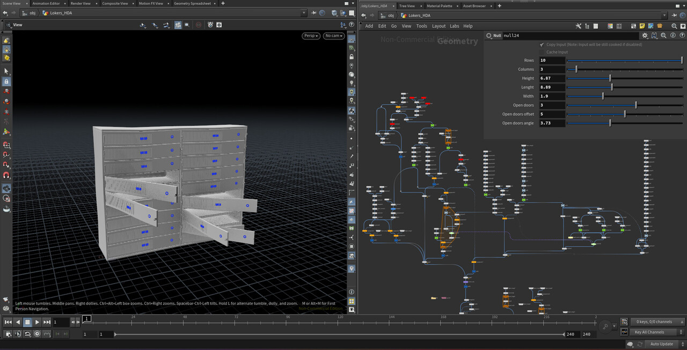
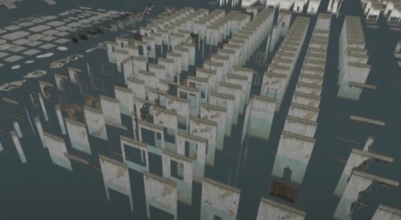
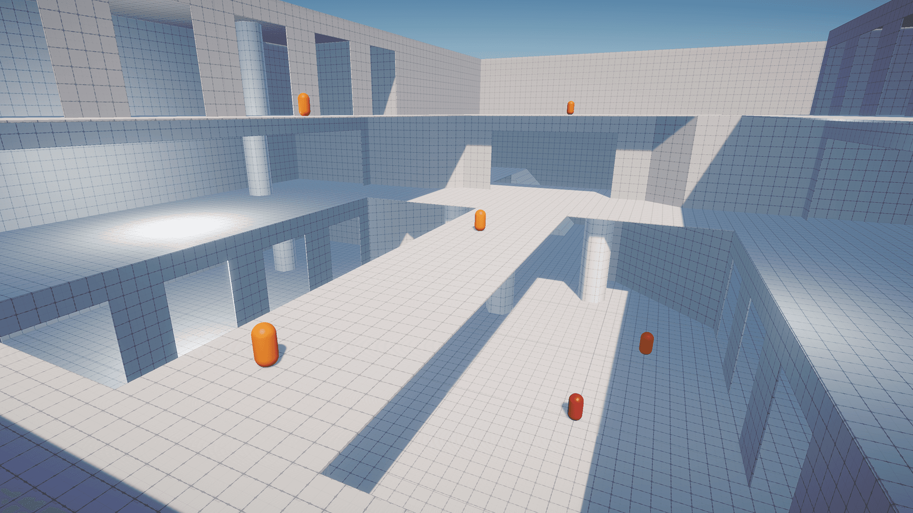
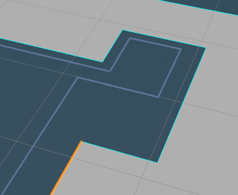

<!-- ===========================================================================
  프로시저럴 던전 배치 툴 — 케이스 스터디 본문
  출처: 사내 발표자료(프로시주얼_던전툴_발표.md) + 개인 블로그(초기 제작기) → 포트폴리오 톤 재작성.
  방침: 1인칭 경험담 톤(했습니다/구현했습니다/적용했습니다). 강의체·이모지 지양. 표는 목록으로.
        문장 중간의 불필요한 쉼표 지양(AI 티). 본인이 만든 툴이므로 설계는 그대로 서술, 기능명은 개념어+원명 병기.
  이미지: 상단 시연영상 + 참고 이미지(후디니/모듈/그레이박스) + 실작업 컷(바닥선 추출).
        ※ 각 기술 단계(루프·벽 세우기·존·산포)의 실제 스크린샷이 있으면 크게 강해짐 → 하단 주석 참조.
=========================================================================== -->

Maze의 던전 배경을 만들 때는 아트팀이 벽·기둥·잔해 조각 키트를 만들고 기획이 바닥 가이드 메시로 구조를 잡으면 사람이 그 외곽을 따라 조각을 하나하나 손으로 세웠습니다. 비슷한 테마의 던전이 계속 반복되는데도 매번 되풀이되던 이 마지막 배치 작업이 아까워서 반자동화해 보려고 직접 만든 Unity 던전 배치 툴입니다.


## 프로시저럴 모델링이란

프로시저럴 모델링은 파라미터에 따라 모델링을 동적으로 관리하는 방식입니다. 보통 후디니에서 많이 쓰고 폭·높이·문 개수 같은 값을 파라미터로 제어합니다. 규모가 오픈 월드나 도시 전체로 커질수록 이 방식이 특히 강하다고 봤고 저는 던전 배치에 적용해 보기로 했습니다.





## 1. 문제 — 조건이 설계를 전부 정했다

막상 배치를 자동화하려니 조건이 만만치 않았고 하나씩 기준을 세워나갔습니다.

- **바닥이 격자가 아니었습니다.** 큐브를 늘리거나 브러시로 만든 임의 크기·형태의 면 집합이었습니다.
- **다층 구조였습니다.** 계단으로 이어지는 높이차가 있어 벽의 높이를 바닥마다 따라가야 했습니다.
- **완전 자동은 무리라고 판단했습니다.** 목표를 초벌 자동 배치 + 사람 보정, 즉 반자동으로 잡았습니다.
- **재생성해도 결과가 같아야 했습니다.** "다시 생성"을 눌러도 같은 시드면 같은 던전이 나와야 사람이 보정한 결과가 날아가지 않기 때문입니다.

팀이 모듈식 레벨 디자인을 쓰고 있어서 모델 자체는 변형하지 않고 완성된 조각을 배치만 하는 방향으로 정했습니다. 기획이 넘겨주는 바닥 가이드 메시를 유일한 입력으로 삼았습니다.



## 2. 가이드 메시에서 테두리를 추출한다

가이드 메시의 바닥이 아무리 불규칙해도 면의 바깥 테두리는 항상 존재한다는 점에 주목했습니다. 그래서 메시의 모든 삼각형 엣지를 세어 두 삼각형이 공유하면 내부 엣지라 버립니다. 그리고 한 삼각형에만 속한 엣지면 외곽 경계라고 생각했습니다.

```
두 삼각형이 공유하는 엣지  →  내부 엣지 (버림)
한 삼각형에만 속한 엣지    →  외곽 경계 (보존)
```

하지만 실제 적용해보니 2가지 문제가 있었습니다.

- **중복 정점** — Unity 메시는 UV 경계에서 같은 위치에 정점이 여러 개였습니다. 인덱스로만 비교하니 내부 엣지가 "공유 안 됨"으로 오판돼 외곽선이 과다 검출됐습니다. 그래서 위치가 오차 0.01 이내면 같은 점으로 취급하는 병합을 먼저 돌렸습니다.
- **바닥만 필요** — 가이드 메시엔 옆면·밑면도 있었습니다. 노멀이 위를 향하는 윗면 삼각형만 골라 썼습니다.

이 둘을 처리하고 나서야 불규칙 브러시 바닥에서도 외곽선이 깨끗하게 나왔습니다.



## 3. 엣지들을 이어서 루프 만들기

경계 엣지를 모아놔도 아직은 낱개만 있는 그룹이었습니다. 벽을 세우려면 이걸 한 줄로 이어진 닫힌 루프로 연결해야 했습니다. 각 점마다 연결된 인접 리스트를 만들고 아무 엣지에서 출발해 아직 쓰지 않은 엣지로만 전진하다 출발점으로 돌아오면 루프 하나가 완성되게 했습니다. 떨어진 영역은 자연스럽게 별도 루프가 됐습니다.

또한 전진할 때 높이가 갑자기 뛰는 연결(Y 차이 0.05 초과)은 거부하도록 했습니다. 그래서 2층 바닥과 1층 바닥이 각자의 루프로 분리됐습니다.

루프가 나오면 마지막으로 안쪽을 바라보는지, 밖을 바라보는지 판정했습니다. 도는 방향을 XZ 평면에서 계산하니 루프가 시계 방향인지 반시계인지 알 수 있었고 그것으로 벽이 안쪽을 바라보는 방향을 정했습니다.

## 4. 루프를 따라 벽 세우기

루프 한 구간의 시작점부터 끝까지 순서대로 벽 조각을 놓습니다. 조각을 하나 놓을 때마다 그 길이와 여백만큼 다음 배치 위치를 앞으로 옮기는 방식입니다.

```
커서 = 코너조각 절반 + 여백
반복:
    벽 조각 선택 (시드 랜덤)
    커서 + 조각길이가 구간을 넘으면 중단
    조각 배치 → 커서 += 조각길이 + 여백
    (기둥 옵션이 켜져 있으면 벽·기둥·벽·기둥 교대)
남은 자투리 → 필러 조각을 X축으로 늘려 딱 맞게 메움
```

루프가 크게 꺾이는 지점에는 벽 조각 대신 코너 조각을 놓았습니다. 벽은 코너 조각 길이의 절반만큼 뒤에서 시작하게 해 둘이 겹치지 않도록 했습니다.

여기에 **피벗 자동 보정**을 넣었습니다. 아트팀이 만든 조각들은 피벗(기준점)이 중심인 것도, 끝인 것도, 바닥인 것도 있어서 제각각이었습니다. 아트팀에 기준을 맞춰 달라고 요구하는 대신 툴이 조각의 실제 크기를 직접 재도록 했습니다. 조각을 감싸는 상자의 여덟 꼭짓점을 월드 좌표로 바꿔 가장 왼쪽 X와 가장 아래 Y를 구하고 그만큼 조각을 밀어 넣습니다. 그러면 피벗이 어디에 있든 조각의 왼쪽 끝이 배치 위치에, 바닥이 지면에 맞춰집니다. 덕분에 조각 키트를 수정 없이 그대로 쓸 수 있었습니다.

## 5. 재생성해도 같은 결과가 나오게 만들기

같은 벽이라도 여러 버전(variant)이 있어서 섞어 써야 했는데 그냥 난수를 쓰니 다시 생성할 때마다 던전 모습이 달라졌습니다. 사람이 손으로 보정해 둔 작업이 전부 날아가는 셈이었습니다. 그래서 배치 순서를 따라가는 시드 기반 난수를 썼습니다. 시드가 같으면 같은 던전이 나옵니다.

그리고 어디를 다르게 할지 지정하는 장치를 두 가지 만들었습니다.

- **구간 존(LayoutZone)** — 씬 뷰에서 루프의 한 구간을 클릭해 존을 지정하면 그 구간만 다른 벽·코너·기둥 세트를 씁니다. 이 복도만 부서진 벽으로 바꾸는 작업이 클릭 몇 번으로 끝납니다.
- **공간 존(SphereZone)** — 씬에 구를 하나 놓으면 그 안에 들어간 조각이 확률에 따라 교체됩니다. 역할은 둘로 나눴습니다. Variant는 무엇으로 바꿀지(예: 이끼 낀 벽), Modifier는 어떤 상태를 얹을지를 정합니다. 두 존이 겹치면 이끼 낀 상태와 불탄 상태를 합친 조각까지 찾아가기 때문에 지역마다 특색을 겹쳐서 줄 수 있었습니다.

## 6. 바닥과 벽에 장식 뿌리기

벽이 서고 나면 바닥에 덤불·버섯·잔해를 뿌렸습니다. 처음엔 전체에 고르게 뿌렸는데 부자연스러웠습니다. 자연물은 원래 뭉쳐서 자라기 때문입니다. 그래서 두 단계로 나눴습니다.

**1단계 — 뭉칠 중심점 고르기.** 바닥 범위에 후보 위치를 무작위로 찍고 조건을 통과한 것만 중심점으로 채택했습니다. 조건은 세 가지입니다. 루프 안쪽에 있는지, 이미 잡힌 중심점들과 충분히 떨어져 있는지(너무 몰리는 것 방지), 그리고 **가장자리 편향(EdgeBias)** 값입니다. 가장자리 편향은 외곽선까지의 거리에 따라 채택 확률을 조절하는 값으로 양수면 덤불이 벽 쪽에 몰리고 음수면 가운데에 몰립니다. 값 하나로 분포 성격이 바뀝니다.

참고 자료입니다.

- 거리로 채택 확률을 정해 분포를 조절하는 방식 — [Rejection Sampling](https://angeloyeo.github.io/2020/09/16/rejection_sampling.html)
- 후보를 찍고 맞지 않으면 버린 뒤 다시 찍는 방식(dart throwing) — [Fast Poisson Disk Sampling in Arbitrary Dimensions](https://www.cs.ubc.ca/~rbridson/docs/bridson-siggraph07-poissondisk.pdf)

**2단계 — 중심점 주변에 뿌리기.** 각 중심점 둘레로 아이템을 흩고 가중치 추첨으로 종류를 고릅니다. 그다음 바닥 메시를 향해 수직으로 선을 쏴서 실제로 닿는 높이에 올려놓았습니다. 계단 위든 단차 위든 바닥 높이를 그대로 따라갑니다.

같은 방식을 벽면에도 적용했습니다. 이번엔 이미 세워진 벽 조각의 표면 위에 후보 위치를 찍었습니다. 삼각형 안에 고르게 찍되 바닥처럼 누운 면은 제외하고 벽 앞면만 남기고(정면에서 30도 이상 벗어나면 제외) 벽 꼭대기 근처도 제외했습니다. 조건을 통과한 자리에만 담쟁이나 균열 장식이 붙습니다.

## 7. 전체 파이프라인

```
[가이드 메시 (기획)]
   │  윗면만 골라 → 정점 병합 → 홀로 남은 엣지 = 외곽
   ▼
[경계 루프들]  ── 높이별로 분리, 도는 방향으로 안/밖 판정
   │  시작점부터 순서대로 벽 배치 (코너·기둥·자투리 메움, 피벗 자동 보정)
   │  시드 난수로 버전 선택 + 구간 존으로 세트 교체
   │  공간 존 안이면 위치 해시로 Variant/Modifier 교체
   ▼
[벽 완성]
   │  바닥에 중심점 찍기 + 가장자리 편향 + 주변 산포 + 높이 안착
   │  벽면 표면 샘플링으로 벽 장식 산포
   ▼
[씬 인스턴스 → 사람이 보정 → 프리팹 저장]
```

생성물은 전부 하나의 부모 오브젝트 밑에만 만들어지고 Undo에 등록되도록 했습니다. 결과가 마음에 들지 않으면 되돌리기 한 번이나 Clear 버튼 한 번으로 지울 수 있습니다.

<!-- ── 이미지 보강 여지 ─────────────────────────────────────────
  현재: 시연영상 + 참고 이미지 3종(후디니/모듈/그레이박스) + 실작업 컷 1종(바닥선 추출).
  더 강해지려면 각 기술 단계의 실제 스크린샷을 추가(영상에서 캡처 가능):
    §3 루프 — 높이별로 분리된 경계 루프
    §4 벽 세우기 — 줄자 커서로 벽·코너·기둥이 선 결과 / 피벗 보정 전후
    §5 존 — 구간 존/공간 존으로 지역 특색을 칠한 비교
    §6 산포 — EdgeBias로 분포가 달라지는 비교, 벽면 산포
  준비되면 해당 섹션에  한 줄로 삽입.
========================================================================= -->
