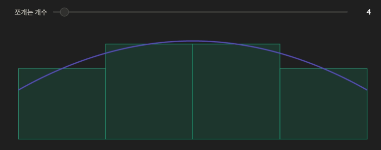
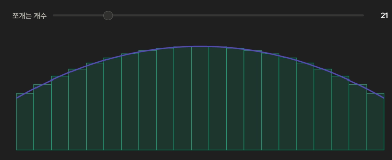
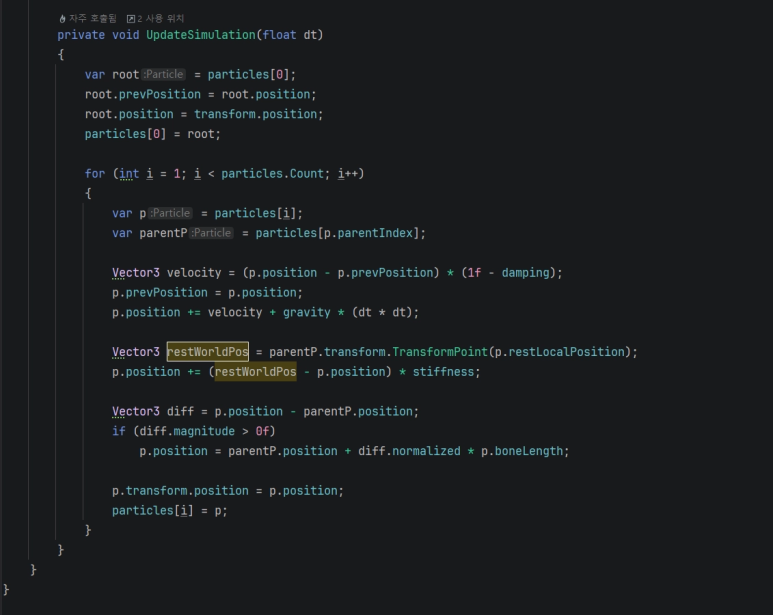

<!-- ===========================================================================
  스프링 본 물리 시뮬레이션 툴 — 케이스 스터디 본문
  출처: 발표자료(스프링본_피직스툴_발표.md) + 개인 블로그 제작기 → 포트폴리오 톤 재작성.
  귀속: 회사 제품이 아니라 MagicaCloth2 내부 이해를 위해 만든 개인 R&D/학습 프로젝트.
  방침: 1인칭 경험담 톤(했습니다/구현했습니다/적용했습니다). 강의체·이모지 지양. 표는 목록으로.
        문장 중간의 불필요한 쉼표 지양(AI 티). 본인이 만든 툴이므로 설계는 그대로 서술, 기능명은 개념어+원명 병기.
  이미지: 상단 시연영상 + 코드 컷 2종(시뮬 루프 §4, 에디터 틱 §6, 블로그 출처). 추가 컷은 하단 주석 참조.
=========================================================================== -->

캐릭터 애니메이션을 확인하다가 꼬리나 옷깃 같은 뼈가 딱딱하게 뻗어 있는 걸 발견했습니다. 그 부위엔 키프레임이 없었고 곧 물리가 들어갈 자리라는 걸 알았습니다. 캐릭터가 뛰면 머리카락이 출렁이고 돌면 치마가 따라 돌아야 하는데 이걸 손 애니메이션으로 다 만들 수는 없기 때문입니다. 그래서 특정 뼈에 물리를 주는 스프링 본 툴을 직접 만들었습니다.

실무에는 이미 MagicaCloth2 같은 상용 솔루션이 있었지만, 그 내부를 이해하고 싶어서 **처음부터 직접 구현**했습니다.


## 1. 문제 — 조건이 설계를 정했다

만들기 전에 조건부터 못 박았고 이 조건들이 이후의 모든 설계 결정을 만들었습니다.

- **모바일 예산으로 판단할 수 있어야 했습니다.** 본 하나당 얼마가 드는지 어디서 아낄 수 있는지를 스스로 계산할 수 있어야 했습니다.
- **에디터에서 바로 보여야 했습니다.** 아티스트가 플레이 버튼을 누르지 않고도 슬라이더를 만지며 출렁임을 확인할 수 있게 하려 했습니다.

최적화를 우선에 두고 나머지를 거기에 맞췄습니다.

## 2. 첫 번째 결정 — 본을 입자로 보기

머리카락 본 체인을 무엇으로 계산할지부터 정해야 했습니다. 본마다 리지드바디와 조인트를 붙여 회전까지 물리 엔진에 맡기는 방법도 있지만 계산이 너무 비싸서 모바일에 맞지 않았습니다. 그래서 최대한 단순하게 잡았습니다. 각 본의 끝점을 위치만 가진 **입자** 하나로 보고 본은 그 입자들을 잇는 거리 규칙으로만 다루기로 했습니다.

- 입자는 위치만 가진 점입니다. 회전도 질량도 가지지 않습니다.
- 본은 "이웃한 두 입자의 거리는 항상 뼈 길이"라는 규칙 하나로 대신했습니다.
- 맨 위 입자(루트)만 캐릭터 애니메이션을 그대로 따라가고 나머지는 물리가 위치를 정하게 했습니다.

컴포넌트를 붙이면 그 트랜스폼부터 자식 체인을 재귀로 훑어 입자 목록을 만듭니다. 각 입자는 원래 포즈에서의 로컬 위치와 부모까지의 뼈 길이를 기억해 둡니다. 이 두 값이 뒤에 나올 복원력과 길이 규칙의 기준이 됐습니다.

## 3. 두 번째 결정 — 속도를 저장하지 않았다 (Verlet 적분)

적분은 잘게 쪼갠 변화량을 계속 더해 전체를 구하는 개념입니다. 곡선 아래 넓이를 사각형으로 채울 때 더 잘게 쪼갤수록 실제 넓이에 가까워지는 것과 같습니다. 시뮬레이션도 매 프레임의 작은 위치 변화를 계속 쌓아 전체 움직임을 만듭니다.





교과서 방식인 오일러 적분은 위치와 속도를 둘 다 변수로 저장하고 갱신하는데 저는 Verlet(버렛) 적분을 골랐습니다. 핵심은 속도를 변수로 두지 않고 "현재 위치 − 직전 위치"에서 유추하는 것입니다.

참고 자료입니다.

- Verlet 적분의 유도와 수식 — [물리 시뮬레이션을 위한 Verlet 적산법](https://abcbox.kr/posts/%EB%AC%BC%EB%A6%AC-%EC%8B%9C%EB%AE%AC%EB%A0%88%EC%9D%B4%EC%85%98%EC%9D%84-%EC%9C%84%ED%95%9C-verlet-%EC%A0%81%EC%82%B0%EB%B2%95/)

```
속도     = (현재위치 - 직전위치) × (1 - damping)
다음위치 = 현재위치 + 속도 + 중력 × dt²
```

속도를 따로 저장하면, 위치를 옮길 때마다 속도도 맞춰 고쳐줘야 합니다. 빠뜨리면 모순이 쌓여 튀거나 폭발합니다. Verlet은 속도가 위치 두 개의 차이라서 이 정정이 자동으로 이뤄집니다.

안정장치도 두 겹 얹었습니다.

- **감쇠(damping)** — 매 프레임 속도에 `(1 - damping)`을 곱해 서서히 잦아들게 했습니다. 감쇠가 없으면 그네를 한 번 민 것처럼 흔들림이 영원히 멈추지 않는데 현실의 공기 저항·마찰을 이 값이 대신합니다.
- **속도 상한(maxVelocity)** — 속도 크기에 상한을 둬 프레임이 튀어도 입자가 한 번에 날아갈 수 있는 거리 자체를 봉인했습니다.

## 4. 세 가지 힘을 더한 뒤 뼈 길이로 고정하기

매 프레임 각 입자에 세 가지 힘을 더하게 했습니다.

```
① 관성   : 가던 방향으로 계속        (Verlet 속도)
② 중력   : gravity × dt² 만큼 아래로
③ 복원력 : 원래 포즈 자리로 stiffness 비율만큼 끌려감
```

③이 스프링 본의 "스프링"입니다. 부모 뼈와 자식 뼈 사이를 고무줄로 묶었다고 보면 됩니다. 중력과 관성 때문에 자식 뼈가 원래 자리에서 멀어지면 고무줄이 당겨서 되돌립니다. 부모 본 기준으로 원래 포즈의 자리(restLocalPosition을 월드로 변환)를 계산하고 거기까지의 차이의 일정 비율(복원력 stiffness)만큼 매 프레임 끌어당기게 했습니다. stiffness가 크면 잘 흔들리지 않는 안테나가 되고 작으면 부드럽게 출렁이는 머리카락이 됩니다. 아티스트 손잡이는 사실상 이 값과 damping 둘로 정리했습니다.

세 힘을 다 더한 위치는 아직 후보일 뿐이라 마지막에 뼈 길이로 강제로 맞췄습니다.

```
방향 = (입자위치 - 부모위치)의 방향
입자위치 = 부모위치 + 방향 × 뼈길이     ← 거리는 무조건 뼈 길이
```

힘은 부드럽게(비율로) 규칙은 딱딱하게(강제로) 처리했습니다. 이 조합이 위치 기반 시뮬레이션의 문법이고 머리카락이 절대 늘어나거나 끊어지지 않는 이유입니다. 그리고 3절에서 말했듯 이렇게 위치를 강제로 옮겨도 Verlet 덕에 속도 모순이 안 생겼습니다. 설계가 여기서 맞물렸습니다.



## 5. 충돌은 반발력 없이 표면 밖으로 밀어내기

머리카락이 어깨를 뚫으면 안 됐습니다. 콜라이더는 구와 캡슐 두 종류만 지원했습니다. 몸통·팔·머리는 이 둘로 충분히 감싸졌습니다.

처리도 물리 엔진처럼 반발력을 계산하지 않고 파고든 입자를 표면 밖으로 밀어내기만 했습니다.

- **구** — 입자가 반지름 안에 들어왔으면 중심에서 입자로 향하는 방향으로 표면까지 밀어냈습니다.
- **캡슐** — 캡슐의 중심축(선분)에서 입자와 가장 가까운 점을 찾고 그 점을 기준으로 구 충돌과 동일하게 처리했습니다.

입자가 콜라이더 안에 들어온 순간 가장 가까운 표면으로 밀어냅니다. 이것도 위치를 직접 옮기는 조작이라 Verlet과 궁합이 맞았고 밀려난 만큼이 다음 프레임 속도에 자연스럽게 반영됐습니다. 콜라이더는 지정한 이름의 콜라이더 오브젝트를 캐릭터 계층에서 찾아 자동으로 수집하게 했습니다. 아티스트는 본 밑에 콜라이더 오브젝트를 붙이기만 하면 됐습니다.

## 6. 한 프레임의 전체 흐름

```
[캐릭터 애니메이션이 루트 본을 움직임]
        │
        ▼  (입자마다, 부모→자식 순서로)
① Verlet 속도 = (현재 - 직전) × (1-damping), 상한 클램프
② 중력 × dt² 더함
③ 원래 포즈 자리로 stiffness 만큼 끌어당김
④ 부모와의 거리를 뼈 길이로 강제 고정        ← 자를 댐
⑤ 구·캡슐 콜라이더 밖으로 밀어냄
        │
        ▼
[본 트랜스폼에 위치 반영 → 다음 입자로]
```

## 정리

한 줄로 요약하면 본 체인을 입자로 보고 속도를 저장하지 않는 Verlet 적분으로 관성·중력·복원력을 섞은 뒤 뼈 길이와 충돌은 위치를 직접 옮겨 강제하는 방식으로 터지지 않는 것을 최우선에 두고 설계한 모바일용 스프링 본 툴입니다.

<!-- ── 이미지 보강 여지 ─────────────────────────────────────────
  현재: 이미지 없음(시연영상·본문 이미지 미삽입).
  준비되면 강해지는 컷:
    §1/전체 — 캐릭터 이동 시 머리카락·치마가 출렁이는 전/후 비교 GIF
    §2 본 체인을 입자로 본 개념 컷
    §5 충돌 — 구·캡슐 콜라이더 셋업 상태(어깨·머리에 감싼 모습)
    §6 에디터 — 플레이 없이 슬라이더로 출렁임 확인하는 에디터 프리뷰, Physics Rig 셋업 창
  준비되면 해당 섹션에  한 줄로 삽입.
========================================================================= -->
