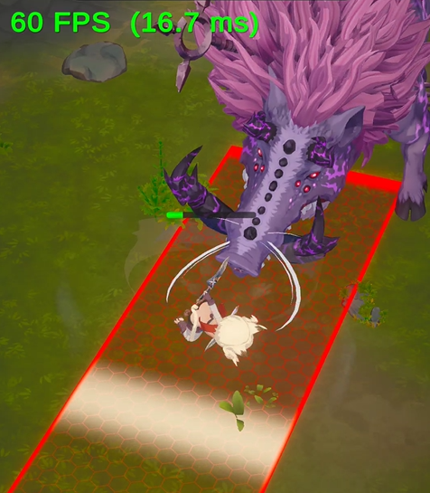

<!-- ===========================================================================
  공격 예고장판 시스템 — 케이스 스터디 본문
  출처: 사내 발표자료(공격장판_발표.md) → 포트폴리오 톤 재작성.
  방침: 1인칭 경험담 톤(했습니다/구현했습니다). 강의체·이모지 지양. 표는 목록으로.
        문장 중간의 불필요한 쉼표 지양(AI 티). 본인이 만든 툴이므로 설계는 그대로 서술.
        기능명은 개념어+원명 병기(예: 모양 데이터(TelegraphShape)). 미공개 보스명은 일반화("한 보스").
  이미지: 상단 시연영상(aoe-loop.mp4) + §1 인게임 컷(fig01-ingame). 추가 스크린샷은 요청 목록 참조.
=========================================================================== -->

Maze 모바일 미니게임의 보스·몹 공격을 바닥에 미리 알려 주는 예고장판 시스템입니다. 설계 전 두 가지 조건을 생각하고 만들었습니다.

{w=360}

- **보이는 범위와 실제 맞는 범위가 정확히 일치하면 좋겠다는 생각을 했습니다.**
- **장판이 채워지는 타이밍을 손수 맞추고 싶지 않았습니다.**

## 1. 그리기와 판정을 하나의 데이터로

가장 먼저 정한 것은 **장판을 그리는 데이터와 데미지를 판정하는 데이터를 같은 하나로** 묶은 것입니다. 보통은 비주얼용 메시와 판정용 콜라이더를 따로 두는데 그러면 둘이 미묘하게 어긋납니다.

그래서 모양 종류와 치수만 담은 **모양 데이터**를 하나 만들었습니다. 원인지 부채꼴인지 사각인지, 반경과 각도는 얼마인지 정도만 들어 있습니다. 셰이더는 이 데이터를 받아 장판을 그리고, 데미지 판정은 같은 데이터로 플레이어가 그 안에 서 있는지를 확인합니다.

점이 범위 안에 있는지 판정하는 원리는 아래 글들이 잘 설명합니다.

- https://velog.io/@hhj3258/게임수학Unity-부채꼴-안의-적-판별
- https://leekangw.github.io/posts/44/

```
              모양 데이터 (원 / 부채꼴 / 사각, 치수만 든 순수 struct)
                     │                              │
           "이 모양대로 그려줘"            "이 점이 이 모양 안이야?"
                     ▼                              ▼
              셰이더가 렌더                    Contains() 로 데미지 판정
```

셰이더는 이 데이터로 모양을 수학적으로 그려서 해상도에 무관하게 테두리가 선명합니다. 무엇보다 그리는 코드와 때리는 코드가 **물리적으로 같은 숫자**를 보니 어긋날 방법이 없습니다. 반경을 바꾸면 비주얼과 판정이 동시에 바뀝니다.

{w=420}

## 2. 타격 순간에 장판을 꽉 차게 만들기

다음은 타이밍입니다. 장판은 시간에 따라 빨간 게 차오릅니다.

```
fill = (지금시각 - 시작시각) / 지속시간      // 0 → 1 로 차오름
```

애니메이션의 실제 타격 프레임이 0.83초인데 장판 지속시간을 0.8초로 잡으면 **장판은 꽉 찼는데 아직 안 때리는** 0.03초가 생깁니다. 이걸 소수점까지 맞추는 것보단 더 좋은 방법이 없을까 생각했습니다.

그래서 타이밍을 맞추는 대신 **타격 순간에 장판을 강제로 100%로 스냅**했습니다.

```
스킬이 실제로 때리는 그 프레임 → 완료 호출
   → fill 을 즉시 1.0 으로 스냅
   → 0.1초 '꽉 찬 채로' 플래시 → 반납
```

완료를 부르는 순간이 곧 타격 순간이니 **"장판이 꽉 차는 걸 본 순간 = 맞는 순간"** 이 코드 구조상 항상 참이 됩니다. 공격이 중간에 끊기면(그로기·사망) 취소로 조용히 지웁니다. 이 표시→완료 / 표시→취소 생명주기를 개별 공격마다 짜지 않고 장판을 띄우는 공통 경로에 한 번만 심어 뒀기 때문에, **완료·취소 두 출구가 모든 장판에 적용됩니다.**

## 3. 그리기와 데미지 판정을 나누기

장판을 띄우는 매니저는 데미지를 전혀 주지 않게 했습니다. 장판을 그리고 지우는 일만 하고 실제로 때리는 것은 공격한 쪽이 합니다. 이렇게 나눠 두니 공격자에 따라 두 가지 방식을 쓸 수 있었습니다.

- **일반 몹은 컴포넌트와 애니메이션 이벤트만으로 씁니다.** 몹에 컴포넌트를 붙이고 공격 클립의 windup 프레임에 애니 이벤트를 하나 꽂으면 끝입니다. 장판을 띄우면서 그 순간의 모양·위치·회전·타격 시각을 저장해 두고 저장한 시각에 플레이어가 범위 안이면 타격이 들어갑니다. 새로 짤 코드가 없습니다.
- **보스는 코드로 직접 제어합니다.** 이동·무적·넉백이 얽혀 있어서 보스 상태 클래스가 표시와 완료와 판정을 직접 호출합니다.

두 방식 모두 같은 매니저와 같은 모양 데이터를 씁니다. 다른 것은 누가 판정을 호출하느냐뿐입니다.

여기서 중요한 것은 **장판을 그린 그 순간의 위치와 회전을 저장해 둔다**는 점입니다. 몹이 그새 움직여도 판정은 처음 그린 자리에서 납니다.

## 4. 장판을 미리 만들어 두고 돌려쓰기

마지막 조건은 모바일에서 여러 장판이 떠도 무겁지 않아야 한다였습니다. 그래서 매니저가 **아무것도 새로 만들지 않게** 했습니다.

```
초기화 시 쿼드 8개를 미리 만들어 풀에 재움 (SetActive false)
표시   → 비활성 슬롯 하나 깨워 재사용 (없으면 가장 오래된 것 뺏음)
채움   → 새 오브젝트 생성 0. MaterialPropertyBlock 으로 색·fill만 교체
끝나면 → 파괴 안 함. 다시 풀에 반납
```

- **런타임 할당 제로** — 게임 도중 생성·파괴가 없어 GC 스파이크가 없습니다.
- **동시 표시 상한 = 풀 크기** — 넘치면 가장 오래된 장판을 재활용해 화면이 장판으로 뒤덮여도 비용이 고정입니다.

특별한 기법을 쓴 것은 아니고 필요한 것을 미리 만들어 두고 돌려쓰게 한 것입니다.

## 5. 전체 흐름

```
[공격자 — 장판을 요청]
   방법 A: 애니 이벤트로 표시       방법 B: 보스 상태가 직접 호출
        │   둘 다 넘기는 건 모양 데이터 하나 (원/부채꼴/박스 + 치수)
        ▼
[매니저 — 그리기 서비스, 데미지 없음]
   풀에서 슬롯 하나 재사용 → 셰이더에 모양·색 세팅
   매 프레임 fill = (지금-시작)/지속 → 빨간 게 차오름
        ▼
[타격 순간]
   완료 → fill 100% 스냅 → "꽉 참 = 타격" 플래시 → 반납
   같은 모양 데이터의 Contains(원점, 회전, 플레이어)로 판정
        ▼
[플레이어]
   장판 안 → 타격 (+ 보스면 넉백) / 회피·무적 → 데미지도 넉백도 무효
```

## 정리

세 가지 조건이 세 가지 설계로 그대로 이어졌습니다.

- **보이는 범위 = 맞는 범위** → 그리기와 판정이 같은 모양 데이터 하나를 공유.
- **타이밍 튜닝 하기 싫다** → 타격 순간 완료 호출로 꽉 참을 강제.
- **모바일에서 가벼워야** → 쿼드를 미리 만들어 두고 돌려써서 런타임 할당을 없앰.

그리고 이 셋 위에 그리는 서비스와 때리는 주체를 분리한 덕에 디자이너는 코드 0줄로, 보스는 코드로 정밀하게 **같은 파이프라인을 두 결로** 썼습니다.

<!-- ── 필요한 이미지 (요청 목록) ─────────────────────────────────
  아직 이미지 없음. 아래가 있으면 각 섹션에 배치:
    상단/전체 — 바닥에 원·부채꼴·사각 장판이 떠서 빨갛게 차오르는 대표 컷(또는 시연 영상)
    §1 단일 진실 — 장판 비주얼 경계와 판정 경계가 정확히 겹치는 걸 보여주는 컷
    §1 모양 3종 — 셰이더로 그린 원/부채꼴/사각 (해상도 무관 선명한 테두리)
    §2 꽉 참=타격 — 채움 0→100 + 타격 순간 스냅 플래시(연속 컷/GIF)
    §4 보스 점프 내리찍기 — 예고(체공) → 착지 타격 시퀀스
    §5 모바일 — 여러 장판 동시 표시(풀링) + 프로파일러(할당/드로우콜) 컷
  준비되면 각 섹션에  한 줄로 삽입.
========================================================================= -->
