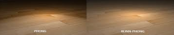
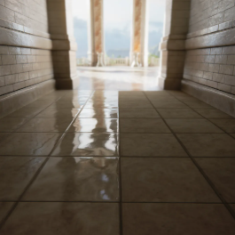
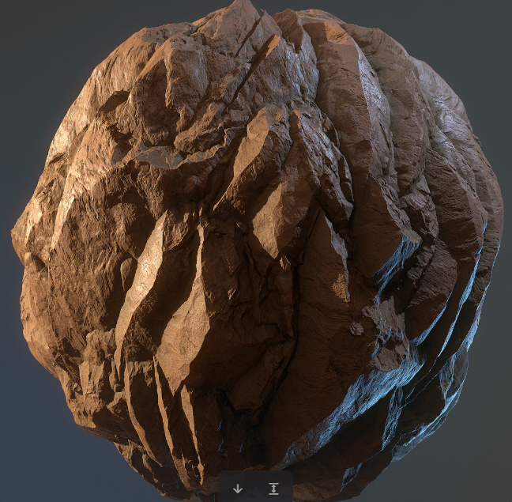
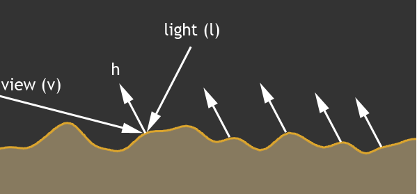
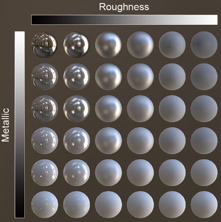
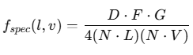
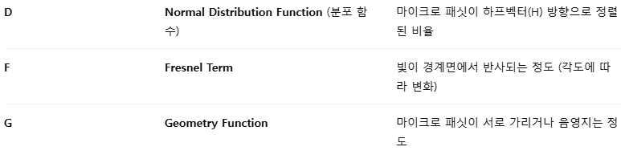
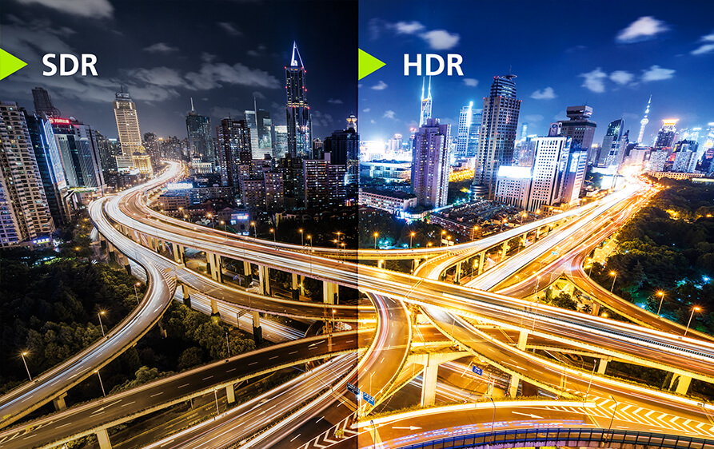

<!-- ===========================================================================
  PBR 셰이더 & 라이팅 — 케이스 스터디 본문
  출처: 개인 블로그(ridas_) "PBR 셰이더 연구"(2025-06) + "PBR 셰이더 심화"(2025-11)
        → 포트폴리오 톤 재작성. 코드는 본인이 작성한 PS_MAIN_RM 원본.
  방침: 1인칭 경험담 톤(했습니다/구현했습니다). 강의체·이모지 지양. 담백·명확.
        문장 중간의 불필요한 쉼표 지양(AI 티).
  이미지: content/works/img/14-pbr-lighting/ (01~08).
        ※ 01~08은 개념 설명용 참고 도표·사진입니다. 본인 결과물은 상단 시연 영상과
          적용 결과 컷(assets/works/lop-pbr.jpg)입니다. 캡션에서 둘을 구분해 적었습니다.
  ── 더 강해지려면 (영상에서 캡처 가능) ─────────────────────────
    §5 러프니스·메탈릭 값을 바꿨을 때 달라지는 비교 컷
    §5 노말맵 온/오프 비교
    §7 톤매핑·LUT 적용 전후 비교
    §8 라이팅 디자인이 드러나는 씬 전경
  준비되면 해당 섹션에  한 줄로 삽입.
=========================================================================== -->

「P의 거짓」의 어둡고 축축한 룩을 재현하려면 재질이 빛에 어떻게 반응하는지를 직접 계산해야 했습니다. DirectX 11로 만든 렌더러 위에 PBR 셰이더를 직접 구현하고 원작의 무드를 살리는 라이팅까지 설계한 과정입니다.

{w=640}


## 1. 왜 PBR인가 — 흉내내기와 계산의 차이

이전까지 쓰던 조명 모델은 빛을 눈으로 관찰한 결과를 흉내 낸 것에 가깝습니다.

퐁 셰이더는 정반사 모델을 씁니다. 빛이 들어오는 방향의 정반사 벡터와 카메라 방향 벡터를 내적해서 둘이 얼마나 일치하는지로 스펙큘러를 정합니다. 블린 퐁은 빛의 방향 벡터와 카메라 방향 벡터의 중간 벡터를 먼저 구하고 그 하프 벡터를 면의 법선과 내적합니다.



둘 다 "이렇게 하면 비슷하게 보이더라"에서 출발한 방식입니다. 반면 PBR은 빛이 표면에서 어떻게 반사되는지를 물리 법칙과 수식으로 계산합니다.

차이가 드러나는 지점은 질감입니다. 물체의 표면은 매끈하지 않습니다. 빛을 비춰 보면 매끈해 보이는 표면에도 작은 스크래치나 세월의 흔적이 남아 있습니다. 그런 것까지 렌더링에 반영하면 보는 사람이 훨씬 더 사실적으로 느낍니다.





## 2. 표면은 작은 거울 조각으로 덮여 있다

PBR의 출발점은 마이크로패싯이라는 개념입니다. 표면이 아주 작은 거울 조각들로 덮여 있고 각 조각이 서로 다른 방향을 향한다고 봅니다. 들어온 빛은 이 미세한 거울들 중 하나에서 반사됩니다.



조각들이 대체로 같은 방향을 보고 있으면 반사가 한곳에 모여 매끈하고 반짝이는 표면이 됩니다. 제각각 흩어져 있으면 반사도 퍼져서 거친 표면이 됩니다. 러프니스라는 값 하나로 이 분포를 조절하는 것이 PBR의 핵심입니다.

## 3. 에너지 보존 — 반사와 확산의 분배

물리 기반이라는 이름이 붙으면서 규칙도 따라옵니다. 그중 하나가 에너지 보존 법칙입니다. 들어오고 나가는 빛 에너지가 1을 넘지 않는다는 원칙입니다.

반사되어 나가는 에너지가 들어온 에너지보다 크면 없던 에너지가 생긴 셈이라 물리적으로 불가능합니다. 그래서 에너지는 늘어나는 것이 아니라 나뉩니다. 표면에 닿은 빛은 일부가 반사되고 나머지는 흡수되거나 확산됩니다.

- **kS** — 스펙큘러 반사의 비율. 프레넬 계산 결과를 그대로 씁니다.
- **kD** — 디퓨즈 확산의 비율. 반사되고 남은 에너지(`1 - kS`)입니다.

이 둘의 합이 1을 넘지 않게 묶어 두면 어떤 각도에서 봐도 밝기가 터지지 않습니다.

## 4. 메탈릭 워크플로 — F0 한 줄로 갈라지는 것

파이프라인은 인풋을 스펙큘러로 받느냐 메탈릭으로 받느냐로 나뉩니다. 스펙큘러를 받으면 F0에 그대로 대입하면 되고 메탈릭을 쓰면 알베도와 메탈릭으로 F0를 만들어 냅니다. 저는 메탈릭 워크플로를 택했습니다.

```hlsl
// 반사율 F0 — 비금속은 0.04로 고정, 금속은 알베도 색이 곧 반사색
float3 F0 = lerp(float3(0.04f, 0.04f, 0.04f), albedo, metallic);
```

F0는 표면을 정면에서 봤을 때 반사되는 빛의 비율입니다. 이 한 줄에 금속과 비금속의 차이가 압축되어 있습니다.

금속과 비금속을 가르는 것은 빛을 흡수하느냐입니다. 플라스틱 같은 비금속은 빛을 어느 정도 흡수하고 나머지를 반사해서 우리 눈에 색으로 보입니다. 금속은 흡수하지 않고 그대로 반사합니다.



이 성질 때문에 실무에서 한 번 걸리는 지점이 있습니다. **금속은 색을 흡수하지 않으므로 디퓨즈 값을 아무리 바꿔도 반응하지 않습니다.** 림라이트 같은 커스텀 셰이더를 얹을 때 금속 재질에서 값이 먹통이 되는 상황을 만나면 대개 이것이 원인입니다.

## 5. 구현 — 셰이더를 한 줄씩

여기서부터는 실제로 작성한 픽셀 셰이더를 순서대로 따라갑니다.

### 알베도와 알파 테스트

```hlsl
float3 albedo = g_DiffuseTexture.Sample(g_LinearSampler, In.vTexcoord).rgb;
albedo *= 1.2f;

float4 albedoA = g_DiffuseTexture.Sample(g_LinearSampler, In.vTexcoord);
if (albedoA.a < 0.05f)
    discard;
```

디퓨즈 맵에서 rgb를 가져오고 알파가 0.05보다 작으면 그리지 않습니다. 나뭇잎이나 천처럼 뚫린 부분을 처리하기 위한 알파 테스트입니다.

### 노말맵 — 범위를 다시 잡는다

```hlsl
float3 normalMap = g_NormalTexture.Sample(g_LinearSampler, In.vTexcoord).rgb;
normalMap = normalMap * 2.0f - 1.0f;        // [0,1] → [-1,1]

// 노말맵이 비어 있으면 기본 법선으로 되돌린다
if (abs(normalMap.x) < 0.01 && abs(normalMap.y) < 0.01 && abs(normalMap.z) < 0.01)
    normalMap = float3(0.0f, 0.0f, 1.0f);

normalMap.xy *= normalStrength;
normalMap = normalize(normalMap);
```

텍스처는 기본적으로 0에서 1 사이의 값만 저장합니다. 그런데 노말맵이 표현하는 것은 방향이고 이 단위 벡터가 항상 위를 향한다는 보장이 없습니다. 음수가 필요하므로 -1에서 1 범위로 되돌려 놓아야 합니다. 이 변환을 빠뜨리면 조명 계산이 어긋납니다.

노말맵이 없는 재질이 섞여 들어오는 경우가 있어서 값이 거의 0이면 기본 법선으로 되돌리는 방어 코드를 넣었습니다.

### TBN — 탄젠트 공간에서 월드 공간으로

```hlsl
float3 T = normalize(In.vTangent);
float3 N_base = normalize(In.vNormal.xyz);
float3 B = normalize(cross(N_base, T));
float3x3 TBN = float3x3(T, B, N_base);

float3 N = normalize(mul(normalMap, TBN));  // Tangent → World
```

노말맵에 저장된 방향은 메시 표면에 붙은 좌표계인 탄젠트 공간 기준입니다. T는 UV의 U 방향, B는 V 방향, N은 면의 법선입니다. 반면 조명 계산은 월드 공간에서 해야 하므로 둘을 이어 줄 변환이 필요합니다. 그 역할을 하는 것이 TBN 행렬입니다.

### 벡터와 내적을 미리 준비한다

```hlsl
float3 V = normalize(g_vCamPosition.xyz - In.vWorldPos.xyz);   // 픽셀 → 카메라
float3 L = normalize(g_vLightDir.xyz * -1.f);                  // 픽셀 → 광원
float3 H = normalize(V + L);                                   // 하프 벡터

float NdotL = max(dot(N, L), 0.0f);
float NdotV = max(dot(N, V), 0.0f);
float NdotH = max(dot(N, H), 0.0f);
float VdotH = max(dot(V, H), 0.0f);
```

빛의 방향 벡터에 -1을 곱해 픽셀에서 광원으로 향하도록 뒤집고 그것과 시선 벡터를 더해 정규화하면 하프 벡터가 나옵니다. 이후 계산은 전부 이 네 개의 내적 위에서 이뤄지므로 미리 구해 둡니다.

### 러프니스와 메탈릭 꺼내기

```hlsl
float3 packed = g_MetalRoughnessTexture.Sample(g_LinearSampler, In.vTexcoord).rgb;

float roughness = saturate(packed.r);
roughness = max(roughness, 0.2f);       // 완전 거울이 되는 것을 막는다
roughness = pow(roughness, 0.75f);      // 반사 강도를 눈으로 보며 조정

float metallic = saturate(packed.g);
```

러프니스와 메탈릭을 한 텍스처의 R과 G 채널에 담아 한 번의 샘플링으로 둘 다 가져옵니다. 러프니스에 하한을 두고 감마를 한 번 먹인 것은 계산상 필요해서가 아니라 원작의 톤에 맞추려고 눈으로 보며 조정한 값입니다.

## 6. Cook-Torrance BRDF — D · G · F

PBR의 핵심은 Cook-Torrance라는 공식입니다. BRDF는 빛이 표면에 닿았을 때 어느 방향으로 얼마나 반사되는지를 정의한 함수이고 Cook-Torrance는 그중 마이크로패싯 기반 모델입니다.



N과 L과 V는 앞에서 이미 구해 뒀으니 남은 것은 D와 G와 F 세 항입니다.



- **D (Normal Distribution)** — 얼마나 많은 패싯이 하프 벡터 방향을 향하고 있는지. 하이라이트의 모양과 크기를 결정합니다.
- **F (Fresnel)** — 경계면에서 반사되는 정도. 비스듬히 볼수록 강해지는 그 값입니다.
- **G (Geometry)** — 패싯끼리 서로를 가리는 정도. 거친 표면에서 반사가 줄어드는 이유입니다.

프레넬은 원래 전자기학 기반이라 실시간으로 쓰기에는 계산량이 많습니다. 그래서 엔진들이 공통으로 쓰는 Schlick 근사식을 그대로 채택했습니다.

```hlsl
float3 F = F0 + (1.0f - F0) * pow(1.0f - VdotH, 5.0f);
```

세 항을 모아 스펙큘러를 만들고 남은 에너지를 디퓨즈로 넘깁니다.

```hlsl
float D = DistributionGGX(NdotH, roughness);
float G = GeometrySmith(NdotV, NdotL, roughness);
float3 F = FresnelSchlick(VdotH, F0);

float3 specular = (D * G * F) / max(4.0f * NdotV * NdotL, 0.001f);
float3 kS = F;
float3 kD = (1.0f - kS) * (1.0f - metallic);
```

`kD`에 `(1 - metallic)`을 한 번 더 곱한 이유는 4장에서 짚은 성질 때문입니다. 금속은 빛을 흡수하지 않으므로 확산 성분이 남으면 안 됩니다.

## 7. 라이팅 — 암부가 죽지 않게

직접광만 계산하면 빛이 닿지 않는 면이 그대로 검게 가라앉습니다. 「P의 거짓」의 룩은 어둡지만 어둠 속에서도 형태가 읽혀야 해서 암부를 따로 손봤습니다.

```hlsl
float3 irradiance = g_vLightDiffuse.rgb * NdotL;

// 그림자 영역에만 들어가는 fill light
float shadowFactor = 1.0f - NdotL;
irradiance += g_vLightAmbient.rgb * 0.3f * shadowFactor;

// 전역 앰비언트를 연한 하늘색으로
float3 ambientBoost = float3(0.25f, 0.3f, 0.35f);
irradiance += ambientBoost;

// 위를 향한 면일수록 하늘빛을 더 받게
irradiance += g_vLightAmbient.rgb * 0.4f * pow(saturate(N.y), 1.5f);
```

`shadowFactor`는 `NdotL`을 뒤집은 값이라 빛을 등진 면일수록 커집니다. 이것을 앰비언트에 곱하면 밝은 면은 그대로 두고 어두운 면에만 빛을 채워 넣을 수 있습니다. 전역 앰비언트를 회색이 아니라 푸른 기가 도는 색으로 잡고 위를 향한 면에 하늘빛을 더 얹은 것도 같은 의도입니다. 암부가 무채색으로 죽지 않고 차가운 색을 머금게 됩니다.

## 8. 빛 계산 이후 — HDR에서 화면까지

계산이 끝난 빛의 값은 1을 넘는 경우가 많습니다. 밝기를 0에서 1 사이로만 다루면 정보가 잘려 나가므로 일단 그보다 넓은 범위인 HDR로 들고 있습니다.



이 값을 화면에 내보내려면 두 단계를 더 거칩니다. 먼저 톤매핑으로 0에서 1 사이로 정규화하고 그다음 감마 보정으로 사람 눈이 밝기를 감지하는 곡선에 맞춰 다시 폅니다.

```hlsl
float3 Lo = (kD * albedo / PI + specular) * irradiance;

Lo = ACESFilm(Lo);              // 톤매핑
Lo = pow(Lo, 1.0 / 1.25);       // 감마 보정
Lo = saturate(Lo);
Lo = ApplyLUT(Lo);              // 색보정 LUT

float3 colorLUT = IncreaseSaturation(Lo, 1.2f);
```

톤매핑은 ACES 필름 커브를 썼습니다. 밝은 쪽이 급격히 날아가지 않고 부드럽게 눌려서 금속 하이라이트가 흰 덩어리로 뭉치는 것을 막아 줍니다. 마지막에 LUT과 채도 보정을 얹어 원작의 색감에 맞췄습니다.

## 정리

PBR을 직접 구현하면서 남은 것은 공식 자체보다 그 공식이 무엇을 모델링하고 있는지에 대한 감각입니다. 러프니스 슬라이더를 움직일 때 실제로는 표면을 덮은 미세한 거울들의 방향 분포가 흩어지는 것이고 메탈릭을 올리면 디퓨즈가 사라지는 것이 아니라 흡수되지 않은 에너지가 전부 반사로 넘어가는 것입니다.

엔진에서 머티리얼을 만질 때 값이 예상과 다르게 움직이면 어느 항이 관여하는지를 짚어 볼 수 있게 됐습니다. 금속에서 디퓨즈가 먹통이 되는 것 같은 문제를 만났을 때 원인을 바로 지목할 수 있는 것이 직접 짜 보고 얻은 가장 실용적인 소득입니다.

## 참고 자료

셰이더 코드는 직접 작성했습니다. 사용한 공식의 출처는 아래와 같습니다.

- Cook-Torrance BRDF와 GGX·Smith·Schlick 근사 — Brian Karis, [Real Shading in Unreal Engine 4](https://blog.selfshadow.com/publications/s2013-shading-course/karis/s2013_pbs_epic_notes_v2.pdf) (SIGGRAPH 2013)
- ACES 필름 톤매핑 커브 — Krzysztof Narkowicz, [ACES Filmic Tone Mapping Curve](https://knarkowicz.wordpress.com/2016/01/06/aces-filmic-tone-mapping-curve/) (2016)
