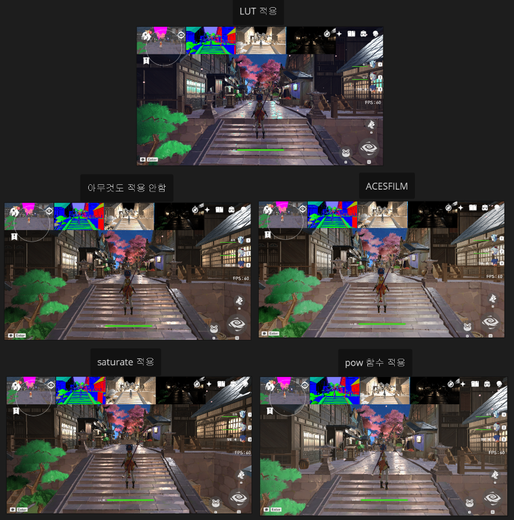
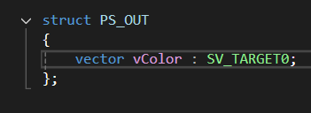
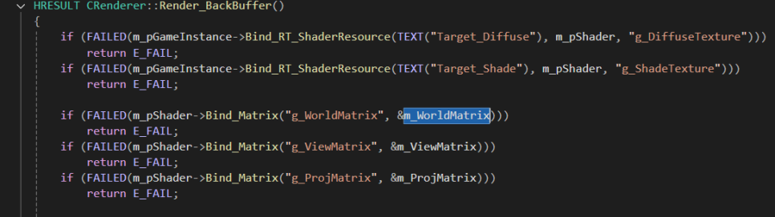
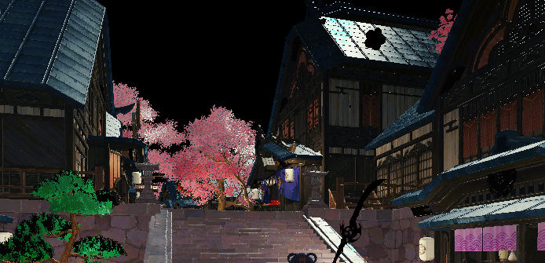
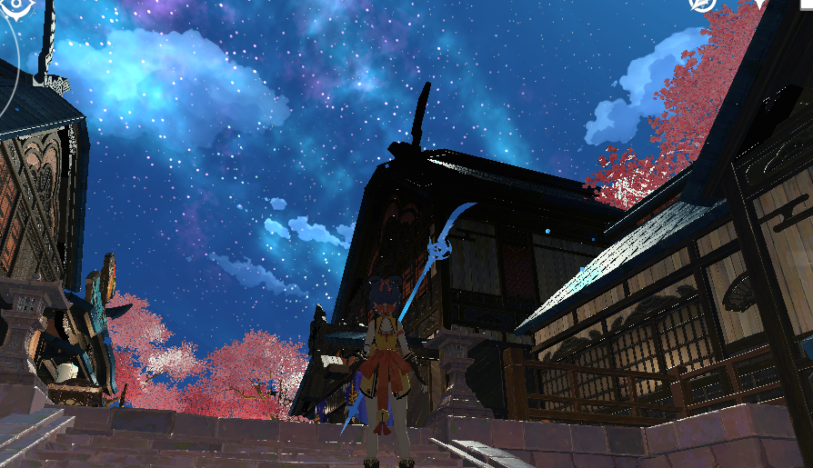
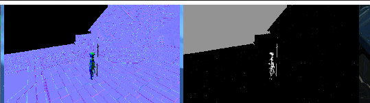
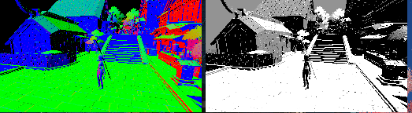
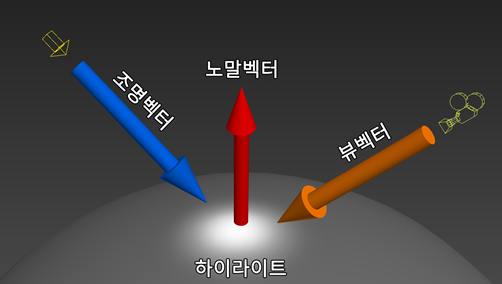

<!-- ===========================================================================
  디퍼드 렌더링 · 라이팅 — 케이스 스터디 본문
  출처: 개인 블로그(ridas_) 후처리 셰이딩 3부작 → 하나의 흐름으로 통합·재작성.
    1편 후처리 개념·렌더타겟 생성 / 2편 MRT 구성·합성 문제 / 3편 라이팅·뎁스 복원
  방침: 1인칭 경험담 톤(했습니다/구현했습니다). 강의체·이모지 지양. 담백·명확.
        3편에 걸친 중복은 합치고, 준비→분리→합성→조명 순서로 논리 정렬.
  이미지: content/works/img/15-deferred/ (01~08).
=========================================================================== -->

캐릭터·이펙트·환경이 한 화면에서 어우러지려면 조명을 일관되게 입히는 구조가 필요했습니다. 그래서 화면을 한 번에 칠하는 대신 디퓨즈·노말·조명을 따로 그려 마지막에 합치는 디퍼드(지연) 렌더링을 DirectX 11에서 직접 구현했습니다. 이 글은 렌더 타겟을 만드는 준비부터 조명 합성까지의 흐름을 정리한 것입니다.

## 1. 왜 후처리인가 — 화면 단위로 연산을 고정한다

렌더링은 크게 전처리와 후처리로 나뉩니다. 정점을 변환하고 광원과 내적해 빛을 계산하는 것이 전처리라면, 후처리는 정점이 아니라 **다 그려진 화면**을 가지고 노는 단계입니다.

후처리의 이점은 연산 횟수가 고정된다는 것입니다. 전처리에서 조명을 계산하면 지형·몬스터·플레이어를 하나하나 그리며 누가 앞인지 따져 가며 픽셀을 여러 번 덧칠합니다. 반면 후처리는 최종 화면에 보이는 픽셀에 대해서만 계산하므로 연산량이 **화면 픽셀 수만큼으로 고정**됩니다. 광원이 많아질수록 이 차이가 커집니다.

## 2. 렌더 타겟을 만들어 렌더를 가로챈다

후처리를 하려면 그림을 받아 둘 도화지, 즉 렌더 타겟이 필요합니다. `Texture2D`를 하나 만들되 **렌더 타겟이면서 동시에 셰이더 리소스로도** 쓸 수 있게 바인드 플래그를 지정하는 것이 핵심입니다.

```cpp
// 렌더 타겟 겸 셰이더 리소스로 쓸 텍스처
TextureDesc.BindFlags = D3D11_BIND_RENDER_TARGET | D3D11_BIND_SHADER_RESOURCE;

m_pDevice->CreateTexture2D(&TextureDesc, nullptr, &m_pTexture2D);
m_pDevice->CreateRenderTargetView(m_pTexture2D, nullptr, &m_pRTV);   // 여기에 그리고
m_pDevice->CreateShaderResourceView(m_pTexture2D, nullptr, &m_pSRV); // 셰이더에서 다시 읽는다
```

RTV(렌더 타겟 뷰)로 이 텍스처에 그림을 그리고, SRV(셰이더 리소스 뷰)로 그 결과를 다시 셰이더에 값으로 넣습니다. 평소에는 백버퍼에 그려 스왑체인으로 화면을 교체하는데, 그 백버퍼 대신 여러 장의 렌더 타겟(MRT, 멀티 렌더 타겟)을 끼워 넣어 **렌더링을 가로챕니다**. DirectX 11에서 MRT는 최대 8장까지 묶을 수 있어 패스를 잘게 쪼개지 않아도 충분했습니다.



## 3. 슬롯을 나눠 MRT에 분리해 그린다

가로챈 렌더 타겟은 화면 크기의 사각(렉트) 버퍼에 텍스처로 다시 발라 확인합니다. 렌더러가 렉트 버퍼와 셰이더를 넘기면 렌더 타겟이 자기 SRV를 그 위에 그리는 구조입니다.

```hlsl
// 가로챈 렌더 타겟을 렉트 버퍼에 그대로 출력(디버그 패스)
PS_OUT PS_MAIN_DEBUG(PS_IN In)
{
    PS_OUT Out = (PS_OUT)0;
    Out.vBackBuffer = g_RenderTargetTexture.Sample(g_LinearSampler, In.vTexcoord);
    return Out;
}
```

여기서 출력 시멘틱 `SV_TARGET0`이 곧 그릴 렌더 타겟의 슬롯 번호입니다. 이 슬롯을 나누면 한 번의 패스로 여러 렌더 타겟에 동시에 그릴 수 있습니다. 저는 1번에 디퓨즈, 2번에 노말, 3번에 조명 결과를 나눠 담는 구조를 잡았습니다.

```hlsl
struct PS_OUT
{
    vector vDiffuse : SV_TARGET0;   // 알베도
    vector vNormal  : SV_TARGET1;   // 노말
    vector vDepth   : SV_TARGET2;   // 깊이(월드 좌표 복원용)
};
```





## 4. 합성에서 만난 문제 — 검게 날아간 하늘·파티클

분리해 그린 결과를 'All' 렌더 타겟 하나에 모아 합성했더니, 하늘이 까맣게 날아가고 파티클·무기도 검게 나오는 문제가 생겼습니다. 셰이더에서 해당 값을 넘기지 않아 클리어 색(검정)이 그대로 남은 것입니다.



원인별로 나눠 해결했습니다. 하늘은 알파가 0인 픽셀을 디스카드해 처리하고, 파티클은 애초에 조명을 받으면 안 되므로 '논블렌드'가 아니라 **'논라이트' 그룹**으로 따로 분리해 관리했습니다.



## 5. 조명 — 노말 변환·스페큘러·월드 좌표 복원

조명 계산의 첫 단추는 노말맵입니다. 노말맵은 탄젠트 공간 기준이라 그대로 쓰면 안 되고, TBN 행렬을 곱해 월드 공간으로 옮겨야 빛 방향과 올바르게 내적됩니다.





빛 방향과 노말을 내적(N·L)해 기본 명암을 만들고, 너무 어두워지는 암부는 앰비언트를 더해 살렸습니다. 빛의 세계에서는 1을 넘는 값이 1로 잘리므로 앰비언트는 사실상 어두운 부분의 최소 밝기 역할을 합니다.

```hlsl
// 디렉셔널 라이트 — N·L 명암 + 앰비언트 + 스페큘러
float4 vNormal = float4(vNormalDesc.xyz * 2.f - 1.f, 0.f);   // 이미 월드 공간 노말
float fShade = max(dot(normalize(g_vLightDir) * -1.f, vNormal), 0.f)
             + (g_fLightAmbient * g_fMtrlAmbient);           // 암부 최소 밝기
Out.vShade = g_vLightDiffuse * saturate(fShade);

// 스페큘러: 반사벡터 R = 2(N·L)N − L, 시선과의 각으로 하이라이트
float4 vReflect = reflect(normalize(g_vLightDir), vNormal);
float4 vLook    = vWorldPos - g_vCamPosition;
Out.vSpecular = (g_vLightSpecular * g_vMtrlSpecular)
              * pow(max(dot(normalize(vLook) * -1.f, normalize(vReflect)), 0.f), 50.f);
```



스페큘러에는 픽셀의 월드 좌표가 필요한데, 후처리 단계에는 정점 정보가 없으므로 **뎁스 버퍼에서 역산**해 복원했습니다. 지오메트리 패스에서 깊이를 저장할 때 NDC 깊이(`z/w`)와 카메라와의 거리(`w/far`)를 함께 담아 둡니다.

```hlsl
// 지오메트리 패스 — 깊이 슬롯에 NDC 깊이와 정규화 거리를 저장
Out.vDepth = vector(In.vProjPos.z / In.vProjPos.w,   // NDC 공간의 z
                    In.vProjPos.w / 500.0f,          // 카메라 far(500)로 나눈 거리
                    0.f, 0.f);
```

후처리에서는 이 값을 되감아 월드 좌표를 복원합니다. UV를 NDC로 펼치고 저장해 둔 거리를 곱한 뒤, 투영·뷰 행렬의 역행렬을 차례로 곱해 뷰 → 월드로 되돌립니다.

```hlsl
// 뎁스에서 월드 좌표 복원 (NDC → 뷰 → 월드)
float  fViewZ = vDepthDesc.y * 500.f;
float4 vWorldPos;
vWorldPos.x = In.vTexcoord.x * 2.f - 1.f;
vWorldPos.y = In.vTexcoord.y * -2.f + 1.f;   // NDC는 Y가 위, UV는 아래라 반전
vWorldPos.z = vDepthDesc.x;
vWorldPos.w = 1.f;
vWorldPos   = vWorldPos * fViewZ;            // 투영 때 나눈 w를 되돌림
vWorldPos   = mul(vWorldPos, g_ProjMatrixInv);
vWorldPos   = mul(vWorldPos, g_ViewMatrixInv);
```

점광원은 여기에 거리 감쇠(`(range − dist) / range`)를 곱해 광원에서 멀어질수록 어두워지게 처리했습니다.
