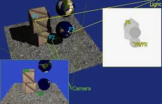
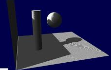
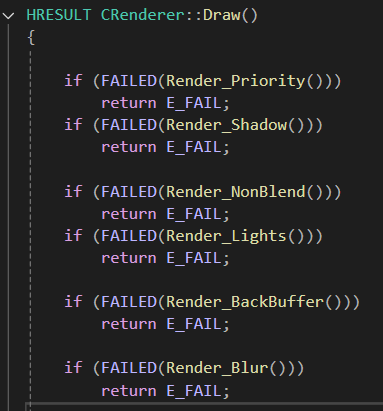
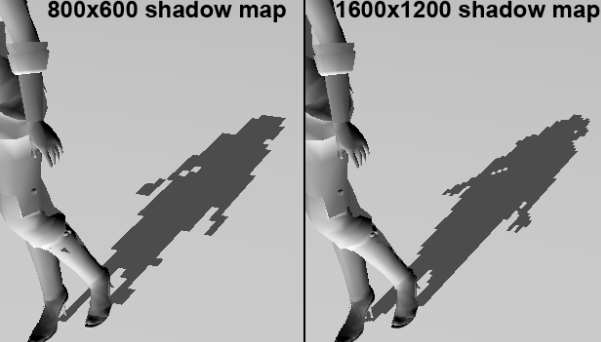
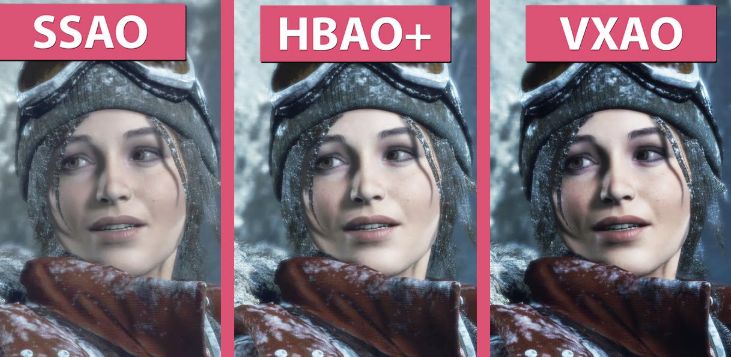
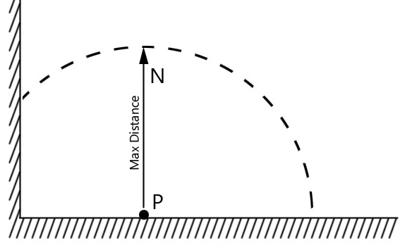
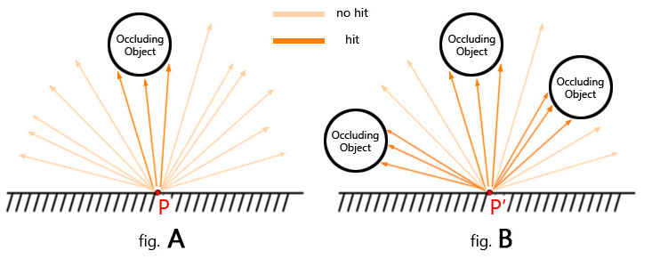
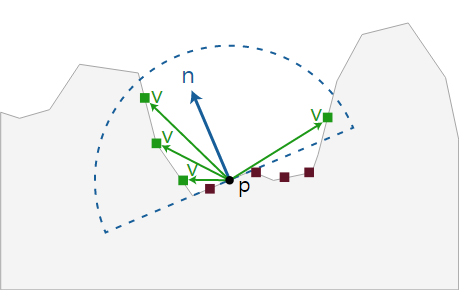
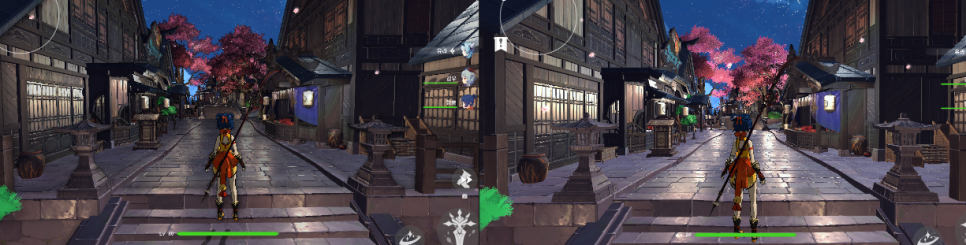

<!-- ===========================================================================
  그림자 매핑 & SSAO — 케이스 스터디 본문
  출처: 개인 블로그(ridas_) 섀도우 매핑 / SSAO 글 → 포트폴리오 톤 재작성.
  방침: 1인칭 경험담 톤(했습니다/구현했습니다). 강의체·이모지 지양. 담백·명확.
  이미지: content/works/img/16-shadow-ssao/ (01~09).
  참고: 인라인 study에서 studyMd로 이관하며 SSAO 핵심 HLSL 코드 추가.
=========================================================================== -->

직접광 명암만으로는 장면이 평면적으로 보입니다. 빛에 가려 생기는 그림자와 구석·틈에서 간접광이 차단되어 생기는 미묘한 음영(AO)을 더해 입체감을 살렸습니다. 둘 다 깊이(뎁스) 정보를 활용하는 기법입니다.

## 1. 그림자 — 빛 시점의 깊이 비교

그림자의 규칙은 둘입니다. ① 빛의 반대 방향으로 생기고, ② 빛이 가로막힌 모든 픽셀이 어두워져야 합니다. ②번이 까다롭습니다. 그림자 방향에 다른 물체가 있으면 그 물체도 어두워져야 하니까요.





해법은 섀도우 매핑입니다. 빛의 방향에서 장면을 바라보는 카메라로 깊이 버퍼를 한 장 찍습니다. 그리고 기존 화면의 각 픽셀을 같은 빛 공간으로 변환해 '빛에서 본 깊이'와 비교합니다. 기존 픽셀이 더 멀면(=빛이 다른 것에 먼저 막혔으면) 그 픽셀은 그림자 안이므로 곱셈으로 어둡게 칠합니다.



비교를 위해 기존 깊이값을 NDC → 월드로 역변환한 뒤 다시 빛의 뷰·투영 행렬을 곱해 '빛에서 본 공간'으로 끌고 옵니다. 이를 UV 좌표로 바꿔 섀도우 맵을 샘플링하고 깊이를 비교합니다.



## 2. SSAO — 화면 공간 간접광 차단

AO(앰비언트 오클루전)는 빛이 직접 닿지 않는 구석을 어둡게 만들어 입체감을 더합니다. 'SS'가 붙으면 화면 공간(Screen Space)에서, 즉 화면에 보이는 픽셀만 계산해 부하를 줄인다는 뜻입니다.









### 뷰 공간에 재료를 저장한다

정확한 거리 비교가 관건이었습니다. 투영 이후에는 원근 때문에 W 나누기가 수행되어 물체 간 거리가 왜곡되므로, 뷰 공간의 노말·포지션·깊이를 렌더 타겟에 따로 저장해 두고 SSAO 계산에 썼습니다. 지오메트리 패스에서 이 값들을 렌더 타겟에 담습니다.

```hlsl
// 지오메트리 패스 — 뷰 공간 노말·포지션·깊이를 렌더 타겟에 저장
float3 vNormal = g_NormalTexture.Sample(DefaultSampler, In.vTexcoord).xyz * 2.f - 1.f;
float3x3 WorldMatrix = float3x3(In.vTangent.xyz, In.vBinormal.xyz, In.vNormal.xyz);
vNormal = mul(vNormal, WorldMatrix);        // 이후 뷰 행렬을 곱해 뷰 공간 노말로

Out.vNormal = vector(vNormal.xyz * 0.5f + 0.5f, 0.f);
Out.vDepth  = vector(In.vProjPos.z / In.vProjPos.w, In.vProjPos.w / 500.0f, 0.f, 0.f);
Out.vPickPos = In.vWorldPos;                // 뷰 공간 포지션(비교용 z 포함)
```

### 반구 샘플 커널을 미리 만든다

SSAO는 픽셀을 기준으로 노말 방향의 반구 안을 여러 방향으로 찔러 봐야 합니다. 그래서 반구로 뻗는 방향 벡터 16개를 렌더러 초기화 때 미리 만들어 셰이더에 넘겼습니다. z가 음수가 되지 않게 막고, 가까운 샘플이 촘촘하도록 제곱 LERP로 분포시켰습니다.

```cpp
/* [ SSAO 반구 샘플 커널 16개 ] */
m_SampleKernel.reserve(16);
for (int i = 0; i < 16; ++i)
{
    XMFLOAT3 sample;
    sample.x = m_pGameInstance->Compute_Random(-1.f, 1.f);
    sample.y = m_pGameInstance->Compute_Random(-1.f, 1.f);
    sample.z = m_pGameInstance->Compute_Random(0.f, 1.f);   // 반구라 z는 양수만

    XMVECTOR v = XMVector3Normalize(XMLoadFloat3(&sample));
    XMStoreFloat3(&sample, v);

    float scale = float(i) / 16.f;
    scale = LERP(0.1f, 1.0f, scale * scale);                // 가까운 샘플을 촘촘하게
    sample.x *= scale; sample.y *= scale; sample.z *= scale;

    m_SampleKernel.push_back(sample);
}
```

### 픽셀마다 방향을 정렬하고 폐색을 누적한다

미리 만든 방향 벡터는 로컬 기준이라 픽셀마다 뷰 공간 노말에 맞춰 돌려 줘야 합니다. 픽셀의 뷰 공간 노말로 TBN 행렬을 만들어 방향을 정렬합니다.

```hlsl
// 반구 방향을 픽셀의 뷰 공간 노말에 맞춰 정렬
float3 up = abs(vViewNormal.y) < 0.999f ? float3(0,1,0) : float3(1,0,0);
float3 T   = normalize(cross(up, vViewNormal));
float3 B   = cross(vViewNormal, T);
float3x3 TBN = float3x3(T, B, vViewNormal);
```

그다음 각 방향을 따라간 위치를 NDC → UV로 변환해 그 지점의 뎁스를 읽고, 실제 픽셀 깊이와 비교합니다. 더 앞에 면이 있으면 폐색값을 누적합니다. 반복문은 `[unroll]`로 펼쳐 픽셀 셰이더 연산을 빠르게 했고, 화면 가장자리를 벗어나는 샘플은 예외 처리했습니다.

```hlsl
[unroll]
for (int i = 0; i < sampleCount; ++i)
{
    // 샘플 방향을 노말 기준으로 회전 → 반구 위 샘플 위치
    float3 rotatedDir = mul(g_AOSampleVectors[i], TBN);
    float3 samplePos  = vViewPosition + rotatedDir * radius;

    // 뷰 공간 → Clip → UV (NDC와 UV는 Y가 반대라 반전)
    float4 clip = mul(float4(samplePos, 1.0f), g_ProjMatrixSSAO);
    clip /= clip.w;
    float2 sampleUV = clip.xy * 0.5f + 0.5f;
    sampleUV.y = 1.0f - sampleUV.y;

    // 화면 밖 샘플은 제외
    if (sampleUV.x < 0.01f || sampleUV.x > 0.99f ||
        sampleUV.y < 0.01f || sampleUV.y > 0.99f) continue;

    // 그 지점의 저장된 깊이 vs 샘플 위치의 깊이 비교
    float sampleViewZ = g_Depth.Sample(g_LinearSampler, sampleUV).z;
    float depthDiff   = abs(fViewZ - sampleViewZ);
    float rangeCheck  = exp(-depthDiff * depthDiff * 5.f);   // 차이 작으면 1, 크면 0
    float occluded    = (sampleViewZ < samplePos.z) ? 1.0f : 0.0f;

    occlusion += occluded * rangeCheck;
}
```

반지름(`radius`)으로 반구의 크기를, 샘플 수로 방향 개수를 조절합니다. 저는 반지름 0.5, 샘플 16개로 타협했습니다. 값 차이가 작을수록 1에 가깝게 감쇄(가우시안)를 걸어 경계를 부드럽게 했습니다.



작업 내내 큰 도움이 된 건 SSAO 렌더 타겟을 화면에 특대형 디버그 창으로 띄워 실시간으로 확인한 것입니다. 계산이 어디서부터 틀어졌는지 곧바로 보이니, 곱셈 블렌딩으로 바로 합성했다면 원인을 못 찾았을 문제를 여러 번 빠르게 잡을 수 있었습니다.
