<!-- ===========================================================================
  언리얼 커스텀 셰이딩 모델 추가 — 케이스 스터디 본문
  출처: 개인 블로그(ridas_) "커스텀 셰이딩 모델 추가" → 포트폴리오 톤 재작성.
  방침: 1인칭 경험담 톤(했습니다/구현했습니다). 강의체·이모지·구어 슬랭 지양.
        택배 배송 비유는 원문의 핵심 설명 장치라 유지하되 담백하게 정리.
        실제 코드 식별자(MSM_Dongha, DonghaShader, DonghaOffset, ToonBxDF 등)는 그대로.
  이미지: content/works/img/18-unreal-shadingmodel/ (원문 스크린샷 01~46 보관, 아래는 선별).
=========================================================================== -->

궁극적인 목표는 언리얼 엔진의 소스코드를 직접 손대 그래픽 작업에 맞게 최적화하고 커스터마이징하는 것입니다. 그 기초가 되는 작업이 **엔진에 나만의 셰이딩 모델을 추가하는 것**이라 판단해 직접 구현해 봤습니다. 언리얼 페스트 2023에서 커스텀 셰이딩 모델 세션을 보고 계속 만들어 보고 싶었던 주제입니다.

{w=560}

선행 작업으로 언리얼 엔진 소스코드를 빌드해 에디터를 직접 띄워 두는 과정이 필요합니다. 이 글은 그 소스코드를 이용해 엔진 내부를 실제로 고치는 단계입니다.

머티리얼 에디터에서 넣은 정보가 HLSL까지 전달되는 흐름이 택배 배송과 비슷하다고 생각해 그렇게 설명합니다. 정보를 포장해서 주소지로 보내고 도착지에서 열어 처리하는 구조입니다.

## 1. 셰이딩 모델을 하나 새로 선언한다

가장 먼저 엔진의 `EngineTypes.h`를 찾아 셰이딩 모델 종류가 정의된 `EMaterialShadingModel` enum에 내 모델을 추가했습니다. 택배로 치면 **등기·일반우편 같은 "택배의 종류"를 하나 새로 만드는 단계**입니다.

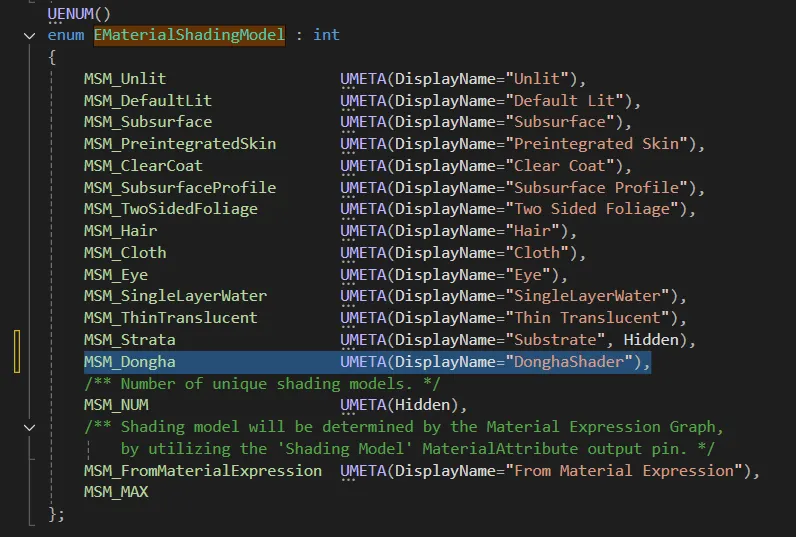{w=560}

기존 enum의 넘버링이 틀어지지 않도록 **맨 마지막에** 추가하는 것이 안전합니다. 언리얼은 enum에 UMETA 메타데이터를 붙여 값을 기준으로 정보를 넘길 수 있어서, DisplayName만 지정하면 머티리얼 에디터에도 그대로 노출됩니다.

이어서 이 셰이딩 모델을 "쓰는지 아닌지"를 담는 플래그를 **1비트 비트필드(`uint8 : 1`)** 로 선언했습니다. 굳이 1비트까지 아낀 이유가 있습니다.

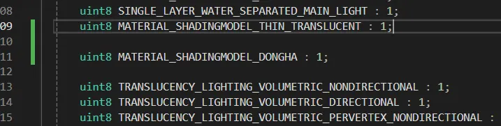{w=560}

이 정보는 CPU에서 GPU로 매 프레임 계속 전달됩니다. 전달할 데이터가 커질수록 비용이 늘고, 실제로 행렬을 GPU로 넘기는 작업이 상당히 무겁습니다. 참/거짓만 확인하면 되는 값에 1바이트(8비트)를 쓸 이유가 없어 1비트로 눌러 담았습니다.

## 2. 에디터에 노출하고 디버깅 훅을 단다

다음은 이 택배가 잘 가고 있는지 추적할 수 있도록 표시를 다는 작업입니다.

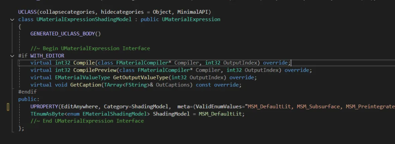{w=560}

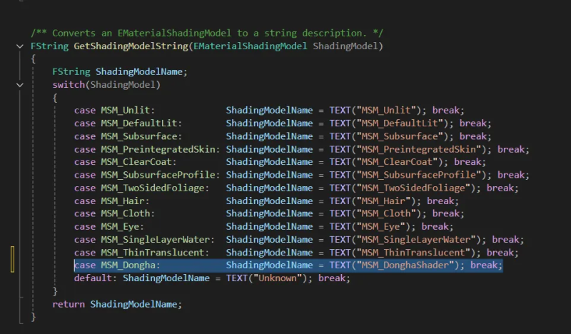{w=560}

또 빛을 계산하는 셰이더인지 아닌지를 가르는 분기가 있습니다. `MSM_Unlit`은 빛 계산을 건너뛰는 쪽이고, 빛을 계산하는 모델이라면 `MSM_DefaultLit` 쪽에 넣어 줍니다. 제 모델은 빛을 계산하므로 그쪽에 `MSM_Dongha`를 추가했습니다.

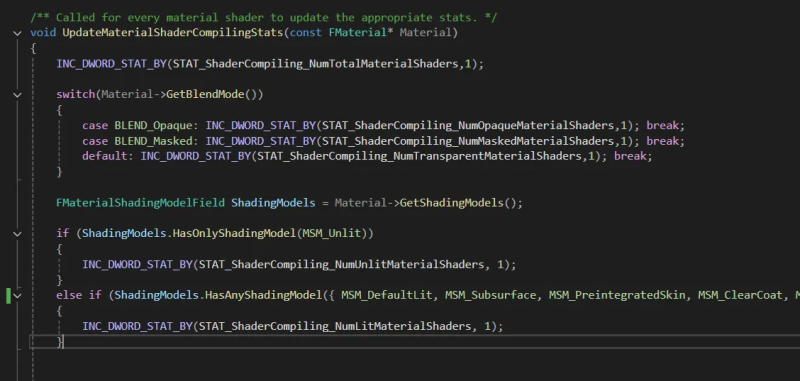{w=560}

## 3. 커스텀 데이터 핀을 열어 GPU로 값을 싣는다

툰 룩을 조절하려면 머티리얼에서 값을 두 개 받아야 합니다. 언리얼은 셰이딩 모델별로 `CustomData0`, `CustomData1` 두 개의 커스텀 핀을 열어 줄 수 있습니다. 머티리얼 에디터에서 옵션을 고를 때 핀이 활성화·비활성화되는 그 동작을 내 모델에도 연결했습니다.

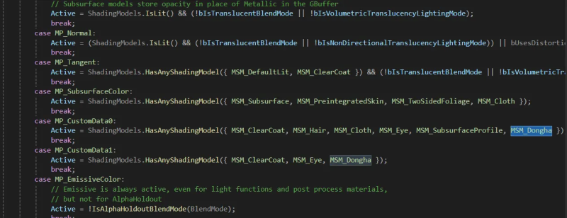{w=560}

핀 이름도 지정했습니다. 사용자가 `CustomData0`이라는 이름만 보면 무슨 값인지 알 수 없으니, 옵션이 켜졌을 때 보일 이름을 붙였습니다. 저는 각각 `DonghaSpecular`, `DonghaOffset`으로 지정했습니다.

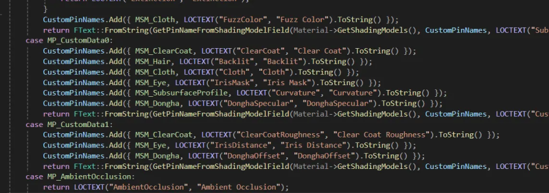{w=560}

그리고 들어온 커스텀 데이터를 어떻게 실을지 정합니다. `CustomData0`, `CustomData1`에 담긴 float 값을 각각 x·y로 묶어 `float4` 형태로 셰이더에 넘기도록 했습니다.

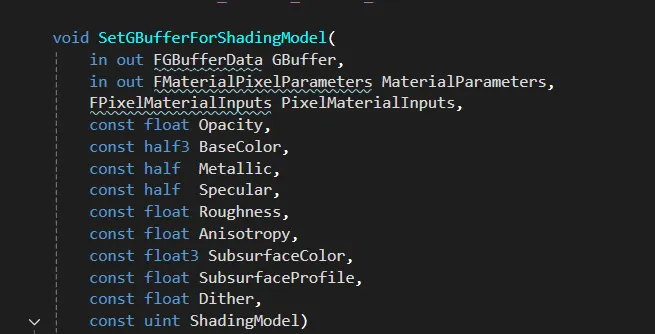{w=560}

머티리얼을 쓰지 않을 때를 대비한 초기화도 넣었습니다. 사용되지 않으면 값이 0으로, 사용되면 1로 생성되도록 플래그를 초기화해 두면 안전합니다.

## 4. GBuffer로 주소를 지정해 발송한다

포장을 마쳤으니 **어디로 보낼지**를 정할 차례입니다. 이 색상이 최종적으로 그려질 곳은 GBuffer이므로, 내 모델에 렌더타겟 번호표를 부여해 "이 렌더타겟에 그려질 택배"라고 표시했습니다.

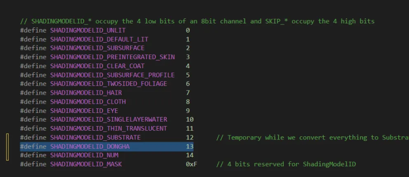{w=560}

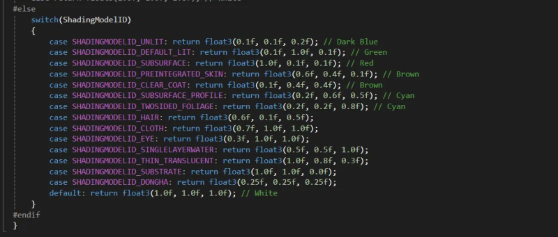{w=560}

이제 실제 발송입니다. `DetermineUsedMaterialSlots`에서 내 모델을 렌더타겟으로 내보냅니다. 보통은 디퓨즈·스펙큘러·노멀 정도만 내보내지만, 제 모델은 **커스텀 렌더타겟에도 그려져야** 하므로 커스텀 데이터를 다룬다는 설정을 함께 켰습니다.

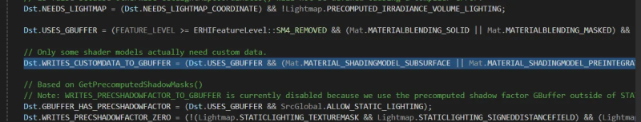{w=560}

## 5. HLSL에서 택배를 받아 연다 — ToonBxDF

여기서부터는 GPU 쪽입니다. 택배가 도착하면 HLSL 셰이더가 라벨부터 확인합니다. GBuffer의 셰이딩 모델 ID가 DONGHA면 `switch` 문에서 `SHADINGMODEL_DONGHA`로 분기하고, 그 내용물이 제 셰이딩 함수 `ToonBxDF`로 들어갑니다.

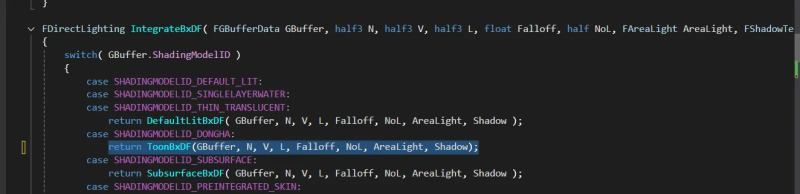{w=560}

`ToonBxDF`는 아래처럼 구성했습니다. NoL을 다시 매핑해 명암 범위를 넓히고, 커스텀 데이터로 받은 스페큘러 범위·오프셋으로 툰 특유의 단계 음영과 하이라이트를 만듭니다. 셰이딩 공식 자체는 호요버스류 툰을 참고한 공개 구현을 바탕으로 정리했습니다.

https://zhuanlan.zhihu.com/p/404857208

```hlsl
FDirectLighting ToonBxDF(FGBufferData GBuffer, half3 N, half3 V, half3 L, float Falloff, float NoL, FAreaLight AreaLight, FShadowTerms Shadow)
{
#if GBUFFER_HAS_TANGENT
    half3 X = GBuffer.WorldTangent;
    half3 Y = normalize(cross(N, X));
#else
    half3 X = 0;
    half3 Y = 0;
#endif

    BxDFContext Context;
    Init(Context, N, X, Y, V, L);
    SphereMaxNoH(Context, AreaLight.SphereSinAlpha, true);
    Context.NoV = saturate(abs(Context.NoV) + 1e-5);

    float SpecularOffset = 0.5;
    float SpecularRange = GBuffer.CustomData.x;

    float3 ShadowColor = 0;
    ShadowColor = GBuffer.DiffuseColor * ShadowColor;
    float offset = GBuffer.CustomData.y;
    float SoftScatterStrength = 0;

    offset = offset * 2 - 1;
    half3 H = normalize(V + L);
    float NoH = saturate(dot(N, H));
    NoL = (dot(N, L) + 1) / 2; // NoL을 다시 매핑해 명암 범위 확보
    half NoLOffset = saturate(NoL + offset);

    FDirectLighting Lighting;
    Lighting.Diffuse = AreaLight.FalloffColor * (smoothstep(0, 1, NoLOffset) * Falloff) * Diffuse_Lambert(GBuffer.DiffuseColor) * 2.2;

    float InScatter = pow(saturate(dot(L, -V)), 12) * lerp(3, .1f, 1);
    float NormalContribution = saturate(dot(N, H));
    float BackScatter = GBuffer.GBufferAO * NormalContribution / (PI * 2);

    Lighting.Specular = ToonStep(SpecularRange, (saturate(D_GGX(SpecularOffset, NoH)))) * (AreaLight.FalloffColor * GBuffer.SpecularColor * Falloff * 8);

    float3 TransmissionSoft = AreaLight.FalloffColor * (Falloff * lerp(BackScatter, 1, InScatter)) * ShadowColor * SoftScatterStrength;
    float3 ShadowLightener = (saturate(smoothstep(0, 1, saturate(1 - NoLOffset))) * ShadowColor * 0.1);

    Lighting.Transmission = (ShadowLightener + TransmissionSoft) * Falloff;
    return Lighting;
}
```

이 함수를 기존 `DefaultLitBxDF` 아래에 구현했습니다. 여기서 얻은 설계 포인트가 하나 있습니다. **툰 셰이딩 공식을 `.usf` 파일로 함수화해 빼 두면** 구조는 그대로 두고 공식만 외부 파일에서 불러와 언제든 바꿀 수 있습니다. 매번 엔진을 다시 빌드하지 않아도 되니 반복 시간이 크게 줄고 유지보수가 편해집니다.

## 6. 빌드와 결과

엔진 소스를 고쳤으니 UE5를 따로 빌드해야 할 것 같지만, 제 게임 프로젝트(DonghaEngine)를 빌드하면 엔진까지 함께 빌드되므로 별도 빌드는 필요 없습니다.

빌드하고 나면 머티리얼의 Shading Model 탭에 제가 만든 `Dongha` 모델이 실제로 생깁니다.

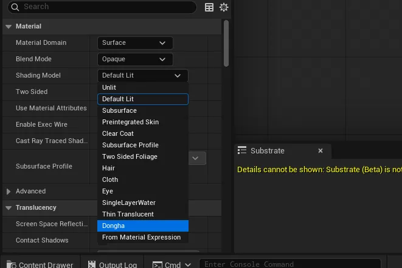{w=420}

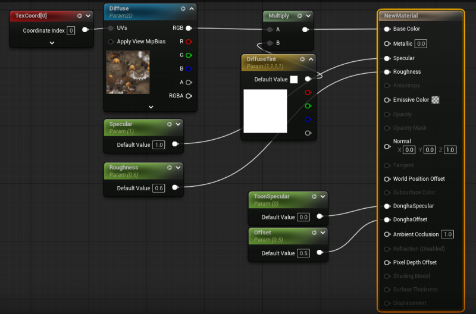{w=560}

보스 몬스터에 이 셰이딩 모델을 적용해 봤습니다. 베이스 컬러만 연결한 상태인데도 툰 룩이 상당히 잘 나왔습니다.

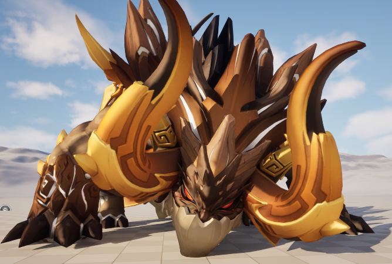{w=560}

## 7. 외곽선을 얹어 마무리

여기에 이전에 만들어 둔 셀 셰이딩 외곽선 포스트프로세스를 연결했습니다. 씬 뎁스 기반으로 경계를 잡는 PP 머티리얼입니다.

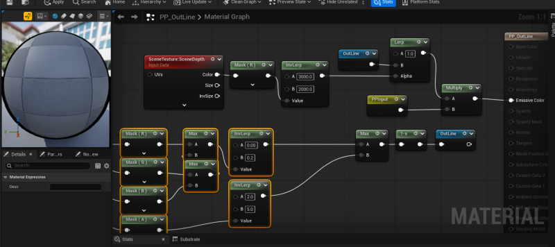{w=560}

전에는 툰 셰이딩 자체를 포스트프로세스 안에서 처리했지만, 이번에는 셰이딩 모델과 외곽선을 따로 만들어 합치는 구조라 외곽선 쪽을 조금 손봤습니다. 그렇게 완성한 최종 결과입니다.

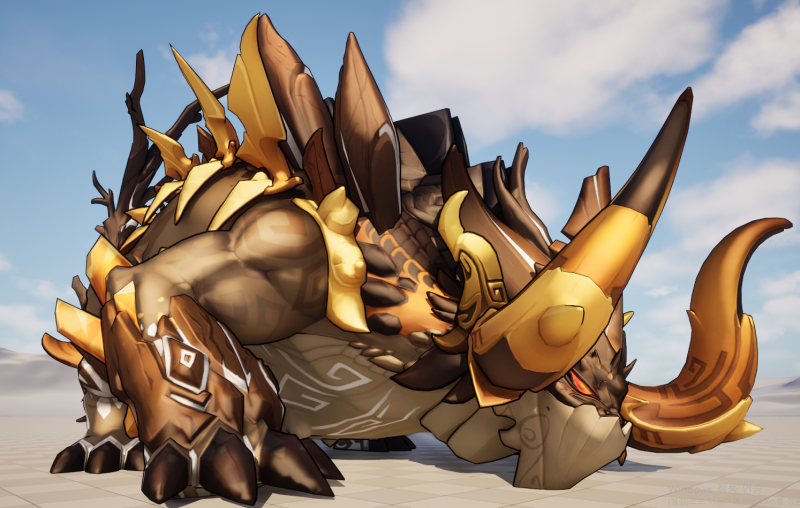{w=640}

## 정리

머티리얼 에디터의 값이 GPU 셰이딩까지 도달하는 전 과정을 직접 손대 본 작업입니다. 흐름을 택배 배송으로 요약하면 이렇습니다.

- **택배 종류 등록** → `EMaterialShadingModel` enum에 `MSM_Dongha` 추가, 사용 여부는 1비트로 최소화.
- **포장·주소 지정** → 커스텀 데이터 핀(`DonghaSpecular`·`DonghaOffset`)을 float4로 싣고 GBuffer 렌더타겟에 발송.
- **도착·개봉** → HLSL에서 셰이딩 모델 ID로 분기해 `ToonBxDF`로 조명·색을 계산.

핵심은 두 가지였습니다. 첫째, CPU→GPU로 매 프레임 오가는 데이터라 비트 단위까지 아꼈다는 것. 둘째, 셰이딩 공식을 `.usf`로 외부화해 엔진 재빌드 없이 룩을 조정할 수 있게 구조를 잡았다는 것입니다. 더 정밀한 룩 개발(룩뎁)은 이 구조 위에서 이어 갈 예정입니다.

{w=640}

## 참고 자료

- 작업의 출발점 — 언리얼 페스트 2023 커스텀 셰이딩 모델 세션(본문 상단 영상)
- `ToonBxDF` 셰이딩 공식 — [공개 구현(知乎)](https://zhuanlan.zhihu.com/p/404857208)을 바탕으로 정리했습니다.
- `D_GGX`·`Diffuse_Lambert` 등 함수 안에서 호출하는 함수는 언리얼 엔진 소스에 있는 것을 그대로 썼습니다.
- 작업 원문 — [커스텀 셰이딩 모델 추가](https://blog.naver.com/ridas_/224075960293) · [엔진 소스 빌드](https://blog.naver.com/ridas_/224075759324) · [셀 셰이딩 외곽선](https://blog.naver.com/ridas_/224048637608)

<!-- ── 참고 링크 ─────────────────────────────────
  원문: https://blog.naver.com/ridas_/224075960293
  선행(엔진 소스 빌드): https://blog.naver.com/ridas_/224075759324
  외곽선(셀셰이딩): https://blog.naver.com/ridas_/224048637608
  ToonBxDF 참고 구현: https://zhuanlan.zhihu.com/p/404857208
  ── 추가로 쓸 수 있는 스크린샷(폴더에 01~46 보관) ───────────
   03/04 비트필드, 06/07 문자열, 09/10 핀 분기, 12/13 핀이름,
   15~19 머티리얼 포장·초기화, 20~26 GBuffer 발송, 27~35 커스텀 버퍼,
   36/37 HLSL 분기, 38 빌드, 43 외곽선 최종컷
========================================================================= -->
