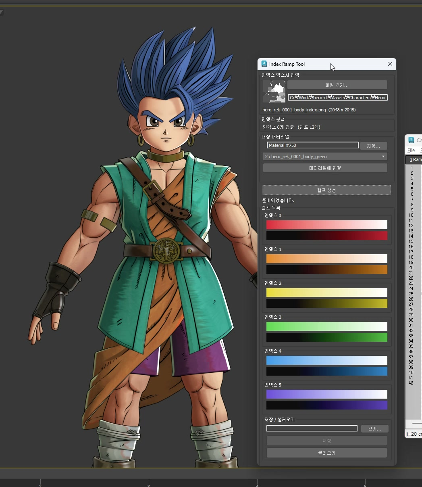
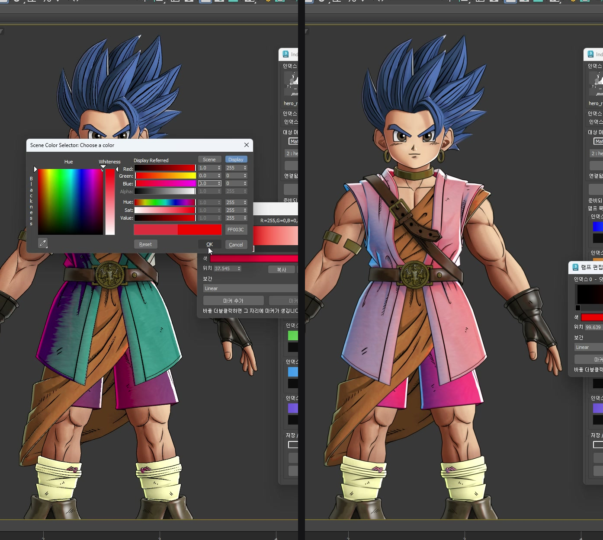
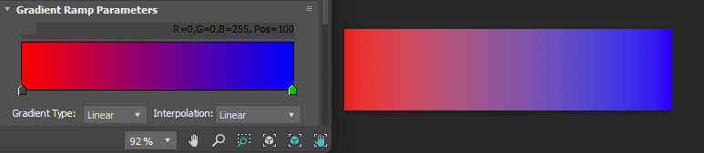
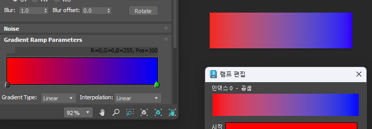
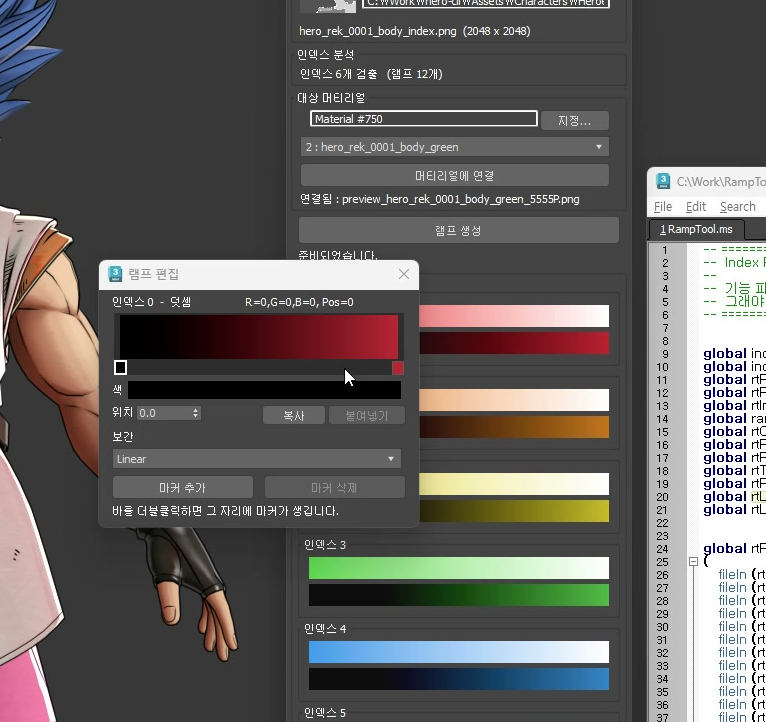
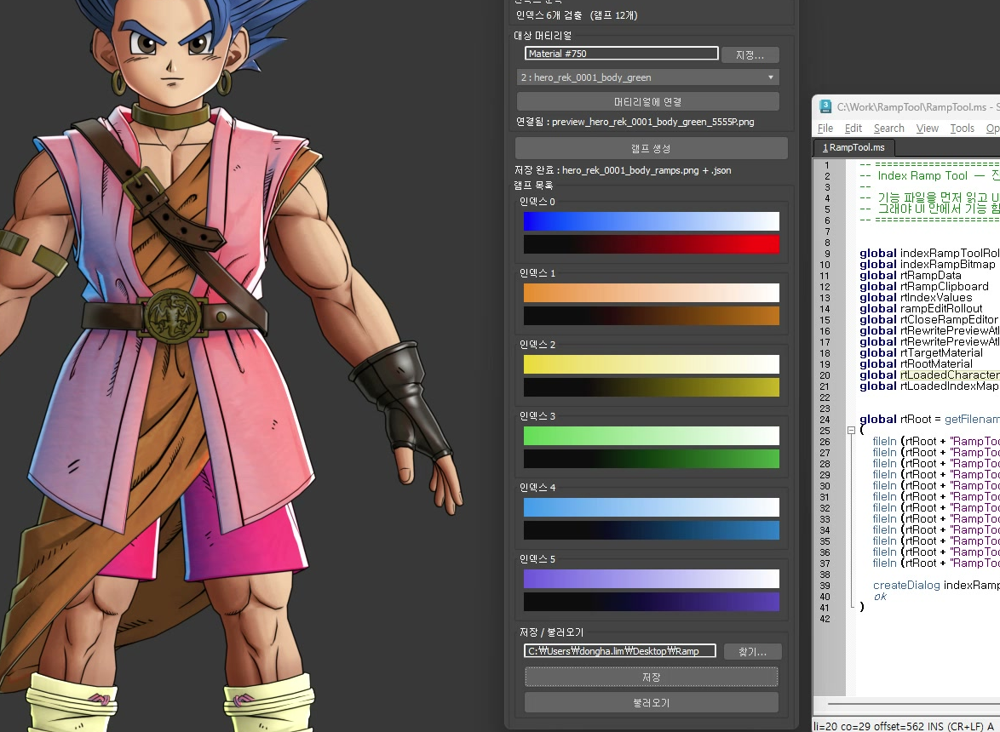
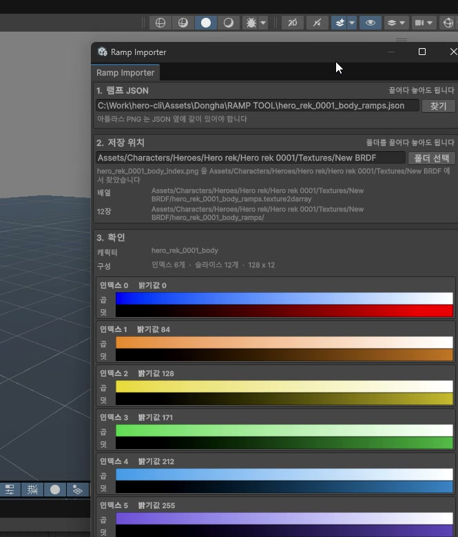
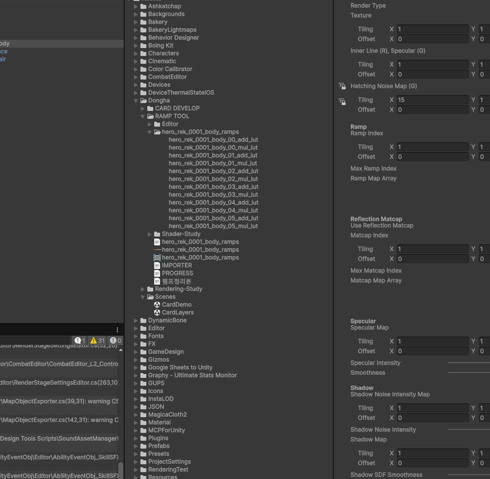
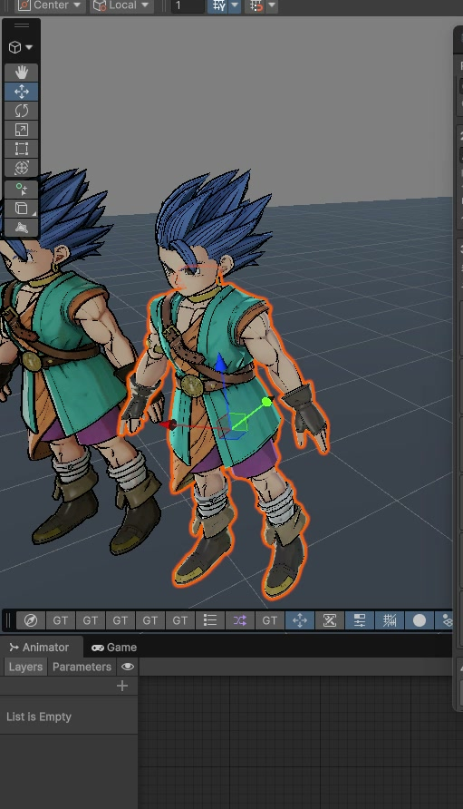

<!-- ===========================================================================
  인덱스 램프 툴 — 케이스 스터디 본문
  출처: 작업 폴더의 진행 문서 (PROGRESS.md 1,942줄 / IMPORTER.md 587줄 /
        Shader-Study 3종 / 램프정리본.md) 를 Claude가 읽고 정리.
  ※ 수치·경위는 전부 문서에 기록된 실측값입니다. 임의로 만든 값 없음.
  ※ 이미지 자리는 본문 곳곳에 "이미지:" 주석으로 표시해 뒀습니다. 캡처를 받으면 채웁니다.
=========================================================================== -->



## 1. 배경 — 색을 정하는 곳과 볼 수 있는 곳이 달랐습니다

먼저 램프맵은 **가로로 긴 그라데이션 한 줄짜리 이미지**입니다. `128 x 1` 픽셀의 가로로 한 줄뿐인 텍스처입니다. 왼쪽 끝이 빛을 못 받는 그늘 색이고 오른쪽으로 갈수록 밝아집니다.

셰이더는 픽셀마다 빛을 얼마나 받는지를 계산한 다음 **그 밝기로 램프의 가로 위치를 정해 색을 꺼냅니다.** 그늘이면 왼쪽 색을 밝으면 오른쪽 색을 씁니다. 빛의 세기를 색으로 바꿔 주는 변환표라고 보면 됩니다. 툰 셰이딩에서 그늘이 검정이 아니라 붉거나 푸른 색조로 떨어지는 것이 이 표 때문입니다.

```
램프 한 장 = 128 x 1 픽셀

   그늘 ────────────────────────▶ 빛
   [ 어두운 색조 ][ 중간색 ][   흰색   ]
              ▲
     이 픽셀이 이만큼 밝다 → 여기 색을 쓴다
```

그런데 표가 하나뿐이면 몸도 머리카락도 눈도 전부 같은 색조로 떨어집니다. 부위마다 다른 표를 쓰게 하려고 **인덱스 맵**을 씁니다. 캐릭터 텍스처와 같은 자리에 맞춰 놓은 흑백 그림인데 부위마다 정해진 회색값으로 칠해 둡니다. 셰이더는 픽셀을 그릴 때 이 그림에서 회색값을 읽고 **몇 번 표를 쓸지** 정합니다.

```
인덱스 맵의 회색값        쓰는 램프
    0   몸        →    0번
    84  머리카락   →    1번
    128 눈        →    2번
```

여기에 한 가지가 더 붙습니다. **표 한 장이 아니라 두 장이 한 쌍**입니다. 하나는 곱하는 표로 그늘의 색조를 정하고 다른 하나는 더하는 표로 피부가 붉게 비쳐 보이는 느낌을 얹습니다. 곱셈만으로는 어두운 곳을 밝게 만들 수 없어서 더하는 쪽이 따로 있습니다. 안 쓰는 부위는 검정을 넣어 두면 아무 일도 일어나지 않습니다.

그래서 **부위가 6개면 램프는 12장**이 됩니다.

문제는 이 12장을 만드는 과정이었습니다. 아티스트는 포토샵에서 `128×1` 픽셀짜리 그라데이션을 한 장씩 그리고 곱·덧 순서와 `_MaxRampIndex` 계수 그리고 압축 설정 같은 규칙을 직접 맞춰야 했습니다. 인덱스 맵의 회색값도 셰이더 공식이 나누는 칸 안에 정확히 들어가야 하는데 이건 눈에 보이지 않는 정보라 맞는지 틀리는지 알 방법이 없었습니다.

그리고 더 근본적인 문제가 있었습니다. **아트 컨펌은 3ds Max에서 납니다.** 그런데 Max에서 쓰는 DirectX Shader는 텍스처 배열을 읽지 못합니다. 그래서 Max 뷰포트에서는 인덱스별로 다른 램프가 적용된 모습을 볼 수가 없었고 색 하나를 바꾸려면 유니티까지 넘어가서 확인하고 다시 돌아오는 왕복이 계속 생겼습니다.

## 2. 설계 — 툴을 Max에 두고 안 보이던 정보를 눈에 보이게 했습니다

컨펌이 Max에서 나므로 툴도 Max에 있어야 한다고 봤습니다. 동선은 이렇게 잡았습니다.

```
1. 창에 인덱스 텍스처를 넣는다
2. 넣는 즉시 인덱스 개수를 검출하고 128 x N 아틀라스를 굽는다
3. 각 인덱스에 빨강·주황·노랑·초록·파랑·보라를 자동으로 넣는다
4. 머티리얼에 연결하면 뷰포트에 부위별 색이 그대로 보인다
5. 램프를 편집하면 그 줄만 다시 구워 뷰포트가 즉시 바뀐다
```

3번이 이 툴에서 제일 마음에 드는 부분입니다. 지금까지 인덱스는 눈에 안 보이는 정보였습니다. 자동으로 구분색을 넣으면 **모델을 보는 순간 어디가 몇 번인지 바로 보입니다.** 순서를 정하는 노동도 사라집니다. 인덱스 맵이 이미 순서를 가지고 있으니 아티스트는 해당 부위에 색만 보면 됩니다.

작업에 들어가기 전에 해결해야 할 문제 하나가 생겼습니다. "PNG를 덮어쓰면 Max 뷰포트가 갱신되는가"입니다. 이게 안 되면 실시간 편집이라는 전제 자체가 무너지므로 먼저 실험 스크립트로 확인했습니다. 결과는 통과였고 파일 변경 자동 감지에 맡기지 말고 저장 직후 `reload()`를 직접 불러 주면 눈에 띄게 빨라진다는 것까지 확인했습니다.



## 3. Max의 보이지 않는 감마 보정

툴을 만들고 나서 아티스트가 포토샵에서 쓰던 색과 비교했는데 맞지 않았습니다. 이유를 찾다 보니 램프를 조절하다 **Max가 화면에 그릴 때와 파일로 쓸 때 각각 한 번씩 더 밝게 만든다**는 문제를 발견했습니다.

| 경로 | 원인 | 결과 |
|---|---|---|
| 파일 | 전역 `fileOutGamma = 2.2` | `194, 153, 208` |
| 화면 | `imgTag` 컨트롤이 자체적으로 `^(1/2.2)` 를 씌움 | `194, 154, 210` |

두 지수가 정확히 `1/2.2`였습니다. 여기서 걸린 함정은 **Max의 감마 설정값을 봐도 이걸 알 수 없다**는 것입니다. `displayGamma` 전역값도 색 관리 대화상자도 `1.0`인데 화면 컨트롤은 그것과 무관하게 감마를 씌웁니다. 설정을 읽지 말고 화면을 캡처해서 직접 스포이드로 찍어야 알 수 있었습니다.

그 뒤로는 색이 이상하면 세 군데를 갈라서 봅니다. 먼저 비트맵 픽셀값을 직접 재서 계산이 맞는지 보고 저장한 PNG를 외부 프로그램으로 열어 파일 감마를 확인하고 마지막으로 화면을 캡처해 스포이드로 찍어 화면 감마를 봅니다. 세 값이 다르면 원인도 각각 다른 것이고 하나로 뭉뚱그리면 못 찾습니다.


## 4. 그라디언트 맵의 색공간 — 여러 가지 보간 방법

램프는 마커와 마커 사이를 코드가 채워서 만듭니다. 그 사이를 어떤 방식으로 채우느냐가 색을 정합니다.

처음에는 RGB 값을 그대로 섞었습니다. 그런데 빨강에서 파랑으로 가는 램프를 만들어 보니 가운데가 탁하게 죽었습니다. 아티스트가 포토샵에서 만든 것과 눈에 띄게 달랐습니다.



원인은 RGB의 세 축이 **색과 밝기를 같이 들고 있다**는 데 있습니다. 빨강 `(255, 0, 0)`과 흰색 `(255, 255, 255)`을 섞으면 초록과 파랑이 같이 올라갑니다. 중간으로 갈수록 채도가 떨어져 탁해지는 것이 이 때문입니다.

포토샵은 OKLab으로 섞습니다. OKLab은 축을 **밝기 하나와 색조 둘**로 나눠 둔 색 공간이라 섞어도 밝기와 색조가 서로를 밀지 않습니다.

https://bottosson.github.io/posts/oklab/

눈 안에는 긴 파장과 중간 파장 그리고 짧은 파장에 반응하는 원추세포 세 종류가 있습니다. 그리고 빛의 양이 8배가 되어도 8배 밝다고 느끼지 않습니다. 실제 값이 `1 → 8 → 27`로 갈 때 사람은 `1 → 2 → 3`으로 느낍니다. 세제곱 관계입니다. OKLab은 이 관계를 세제곱근으로 넣어 계산합니다.

그래서 변환은 네 단계가 됩니다.

- 화면에 찍힌 값을 실제 빛의 양으로 되돌린다
- 빛의 양에서 원추세포 세 종류에 해당하는 값을 구한다
- 세제곱근을 씌워 사람이 느끼는 정도에 맞춘다
- 밝기 하나와 색조 둘이 나온다

원저자가 공개한 공식을 그대로 옮겨 램프 굽는 코드에 넣었습니다. 변환 과정은 따로 글로 정리해 뒀습니다.

https://blog.naver.com/ridas_/224391843068



## 5. 반쯤 성공한 상태를 남기지 않았습니다

저장 파일을 불러올 때 머티리얼을 씬에서 못 찾는 경우를 처음에는 부드럽게 처리했습니다. 칸에 "씬에서 못 찾음"이라고만 적고 램프는 그대로 불러왔습니다.

머티리얼에 연결까지 되어서 바로 수정하는 것이 이 툴의 목적인데 머티리얼이 없으면 편집해도 뷰포트에 안 보입니다. 게다가 그 상태로 저장하면 배선 정보가 빈 값으로 덮여 조용히 사라집니다.

그래서 불러오기를 **하드 실패**로 바꾸고 순서도 같이 정리했습니다.

```
파일 고르기 → 파싱 → 머티리얼 찾기 ← 여기서 실패하면 중단. 화면은 그대로
           → "목록이 사라집니다" 확인 → 적용
```



## 6. 드래그하는 동안 뷰포트가 따라오게 — 26ms에서 5ms로

마커를 끄는 동안 색이 실시간으로 따라오게 만들려니 굽는 비용이 걸렸습니다. 추측하지 않고 나눠서 쟀습니다.

| 항목 | 시간 |
|---|---|
| 전체 아틀라스 굽기 12줄 | 26.0 ms |
| ├ 색 계산 | **22.65 ms · 89%** |
| └ PNG 저장 | 2.7 ms |
| 사본을 떠서 한 줄만 고치기 | 19.8 ms |
| **메모리에 올려두고 한 줄만 고치기** | **4.95 ms** |

색 계산이 89%였습니다. 마커 하나를 움직이면 실제로 바뀌는 것은 그 램프 한 줄뿐인데 12줄을 전부 다시 계산하고 있었던 것입니다. 그래서 드래그를 시작할 때 전체를 한 번 구워 메모리에 올려 두고 움직이는 동안에는 그 줄만 고쳐 저장합니다.

전역에 비트맵을 들고 있으면 누수가 걱정되는데 **수명을 드래그 제스처 하나에 묶어서** 해결했습니다. 버튼을 누를 때 만들고 뗄 때 해제하며 편집 창이 닫힐 때도 같은 해제를 부릅니다. 드래그 중에는 마우스가 위젯에 잡혀 있어 램프 개수가 바뀔 수 없으므로 복잡한 무효화 로직도 필요 없었습니다.

## 7. Max 환경에서의 셰이더 작업

Max 뷰포트에 색을 보여주려면 `HeroToon.fx`가 인덱스 램프를 읽을 수 있어야 했습니다. 다만 상부가 이 fx를 다시 짤 예정이라 승인 범위가 "램프 곱/덧만 동작하게"로 정해져 있었습니다. 최종본을 만드는 게 아니라 **이렇게 하면 된다는 증명**을 만드는 작업이었습니다.

이식하면서 걸린 것이 두 가지입니다.

하나는 **fx에 Point 샘플러가 없다**는 점입니다. Linear 3종뿐이라 인덱스 맵을 그대로 읽으면 부위 경계에서 값이 보간돼 엉뚱한 인덱스가 나옵니다. 유니티는 셰이더가 `sampler_PointClamp`를 직접 지정해서 아티스트가 임포트 설정을 잘못해도 안전한데 fx에는 그 안전장치가 없어서 직접 선언해야 했습니다.

다른 하나는 주소 지정 방식이었습니다. 처음에 Clamp로 넣었는데 fx 파일 안에 이런 주석이 있었습니다.

```hlsl
// Because the y of texture UV is start from -1 to 0 in 3dsMax
lineUV.y = lineUV.y + 1;
```

3ds Max에서는 UV의 y가 `-1`에서 `0`으로 갑니다. 보정 없이 Clamp를 쓰면 음수가 전부 `0`으로 눌려서 **모델 전체가 인덱스 맵의 맨 윗줄만 읽게** 됩니다. Wrap으로 바꾸니 `0~1`이든 `-1~0`이든 양쪽 다 맞았습니다.



## 8. 유니티 임포터 제작

Max에서 저장하면 아틀라스 PNG 한 장과 JSON 한 개가 나옵니다. 유니티 쪽은 이걸 12장으로 잘라 임포트 설정을 박고 `Texture2DArrayImporter`로 `Texture2DArray`를 조립합니다.

https://github.com/pschraut/UnityTexture2DArrayImportPipeline

여기서 설계 원칙을 하나 정했습니다. **유니티는 색을 만들지 않습니다.** 아트 컨펌이 Max에서 나는데 유니티에서 그림이 달라지면 컨펌이 무의미해집니다. 그래서 유니티 쪽에는 색 피커도 슬라이더도 그라디언트 위젯도 넣지 않았습니다. 미리보기가 있지만 편집용이 아니라 "Max에서 본 그거랑 같나" 확인용입니다.

조립 단계에서 한 번 막혔습니다. 배열 에셋은 정상으로 만들어지는데 인스펙터의 텍스처 목록이 비어 있었습니다. 에러도 경고도 없었습니다.

```csharp
arrayImporter.Textures = slices;   // 프로퍼티에 대입해도 dirty 표시가 안 붙는다
arrayImporter.SaveAndReimport();   // 저장할 게 없다고 보고 옛 설정으로 재임포트
```

유니티는 **바뀐 것으로 표시된 값만** 저장합니다. 내장 임포터는 값을 넣는 순간 그 표시를 대신 찍어 주는데 직접 만든 `ScriptedImporter`의 평범한 C# 필드는 아무도 찍어 주지 않습니다. 값은 메모리에서만 바뀌고 유니티는 바뀐 줄을 모릅니다. 그래서 `SaveAndReimport()`가 저장할 것이 없다고 보고 예전 설정으로 다시 읽습니다. `SerializedObject`를 거쳐 쓰면 유니티가 보고 있는 경로로 값이 들어가서 표시가 같이 붙습니다.





마지막으로 아티스트 제보를 하나 반영했습니다. Max에서 뽑은 파일이 아트팀이 쓰던 것과 포맷이 다르다는 것이었는데 재 보니 사실이었습니다. MAXScript의 PNG 저장 기본값이 16비트 RGBA라 지정을 안 하면 그대로 나갑니다. 8비트 RGB로 맞추니 **4,478바이트가 526바이트**가 됐습니다.

## 9. 결과

```
램프 툴에서 마커 편집 → 아틀라스 자동 굽기 → Max 뷰포트 색이 즉시 바뀜
                                        → 저장 → 유니티에서 버튼 하나로 배열 조립
```



원래 목표였던 "아티스트가 Max에서 보면서 램프를 정한다"가 동작합니다. 아티스트가 알아야 할 것은 **인덱스 맵과 색**뿐이고 번호 규칙·페어 순서·계수·임포트 설정은 툴이 흡수합니다. 조립된 배열은 기존 배열과 크기·포맷·`graphicsFormat`·서브오브젝트 ID까지 같은 것을 실측으로 확인했습니다.

## 참고 자료

- OKLab 색 공간 — [Björn Ottosson — *A perceptual color space for image processing*](https://bottosson.github.io/posts/oklab/). 보간 행렬 계수와 변환식은 원문 그대로 사용했습니다.
- 이 작업을 하면서 정리한 글 — [보이는 대로 계산하는 색공간 OKLab](https://blog.naver.com/ridas_/224391843068). RGB와 OKLab의 차이와 변환 과정을 따로 정리해 뒀습니다.
- sRGB 전달 함수 — `IEC 61966-2-1:1999` 표준식.
- 램프 텍스처 활용 사례 — [포켓몬 카드 게임 포켓 CEDEC2025 강연](https://gamemakers.jp/article/2025_08_04_113058/). 램프를 "값을 색으로 바꾸는 변환기"로 쓰는 관점을 정리하는 데 참고했습니다.
- 유니티 배열 조립은 프로젝트에 이미 들어 있던 pschraut의 공개 구현 [`Texture2DArrayImporter`](https://github.com/pschraut/UnityTexture2DArrayImportPipeline)를 그대로 호출했습니다.
