<!-- ===========================================================================
  카드 비주얼 파이프라인 — 케이스 스터디 본문
  출처: 작업 폴더의 설계 문서 (DESIGN.md / DESIGN-ARCHIVE.md /
        CANVAS-VS-3D.md / REVIEW-2026-09-11.md / REFERENCE-ANALYSIS.md) 정리.
  ※ 이미지 자리는 본문 곳곳에 "이미지:" 주석으로 표시해 뒀습니다.
=========================================================================== -->

트레이딩 카드 게임의 등급별 카드 비주얼을 만드는 파이프라인입니다. 한 장짜리 판에 11겹을 합성하는 셰이더와 데이터만 바꾸면 카드가 찍혀 나오는 제너레이터로 구성돼 있습니다.


## 1. 지시 — "포켓포케 같은 카드를 만들어 봐라"

상부에서 받은 지시는 포켓몬 카드 게임 포켓 같은 카드 비주얼을 만드는 파이프라인을 세워 보라는 것이었습니다. 첫 번째로 어떻게 해야 납득할 만한 결과물을 보여줄 수 있을지 생각해 봤습니다.

결론은 **"데모의 완성도"**였습니다. 파이프라인이 얼마나 정교한지를 문서로 설명해도 화면에 나온 카드가 예쁘지 않으면 설득이 안 된다고 생각했습니다. 그래서 목표를 '연출까지 포함해 실제로 돌아가는 데모를 만드는 것'으로 시작했습니다.

## 2. 레퍼런스 분석 — 무엇을 안 할지부터 정했습니다

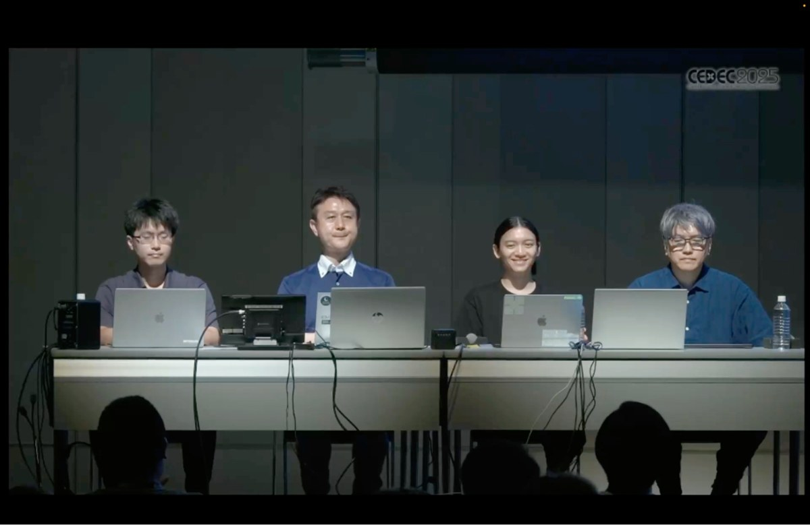{w=280}

레퍼런스로 삼은 것은 포켓포케 개발팀의 CEDEC2025 강연입니다. 기법마다 네 가지를 뽑았습니다.

- 기법의 원리
- 슬라이드에 노출된 소스 텍스처 관찰
- **강연에서 명시한 것과 제가 추론한 것의 구분**
- 우리 프로젝트에 적용할지 여부

첫 번째로 프로젝트 적용을 할 것과 안 할 것을 정했습니다. 강연 분량의 상당 부분이 Houdini 프로시저럴 워크플로인데 그건 팩마다 카드가 수십 장씩 쏟아지는 물량 문제와 2D 일러스트를 가짜 3D로 세우는 변환이 필요해서 만든 것이었습니다. 저희는 장수가 목표가 아니고 2D를 그대로 쓰므로 두 조건 모두 필요 없었습니다.

## 3. 등급 설계 — 셰이더는 등급을 모릅니다

기획에서 내려온 요구는 짧았습니다. **등급명을 글자로 쓰지 말고 색으로만 구분할 것** 그리고 **게임의 장비와 같은 다섯 등급일 것**입니다. 색도 장비에서 쓰던 값을 그대로 씁니다. 주황이 S이고 아래로 보라·파랑·초록·회색 순입니다.

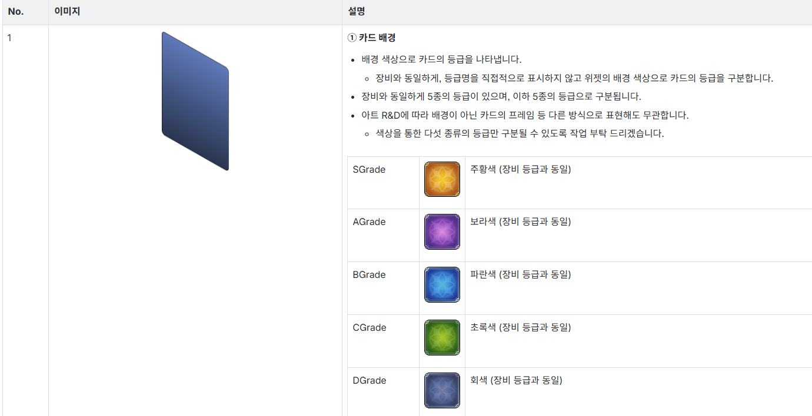

요청대로 배경색에 따라 카드의 등급을 5종으로 나누었고 등급에 따라 차등을 주는 아이디어를 냈습니다. 어느 쪽이 더 좋은 등급인지를 알아보게 하기 위해 표현이 하나씩 더 붙는 구조로 잡았습니다.

| | D | C | B | A | S |
|---|---|---|---|---|---|
| 문양 색 | 회색 | 초록 | 파랑 | 보라 | 주황 |
| 틀 홀로그램 | ✗ | ✗ | 약 | ✓ | 강 |
| 일러스트 홀로그램 | ✗ | ✗ | 약 | ✓ | ✓ |
| 금색 아웃라인 | ✗ | ✗ | ✗ | ✗ | ✓ |

셰이더 키워드로 등급을 나누거나 등급별 셰이더를 따로 두지 않았습니다. 안 쓰는 효과는 값 0을 곱합니다. 그러면 **등급을 추가할 때 데이터만 추가하면 되고 셰이더는 한 줄도 안 고칩니다.** 성능이 문제가 되면 그때 키워드를 얹으면 됩니다.

여기에 원칙 하나를 더 뒀습니다. **정면은 그림이고 기울이면 반짝임**입니다. 정면에서 화려하면 틀린 것입니다. 그래서 하위 등급은 기울여도 거의 안 변하게 만들었습니다. 아래 등급이 반짝이면 윗 등급이 안 살기 때문입니다. 완성 판정 기준도 여기서 나왔습니다. 설명 없이 카드 세 장을 보여줬을 때 "얘가 제일 좋은 거네"가 바로 읽혀야 한다고 생각했습니다.

## 4. 판 한 장에 11겹 — 드로우콜은 하나입니다

카드는 겹을 오브젝트로 쌓지 않고 한 장의 메시에 셰이더가 11겹을 순서대로 덮어씁니다. 아래에서 위로 올라갑니다.

```
10 반짝이(앞)        카드 전체 반짝임
 9 장식              카드마다 다른 아이콘·문양
 8 카드 테두리        테두리가 번쩍인다 · 곱셈 합성
 7 프레임            테두리 선만. 본체는 비어 있다
 6 근경              캐릭터 앞에 놓이는 그림
 5 캐릭터 림라이트    금색 아웃라인 · SDF
 4 캐릭터 일러스트
 3 반짝이(뒤)        캐릭터 뒤 별가루
 2 홀로그램          위상 텍스처 → 램프
 1 배경
 0 등급 문양          카드 몸통
```

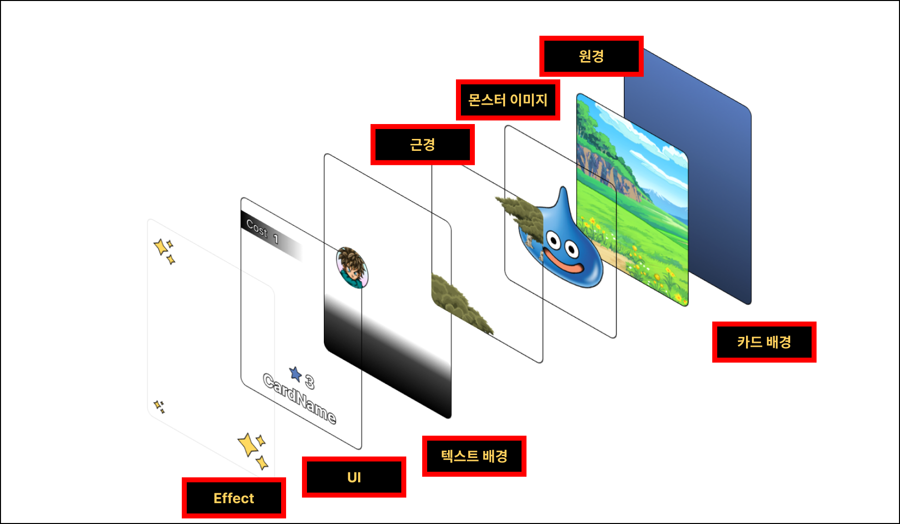

홀로그램은 레퍼런스에서 설명한 구조를 그대로 따랐습니다. 종이 카드의 홀로그램은 CD 뒷면을 기울일 때 무지개가 보이는 것과 같은 원리입니다. 표면에 눈에 안 보일 만큼 촘촘한 홈이 새겨져 있어서 빛이 색깔별로 다른 각도로 튕겨 나가고 그래서 보는 각도에 따라 색이 달라집니다. 이 현상을 두 단계로 흉내 냅니다. **위상 텍스처로 무늬를 흑백으로 만들고 그 값을 램프에 통과시켜 색을 입힙니다.** 무늬와 색이 분리돼 있어서 색만 바꾸고 싶을 때 무늬를 다시 그릴 필요가 없습니다.

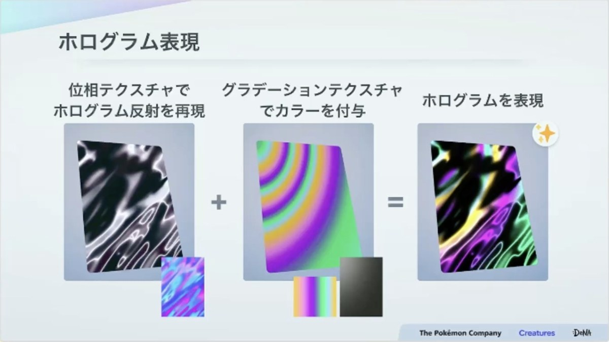

기울기 마스크에서 한 번 헤맸습니다. 정면일 때는 홀로그램을 눌러 두고 기울일수록 올라오게 하는 계산입니다. 그러려면 셰이더가 지금 카드가 얼마나 기울어져 있는지를 알아야 합니다. 그 값을 카메라에서 각 픽셀을 향하는 방향으로 구했더니 카드를 똑바로 세워 둔 정면 상태에서도 가장자리에 홀로그램이 떠 있었습니다.

원인은 원근이었습니다. 카메라는 한 점에서 화면 전체를 부채꼴로 내다봅니다. 그래서 카드 한가운데 픽셀은 정면으로 마주 보지만 **왼쪽 끝과 오른쪽 끝 픽셀은 비스듬히 보게 됩니다.** 카드를 하나도 안 기울였는데 가장자리 픽셀이 스스로 기울어져 있다고 계산한 것입니다. 카드가 화면에서 클수록 그리고 카메라가 가까울수록 이 각도는 더 커집니다. 기울여서 생긴 각도와 원근 때문에 생긴 각도를 셰이더가 구분하지 못했습니다.

고친 방법은 시선을 픽셀마다 구하지 않고 **카드 중심 한 곳에서 한 번만 구해 모든 픽셀이 같은 값을 쓰게** 한 것입니다. 그러면 카드 안 어디를 보든 기울기 값이 하나라서 카드를 돌린 만큼만 홀로그램이 올라옵니다.

겹 5의 금색 아웃라인도 같은 발상입니다. 외곽선을 금색으로 칠하는 것이 아니라 마스크로 영역을 정하고 거기에 줄무늬 그라데이션을 통과시켜 금속처럼 번쩍이게 만듭니다. 매끈한 그라데이션을 쓰면 금속이 아니라 그냥 노란 테두리가 됩니다.

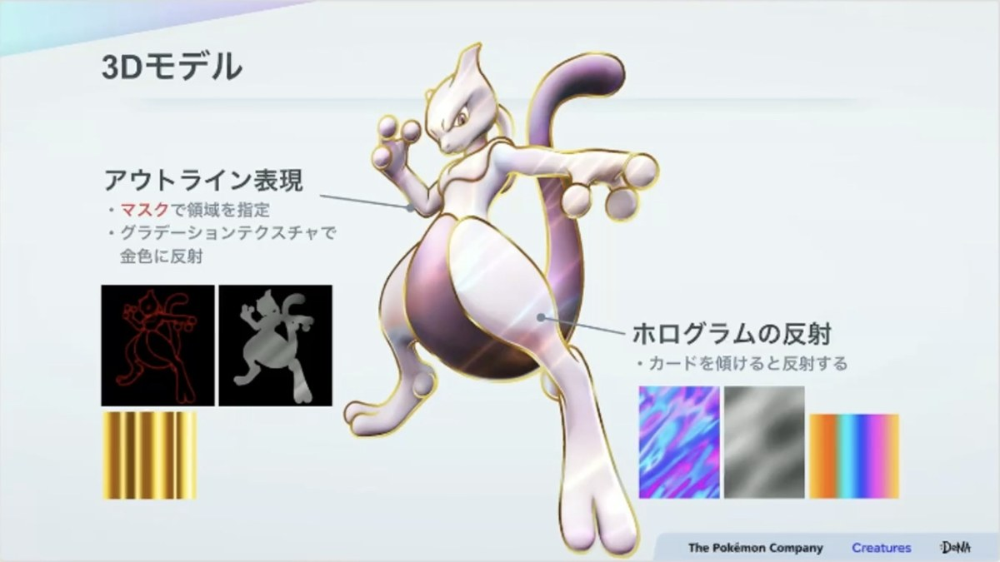

문제는 그 영역을 어떻게 구하느냐였습니다. 캐릭터 실루엣에서 바깥으로 몇 픽셀 퍼진 띠가 필요한데 처음에는 밉맵으로 실루엣을 번지게 해서 만들었습니다. 중간 점검에서 이걸 SDF로 바꾸라는 지적을 받고 다시 만들었습니다.

SDF는 **거리를 미리 구워 두는 방식**입니다. 일러스트마다 같은 크기의 흑백 이미지를 한 장 더 만드는데 이 이미지의 픽셀에는 색이 아니라 **캐릭터 실루엣의 경계까지 얼마나 떨어져 있는지**가 들어갑니다. 실루엣 안쪽이 가장 밝고 바깥으로 멀어질수록 어두워집니다. 이걸 거리 맵이라고 부릅니다.

거리 맵이 있으면 셰이더가 할 일은 한 번 읽고 자르는 것뿐입니다. 어디까지를 외곽선으로 칠지 기준값 하나만 정하면 되고 그 값을 내리면 띠가 두꺼워집니다. **슬라이더 하나가 곧 외곽선 굵기**가 되는 셈인데 굵게 하든 얇게 하든 읽는 횟수는 한 번으로 같습니다. 잘라낸 띠에 금색 램프를 곱하면 끝입니다.

거리 맵은 일러스트의 알파만 있으면 만들 수 있어서 아티스트가 따로 그릴 것이 없습니다. 에디터 툴로 뽑게 해 뒀습니다. 얼마나 멀리까지 잴지와 알파 얼마부터 캐릭터로 볼지 두 값만 조절하고 여러 장을 한 번에 구울 수도 있습니다.

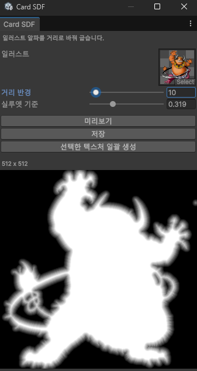

빠뜨리기 쉬운 것이 둘 있습니다. **거리 맵은 일러스트와 크기가 같아야 합니다.** 셰이더가 두 장을 같은 좌표로 읽기 때문입니다. 그리고 **일러스트 사방에 10% 정도 여백이 있어야 합니다.** 캐릭터가 이미지에 꽉 차 있으면 바깥으로 퍼질 자리가 없어서 외곽선이 잘립니다. 게임용 몬스터 스프라이트는 대개 꽉 차 있어서 여기를 먼저 확인해야 합니다.

시차는 겹마다 UV를 밀어서 만듭니다. 배경이 제일 많이 밀리고 일러스트와 근경 순으로 줄어듭니다. 밀리는 만큼 가장자리가 비므로 배경은 카드보다 크게 만들고 확대해서 넣습니다.

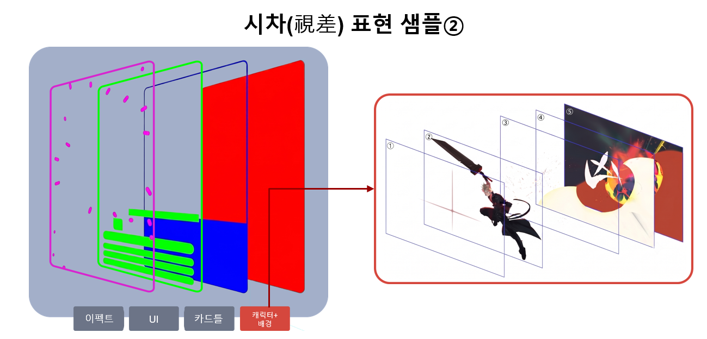

## 5. 카드에 검은 얼룩이 뚫렸습니다 — 조건 세 개가 겹쳐야 나타나는 버그

이 작업에서 제일 오래 잡았던 문제입니다. 카드를 돌리면 판 위에 삼각형 모양으로 검은 빗금이 뜨는데 정면일 때는 잘 안 보이고 기울일수록 심해졌습니다.

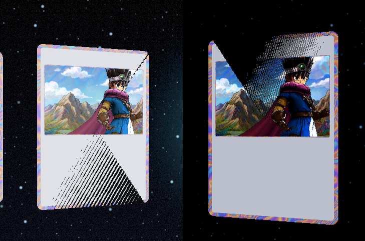

원인은 **조건 세 개가 모두 겹쳐야** 나타나는 것이었습니다.

| | 조건 | 당시 상황 |
|---|---|---|
| 1 | Depth Priming이 강제로 켜져 있음 | 프로젝트 렌더러 설정. 건드릴 수 없음 |
| 2 | 메시 정점이 300 미만 | 카드가 114개라 다이나믹 배칭 대상 |
| 3 | SRP Batcher에서 빠짐 | `MaterialPropertyBlock`을 붙여 뒀음 |

URP는 깊이를 미리 한 번 그려 두고 본 패스를 "깊이가 정확히 같은 픽셀만 통과"로 그립니다. 3번 때문에 SRP Batch로 못 가고 다이나믹 배칭으로 밀려나는데 다이나믹 배칭은 **CPU가 정점을 미리 월드 좌표로 변환**합니다. 그런데 그 경로를 타는 것은 정점만 필요한 깊이 그리기뿐이고 색과 UV까지 들고 있는 본 그리기는 GPU가 합니다.

```
깊이 그리기   CPU가 계산   1.2500000
색 그리기     GPU가 계산   1.2500001   ← 끝자리가 달라 탈락 → 검게 뚫림
```

처음에는 왜 이런 버그가 났는지 생각해 봤습니다. 메시에 겹친 면이 있는지 두 패스의 정점 변환이 다른지 배경판과 부딪히는지 카드가 두 장 겹쳐 있는지 차례로 확인했는데 전부 아니었습니다.

마지막으로 셰이더를 기본 Lit으로 돌려봐도 해당 버그가 나왔습니다.

**결정적이었던 것은 프레임 디버거였습니다.** 깊이 미리 그리기 안에 `Draw Dynamic`이 보이는 순간이 갈렸습니다. 때문에 다이나믹 배칭으로 인한 깊이 불일치가 원인이라고 후보를 좁힐 수 있었습니다.

그에 대한 해결책으로 카드를 SRP Batch에 포함되게 만들었습니다.

UV 아틀라스의 앞쪽 면에 대한 좌표를 `MaterialPropertyBlock`을 이용하여 넘기고 있었지만 이를 UV2에 0~1 사이로 통일시키고 그 값을 메시의 UV2에 실었으며 머티리얼 값을 전부 같은 버퍼 안에 넣고 모든 패스가 똑같이 선언하게 맞췄습니다.

## 6. 캔버스냐 3D냐 — 두 벌을 다 만들어서 보고했습니다

중간에 상사가 던진 질문은 "카드를 UI로 만들 것인가 3D 물체로 만들 것인가"였습니다.

발단은 인게임에 3D로 카드를 띄웠더니 피사계 심도가 걸려 뿌옇게 나온 것이었습니다. 카드는 카메라 코앞에 있어서 가장 흐린 자리에 놓인 셈이었습니다. 포스트 프로세싱은 화면 전체에 거는 연산이라 특정 픽셀만 빼는 방법이 없습니다. **포스트가 끝난 뒤에 그린다**는 숙제가 생겼습니다.

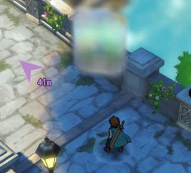

숙제를 풀기 전에 스스로 지킬 규칙을 먼저 정했습니다.

- 게임 화면이 카드 뒤에 보여야 한다
- 게임 전체에 영향을 주지 않는다
- 카메라와 렌더러를 건드리지 않는다
- 렌더 텍스처를 또 만들지 않는다

렌더 텍스처나 전용 카메라를 새로 들이면 숙제는 바로 풀리지만 팀 전체가 쓰는 설정을 건드리게 됩니다. 그래서 게임 씬에 이미 있는 `ScreenCanvas`에 얹는 방향으로 먼저 갔습니다.

### 캔버스 카드

카드 몸통은 `RawImage`로 표현했습니다. `Image`는 스프라이트를 받으면서 UV가 `0, 0`이 되는데 `RawImage`는 UV가 `0~1`로 들어와서 셰이더가 쓰던 좌표를 그대로 쓸 수 있습니다.

셰이더는 UI 규약에 맞게 네 가지를 고쳤습니다. 깊이 테스트를 끄고 큐를 Geometry에서 Transparent로 옮기고 뎁스와 섀도우 패스를 지우고 원근 표현을 새로 넣었습니다. 캔버스는 직교 투영이라 기울여도 원근이 안 생기기 때문입니다.

```hlsl
float eyeDistance = referenceHalfHeight / max(tan(radians(_PerspectiveFov * 0.5)), 1e-5);
float perspectiveScale = eyeDistance / (eyeDistance + input.positionOS.z);
output.positionCS.xy *= perspectiveScale;
```

밑변을 높이와 탄젠트로 구해 카메라까지의 거리를 만들고 거기에 정점의 오브젝트 스페이스 Z를 더해 나눕니다. 원근은 결국 거리로 나누는 것입니다. 화각을 그대로 받게 해서 **화각 0이 곧 끄기**가 되도록 했고 카드의 회전은 `ViewDir` 컴포넌트가 읽어 셰이더로 넘깁니다.

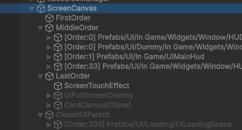

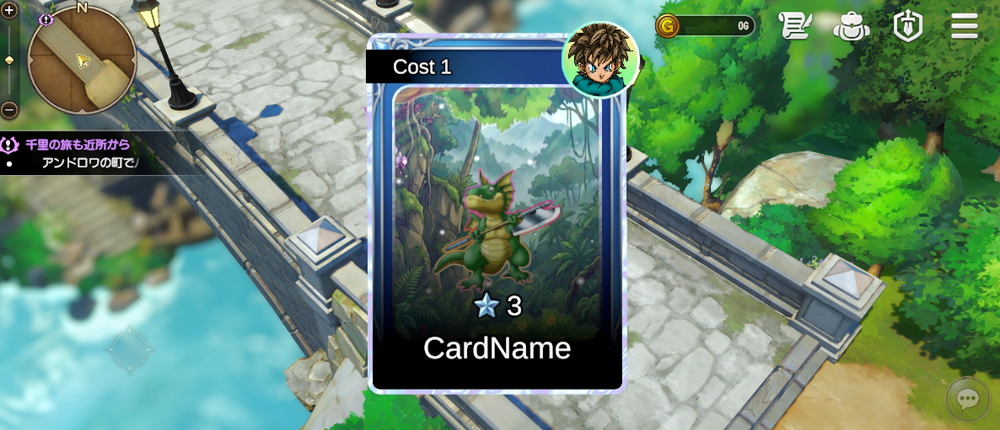

규칙 네 개를 다 지키면서 화면에 띄우는 데까지 갔지만 남는 과제가 셋 있었습니다. **카드 옆면의 두께를 표현할 수 없고 원근은 진짜가 아니라 흉내이며 카드 애니메이션을 어떻게 할지가 난감했습니다.**

### 월드 캔버스 카드

카드를 월드에 세워 보기도 했습니다. 이러면 포스트 프로세싱이 카드 위에 덮이고 아웃라인도 카드 위로 올라옵니다. 프레임 디버거로 보면 불투명 단계에서 그려지고 있어서 포스트보다 앞입니다. 월드에 두는 순간 카드는 씬의 다른 물체와 똑같은 취급을 받습니다.

그러면 프로젝트는 월드 캔버스를 어떻게 쓰고 있는지 찾아봤습니다. 게임 씬에 `WorldCanvas` 객체가 이미 있었는데 정작 설정은 달랐습니다.

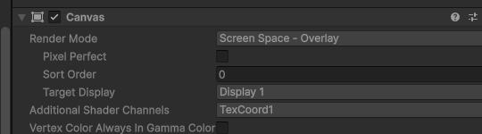

코드를 따라가 보니 `CreateUI`로 UI를 자식에 만들고 `AddUI`로 명단에 등록한 다음 월드 좌표를 화면 좌표로 바꿔 매 프레임 갱신하고 있었습니다. 데미지 숫자나 이름표는 사물에 가려지거나 흐려지면 안 되니 **위치만 월드에서 받아오고 그리기는 화면 UI로** 하는 방식을 택한 것입니다.

### 3D 카드

3D로 가면서도 피사계 심도는 피해야 합니다. 그래서 이 게임이 인벤토리 아이템을 어떻게 그리는지 봤습니다. 프리팹으로 만들어 둔 무대가 따로 있고 버튼을 누르면 그 무대를 상공에 동적으로 생성한 뒤 무대 안의 카메라로 바꿔치기하는 방식이었습니다.

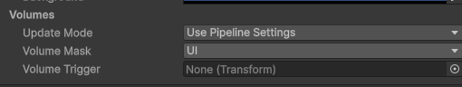

핵심은 **포스트 프로세싱을 끄는 것이 아니라 다른 볼륨을 보게 하는 것**입니다. 월드 카메라는 Default 레이어의 볼륨을 보고 무대 카메라는 UI 레이어의 볼륨을 봅니다. 월드의 피사계 심도는 무대 카메라 눈에 아예 안 들어옵니다. 대신 카메라를 따로 운용하는 로직이 필요하고 그 대가로 옆면 두께와 진짜 원근 그리고 처음 설계 의도를 그대로 지킬 수 있습니다.

### 재 보고 정한 것

에디터에서 카드 한 장을 회전시키는 상태로 두 방식을 나란히 쟀습니다. 도구는 프레임 디버거와 프로파일러의 Rendering 항목입니다.

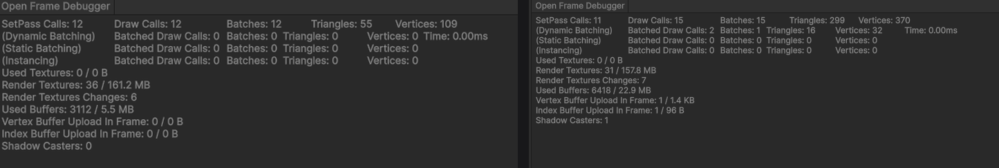

**3D 카드 쪽이 확장성에서 낫다고 보고했습니다.** 카드가 10장에서 30장으로 늘어날 때 캔버스는 SetPass가 따라 늘지만 3D 방식은 SRP 배처에 묶여 그만큼 늘지 않기 때문입니다. 조명과 그림자를 받을 수 있다는 것도 3D 쪽 장점입니다. 위의 내용을 종합하여 상사에게 보고하였고 최종적으로 3D로 가자는 방향을 세웠습니다.

## 7. 제너레이터 — 카드를 수십 개 만들어야 하는 구조

캐릭터가 늘면서 등급도 있다면 관리할 것이 곱셈으로 늘어납니다. 게다가 카드마다 그림이 달라서 머티리얼을 공유할 수 없었고 카드 한 장마다 머티리얼 파일이 하나씩 생기는 일이 발생했습니다. 때문에 카드를 프리팹으로 만들 것인가에 대한 고민이 생겼습니다.

그래서 목표를 **데이터만 바꾸면 카드가 바뀌는 것**으로 잡았습니다. 완성 기준에도 캐릭터 교체가 데이터만 바꿔서 되어야 한다는 항목을 넣어 뒀습니다.

구조는 셋으로 나눴습니다.

```
프리셋   에디터 전용 · 잠김     견본. 꽂는 순간 값을 복사한다
        │
카드 데이터   고칠 수 있음      카드 정보 · 일러스트 · 겹 값
        │
CardView   카드에 붙는 컴포넌트  메모리에서 머티리얼을 만들어 굽는다
```

**프리셋**은 견본입니다. 등급과 테마를 조합해 아홉 개를 미리 만들어 뒀고 카드 데이터에 꽂는 순간 값 열여덟 칸이 복사됩니다. 복사한 뒤에는 카드 데이터가 프리셋을 가리키지 않습니다. 게임에 카드 데이터가 나가도 에디터 전용 프리셋이 딸려가지 않게 하려는 것입니다. 프리셋 자체는 빌드에 안 들어가도록 에디터 폴더에 두고 인스펙터를 잠가서 실수로 고치는 일이 없게 했습니다.

**카드 데이터**는 반대로 고칠 수 있는 파일입니다. 프리셋으로 뼈대를 깔고 카드마다 다른 부분은 인스펙터에서 겹 값을 직접 만집니다. 값을 바꾸면 씬에서 그 데이터를 쓰는 카드가 전부 다시 구워집니다.

**CardView**는 카드에 붙는 컴포넌트입니다. 카드가 켜질 때 템플릿을 복제해 메모리에 머티리얼을 만들고 겹마다 값을 써넣은 다음 앞면 슬롯에 입힙니다. 굽기를 에디터 전용 코드가 아니라 컴포넌트에 둔 이유는 **머티리얼 파일이 쌓이면 안 되고 게임 중에도 카드를 만들 수 있어야 한다**고 봤기 때문입니다. 프로젝트에는 데이터 파일만 남고 머티리얼 파일은 한 개도 생기지 않습니다. 에디터와 게임이 같은 길로 카드를 만듭니다.


## 8. 결과

```
카드 데이터를 고친다  →  CardView 가 메모리에서 머티리얼을 굽는다  →  카드가 바뀐다
```

처음에 세운 완성 기준이 "설명 없이 카드 세 장을 보여줬을 때 얘가 제일 좋은 거네가 바로 읽히는 것"이었습니다. 데모 씬에서 재생하면 등급이 다른 카드 세 장이 저절로 기울고 정면에서는 캐릭터가 또렷하다가 기울이면 홀로그램이 흐릅니다. 하위 등급은 기울여도 거의 변하지 않습니다.

만든 것을 정리하면 이렇습니다.

- 앞면 11겹 합성 셰이더와 뒷면·측면 셰이더 그리고 3D 메시 정보 UI 셰이더
- 카드 메시 생성 툴 — 가로·세로·두께·모서리를 슬라이더로 바꾸면 씬에서 즉시 재생성
- 위상 텍스처 생성 툴과 일러스트 알파에서 거리 맵을 굽는 SDF 생성 툴
- 겹 단위로 나뉜 머티리얼 인스펙터
- 제너레이터 — 프리셋에서 카드 데이터로 값을 복사하고 카드가 켜질 때 메모리에서 머티리얼을 굽습니다


## 참고 자료

- 기법 레퍼런스 — [포켓몬 카드 게임 포켓 CEDEC2025 강연](https://gamemakers.jp/article/2025_08_04_113058/). 홀로그램의 위상+램프 구조와 마스크로 세기를 조절하는 방식 그리고 시차 처리를 참고했습니다. **본문의 슬라이드 이미지 세 장은 이 강연 자료에서 인용한 것이며 제 작업물이 아닙니다.** 저작권은 강연자와 The Pokémon Company·Creatures·GAME FREAK에 있습니다.
- 둥근 사각형 SDF — [Inigo Quilez — *2D distance functions*](https://iquilezles.org/articles/distfunctions2d/).
- 반짝이 난수 — Dave Hoskins가 Shadertoy에 공개한 *Hash without Sine*. `sin` 없이 곱셈과 소수부만으로 난수를 만드는 방식이라 모바일에서 정밀도 줄무늬가 생기지 않습니다.
- 거리 맵 생성 알고리즘 — [8SSEDT (Richard Mitton, *Signed Distance Fields*)](http://www.codersnotes.com/notes/signed-distance-fields/). 픽셀마다 경계까지의 거리를 여덟 방향으로 전파해 구하는 방식이고 생성 툴은 이 알고리즘을 옮긴 것입니다.
